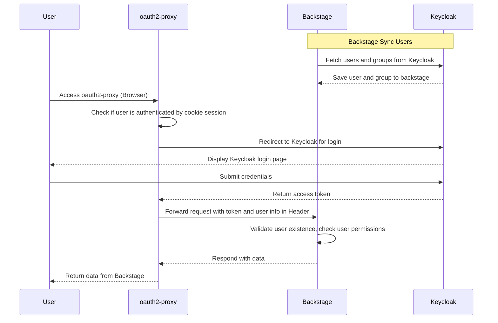

基于 K8S 部署 Backstage，集成 oauth2-proxy 和 Keycloak，实现用户管理、认证和授权，配置详解和原理介绍。

如果你遇到以下问题或诉求，可以参考此文档。

- [Backstage](https://backstage.io/) 接入 oauth2-proxy，登录或认证失败。
- Backstage 实现 RBAC、ABAC 授权管理，以及如何实现自定义权限。
- [oauth2-proxy](https://oauth2-proxy.github.io/oauth2-proxy/) 对接 keycloak，参数不理解或者配置一直错误。

在开始之前，我们先了解一个点，Backstage 官方开源有开箱即用的容器镜像，也有丰富的插件生态，然而区别于其他插件类应用，Backstage 有自己的特点：

1. Backstage 插件分为 frontend 和 backend，一个完整的插件可能包含两种，也可能只包含其中一种。
2. 开源发布的开箱即用的容器镜像，只包含基础插件，一般只用来作为初次学习使用。
3. 如果想使用其他插件，需要做一些编码工作，一般步骤如下。

   - 使用 `npx @backstage/create-app@latest` 创建一个基础项目。
   - 按插件要求安装插件，配置插件菜单、UI 效果、权限、认证信息等，每个插件要求不同。
   - 按需开发自己的插件。
   - 编译成新容器镜像，某些插件可能还需要在容器中额外安装一些依赖包，部署时使用此容器镜像。

4. 基本上每个插件都有自己的配置要求，需根据插件文档配置 app-config.yaml。

可以把 Backstage 类比于 Spring Boot，提供了 starter、framework、plugins，如果想真实使用，需要自己引入依赖，编译成自己的镜像发布部署，欢迎 star 我们基于 Backstage 定制的开源项目 [xlabs-developer-platform](https://github.com/xlabs-club/xlabs-developer-platform)。

核心组件介绍：

- 用户同步使用 Red Hat 贡献的社区开源插件 [@backstage-community/plugin-catalog-backend-module-keycloak](https://github.com/backstage/community-plugins/tree/main/workspaces/keycloak/plugins/catalog-backend-module-keycloak)，将 keycloak 用户同步到 Backstage 数据库，后面我们会提到为什么需要这一步。
- 认证使用官方内置的 [OAuth 2 Proxy Provider](https://backstage.io/docs/auth/oauth2-proxy/provider).
- 授权，权限管理 Permissions，支持 RBAC、ABAC， 使用 Red Hat 贡献的社区开源插件 [@backstage-community/plugin-rbac](https://github.com/backstage/community-plugins/tree/main/workspaces/rbac/plugins)，虽然插件名字叫 RBAC，但是实际上支持 ABAC。注意 Spotify 也有 [RBAC 插件](https://backstage.spotify.com/marketplace/spotify/plugin/rbac/) 需要购买 License 才能用，两个插件别弄混了。

以上认证和授权是独立的，如果你只需要认证，不需要授权，那可以不需要 RBAC 插件。

整体架构流程图：



## 安装部署配置详解和原理分析

在开始之前，我们先特别注意几个比较容易踩坑的点：

1. Backstage OAuth 2 Proxy Provider 除了进行用户登录认证外，还会校验用户是否已经存在，如果不存在会返回错误，所以我们需要使用 `@backstage-community/plugin-catalog-backend-module-keycloak` 插件，先将用户同步到 backstage 里。
2. Backstage 的 `Sign In resolver` 依赖 oauth2-proxy 传递的 http header，所以我们把 backstage 作为 oauth2-proxy 的 upstream，网络流量是 User -> oauth2-proxy -> Backstage。下面我们会单独说明依赖哪些 Header。
3. oauth2-proxy 以 email 作为用户校验和识别，所以尽量为用户设置 email，否则后续会有很多额外配置和开发工作。等报错了就知道怎么解决了，能解决，只是带来额外的工作。

下面的安装部署配置，都在我们的部署脚本 [xlabs-ops](https://github.com/xlabs-club/xlabs-ops/tree/main/xlabs-k8s-starter) 源码里，可供参考，方便复制粘贴。

### Keycloak 配置准备

Keycloak 需要准备两对 client id 和 client secret，都是 `OpenID Connect` , 分别给 Backstage `@backstage-community/plugin-catalog-backend-module-keycloak` 插件同步用户用， 和 oauth2-proxy 登录认证使用。如果你想省事，也可以把两个 client 合并成一个。

- 给 Backstage 同步用户使用，假设 id 叫 `backstage`，需要在 keycloak 开启 `Authorization`，并在 `Service Account  Roles` 授权查询 users 和 groups 的权限。他的作用就是通过 keycloak 的 api 将 users 和 groups 同步到 backstage，如果没有权限，在 backstage 的日志里应该能看到一些相应的错误信息。

- 给 oauth2-proxy 登录认证用，假设 id 叫 `oauth2-proxy`, 需要在 keycloak 设置 `Valid redirect URIs` 为你 backstage 的回调地址，支持通配符，比如 `https://backstage.nxest.com/*`，并设置 `Audience` 和 `Groups` scope， 否则登录失败。具体设置 scope 方式请参考官方文档 [oauth2-proxy-keycloak-oidc](https://oauth2-proxy.github.io/oauth2-proxy/configuration/providers/keycloak_oidc/) 和我的另外一遍博客 [traefik-oauth2-proxy-keycloak](https://www.xlabs.club/blog/traefik-oauth2-proxy-keycloak/)。

### oauth2-proxy 配置

oauth2-proxy 也有很多部署方式，以 K8S 内部署 `bitnami/oauth2-proxy` helm chart 为例，核心配置参考如下。

```yaml
configuration:
  clientID: oauth2-proxy
  clientSecret: copy-from-keycloak-oauth2-proxy-client-secret
  # openssl rand -base64 32 | tr -- '+/' '-_'
  cookieSecret: "Vr0_r5nWZPLAxNgI9ZIU2JnE24brhPbkZ0sUN_phwJo=="
  # https://oauth2-proxy.github.io/oauth2-proxy/configuration/overview
  # oauth2_proxy.cfg 是 toml，注意等号后面 String 类型需要引号
  content: |
    provider = "keycloak-oidc"
    provider_display_name = "Keycloak"
    email_domains = "*"
    pass_access_token = true
    ssl_insecure_skip_verify = true
    ssl_upstream_insecure_skip_verify = true
    insecure_oidc_allow_unverified_email = true
    code_challenge_method = "S256"
    cookie_expire = "30m"
    cookie_refresh = "4m"
    skip_auth_routes = '.*\.(js|css)$'
    upstreams = "http://backstage.backstage.svc:7007"
    silence_ping_logging = true
    backend_logout_url = "<%= keycloakBaseUrl %>/realms/devops/protocol/openid-connect/logout"

  oidcIssuerUrl: <%= keycloakBaseUrl %>/realms/devops
  redirectUrl: ""
  # 白名单支持通配符： *.xxx.com
  whiteList: "*.xxx.com"
```

注意这里几个特别关键的配置：

- 将 `<%= keycloakBaseUrl %>` 替换为你的 keycloak 真实 URL 地址，设置为对外地址，比如 ingress 的域名。
- devops 是我自定义的 realm 名字，请根据你自己实际的情况设置，keycloak 默认的 realm 是 master。
- upstreams：设置为 backstage 的服务地址。我这里设置的是 backstage 的 k8s service 地址，因为 oauth2-proxy 和 Backstage 都在 K8S 集群内，能通即可。
- cookie_refresh : 设置为 Keycloak Access-Token lifespan - 1m
- cookie_expire : 设置为 Keycloak Refresh-Token lifespan (Keycloak client_session_idle)
- skip_auth_routes 对某些 url 不做认证，可写可不写，看你爱好。

关于 keycloak token 过期时间的配置，可以参考 keycloak 官方文档或 [IDaaS Book](https://idaas.xlabs.club/)。

### Backstage 配置

Backstage 需要编码，引入 Keycloak 和 RBAC 插件，修改导航栏菜单，然后才是配置文件。这部分并没有什么难度，参考插件说明即可完成，注意请根据插件的最新版本说明配置，这里提到的一切都可能过时，Backstage 变化实在是太大了。

Backstage 我们区分认证和授权两部分，两部分可独立配置，但是都依赖用户同步，所以先把用户同步到 Backstage 数据库。

#### 用户同步

官方英文最新文档请参考 [catalog-backend-module-keycloak](https://github.com/backstage/community-plugins/tree/main/workspaces/keycloak)，请根据最新文档操作。

基本步骤：

1. 安装插件依赖。

   ```bash
    yarn workspace backend add @backstage-community/plugin-catalog-backend-module-keycloak
   ```

2. 在 backstage 注册插件，backstage 工程 `packages/backend/src/index.ts` 增加以下代码。

   ```ts
    const backend = createBackend();
    # 增加这一行
    backend.add(
      import('@backstage-community/plugin-catalog-backend-module-keycloak'),
    );
    backend.start();
   ```

3. 配置插件同步需要的 client id 和 client secret，同步周期，在 backstage 的 app-config.yaml 增加以下片段。

   ```yaml
   catalog:
    providers:
      keycloakOrg:
        default:
          baseUrl: https://<keycloak_host>
          loginRealm: ${KEYCLOAK_REALM}
          realm: ${KEYCLOAK_REALM}
          # 这里的 client 就是我们上面说的 backstage client， 需要授权查询用户和组的权限
          clientId: ${KEYCLOAK_CLIENTID}
          clientSecret: ${KEYCLOAK_CLIENTSECRET}
          schedule: # Optional (defaults to the configurations below if not provided); same options as in TaskScheduleDefinition
            # supports cron, ISO duration, "human duration" as used in code
            frequency: { minutes: 30 } # Customize this to fit your needs
            # supports ISO duration, "human duration" as used in code
            timeout: { minutes: 3 } # Customize this to fit your needs

   ```

以上配置完成后，观察下 backstage 的运行日志，成功的话会有同步了多少个 user 和 group 的日志，失败的话会有失败原因，确保同步成功。

#### 用户认证

官方英文最新文档请参考 [OAuth 2 Proxy Provider](https://backstage.io/docs/auth/oauth2-proxy/provider/)，请根据最新文档操作。

基本步骤：

1. 安装 backstage 后端插件依赖。

   ```bash
    yarn --cwd packages/backend add @backstage/plugin-auth-backend-module-oauth2-proxy-provider
   ```

2. 配置 backstage 后端代码，启用插件，在 `packages/backend/src/index.ts` 增加以下代码。

    ```ts
    # 增加这一行
    backend.add(
      import('@backstage/plugin-auth-backend-module-oauth2-proxy-provider'),
    );
    ```

3. 配置 oauth2Proxy 认证组件需要的参数，在 backstage 的 app-config.yaml 增加以下片段。

   ```yaml
    auth:
      # environment 必须定义，一般定义为 development 和 production，可根据自己的需要定义，后面代码中会有引用名字的地方
      environment: development
      providers:
        oauth2Proxy:
          signIn:
            resolvers:
              # See https://backstage.io/docs/auth/oauth2-proxy/provider#resolvers for more resolvers
              - resolver: forwardedUserMatchingUserEntityName
   ```

4. 改前端代码，修改登录页面，使用 oauth2Proxy 的登录组件，参考 [官方文档](https://backstage.io/docs/auth/#sign-in-with-proxy-providers). 在 `packages/app/src/App.tsx` 找到 `SignInPage` 修改为如下片段，当然，你可以根据自己的环境定制更多自己的登录页面。

   ```ts
    // SignInPage: props => <SignInPage {...props} auto providers={['guest']} />,
    SignInPage: props => {
      const configApi = useApi(configApiRef);
      // 开发环境使用 guest 账号，生产环境使用 oauth2Proxy 作为登录认证
      if (configApi.getString('auth.environment') === 'development') {
        return (
          <SignInPage
            {...props}
            providers={['guest']}
          />
        );
      }
      return <ProxiedSignInPage {...props} provider="oauth2Proxy" />;
    }
   ```

上面我们使用了 backstage 的 resolvers `forwardedUserMatchingUserEntityName`, 他就是从 Http Header 中获取 oauth2-proxy 传递过来的 `x-forwarded-user` 值与数据库比对，找到用户信息。

oauth2-proxy 传递到 upstream 的常用 header 有：

```yaml
x-forwarded-user: af188bba-0388-2623-8cdb-39422e8be30a # user database id
x-forwarded-preferred-username: lisan123 # user login name
x-forwarded-groups: admin,test-group # user groups
x-forwarded-access-token: xxx # Access Token
authorization: Bearer token xxx # 注意这个是 ID Token，不是 Access Token
cookie: xxx
```

至此，登录认证已经可以了。

#### 用户授权

RBAC 授权插件有前端和后端两个插件。

先安装 backend 后端插件，基本步骤：

1. 安装 backstage 后端插件依赖。

   ```bash
    yarn workspace backend add @backstage-community/plugin-rbac-backend
   ```

2. 配置 backstage 后端代码，启用插件，在 `packages/backend/src/index.ts` 补充以下代码。

    ```diff
    // 删除原来的 permission plugin
    - backend.add(import('@backstage/plugin-permission-backend/alpha'));
    - backend.add(
    -    import('@backstage/plugin-permission-backend-module-allow-all-policy'),
    -  );
    // 增加这一行
    + backend.add(import('@backstage-community/plugin-rbac-backend'));
    ```

3. 配置 RBAC 插件用户权限，在 backstage 的 app-config.yaml 增加以下片段。

   ```yaml
    permission:
      enabled: true
      # see https://github.com/backstage/community-plugins/tree/main/workspaces/rbac/plugins/rbac-backend
      rbac:
        maxDepth: 1
        admin:
          superUsers:
            # 这里的 “default” 是 backstage 的 namespace 的概念，没改默认是 default
            - name: user:default/zhangsan
            - name: user:default/mike
          users:
            - name: user:default/lisir
            - name: group:default/admins
   ```

再安装 frontend 前端插件，把 RBAC 管理界面放出来，基本步骤：

1. 安装 backstage 前端插件依赖。

   ```bash
    yarn workspace app add @backstage-community/plugin-rbac
   ```

2. 配置 backstage 前端代码，在 `packages/app/src/App.tsx` 补充以下代码，增加 Route。

    ```ts
    import { RbacPage } from '@backstage-community/plugin-rbac';

    <Route path="/rbac" element={<RbacPage />} />;
    ```

3. 配置导航菜单，修改 `packages/app/src/components/Root/Root.tsx`。

   ```ts
    import { Administration } from '@backstage-community/plugin-rbac';

    export const Root = ({ children }: PropsWithChildren<{}>) => (
      <SidebarPage>
        <Sidebar>
          ...
          <Administration />
          ...
        </Sidebar>
      </SidebarPage>
    );
   ```

至此，用以上配置有权限的用户登录，就可以访问 RBAC 管理界面了。根据 [权限管理文档](https://backstage.io/docs/permissions/overview) 开启自定义权限之旅吧。
