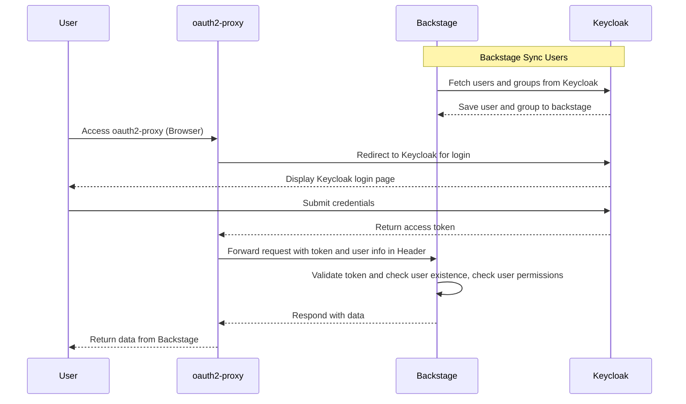

基于 K8S 部署 Backstage， 集成 oauth2-proxy 和 Keycloak，实现用户管理、认证和授权，都是基于开源软件原始功能实现。

如果你有以下类似需求，可以参考此文档。

- [Backstage](https://backstage.io/) 接入 oauth2-proxy 认证。
- Backstage 实现 RBAC、ABAC 授权管理。
- [oauth2-proxy](https://oauth2-proxy.github.io/oauth2-proxy/) 对接 keycloak，功能和参数详解。

在开始之前，我们先了解一个点，Backstage 官方开源有开箱即用的容器镜像，也有丰富的插件生态，然而区别于其他插件类应用，Backstage 有自己的特点：

1. Backstage 插件分为 frontend 和 backend，一个完整的插件可能包含两种，也可能只包含其中一种。
2. 开源发布的开箱即用的容器镜像，只包含基础插件，一般只用来作为初次学习使用。
3. 如果想使用其他插件，需要做一些编码工作，一般步骤如下。

    - 使用 `npx @backstage/create-app@latest` 创建一个基础项目。
    - 按插件要求安装插件，配置插件菜单、UI 效果、权限、认证信息等，每个插件要求不同。
    - 按需开发自己的插件。
    - 编译成新容器镜像，某些插件可能还需要在容器中额外安装一些依赖包，部署时使用此容器镜像。

4. 基本上每个插件都有自己的配置要求，需根据插件文档配置 app-config.yaml。

可以把 Backstage 类别于 Spring Boot，提供了 starter、framework、plugins，如果想真实使用，需要自己引入依赖，编译成自己的镜像发布部署，欢迎 star 我们基于 Backstage 定制的开源项目 [xlabs-developer-platform](https://github.com/xlabs-club/xlabs-developer-platform)。

核心组件介绍：

- 认证使用官方内置的 [OAuth 2 Proxy Provider](https://backstage.io/docs/auth/oauth2-proxy/provider).
- 用户同步使用 Red Hat 贡献的社区开源插件 [@backstage-community/plugin-catalog-backend-module-keycloak](https://github.com/backstage/community-plugins/tree/main/workspaces/keycloak/plugins/catalog-backend-module-keycloak)，将 keycloak 用户同步到 Backstage 数据库，后面我们会提到为什么需要这一步。
- 权限管理 Permissions，支持 RBAC、ABAC， 使用 Red Hat 贡献的社区开源插件 [@backstage-community/plugin-rbac](https://github.com/backstage/community-plugins/tree/main/workspaces/rbac/plugins)。

整体架构流程图：

## 安装部署配置详解
