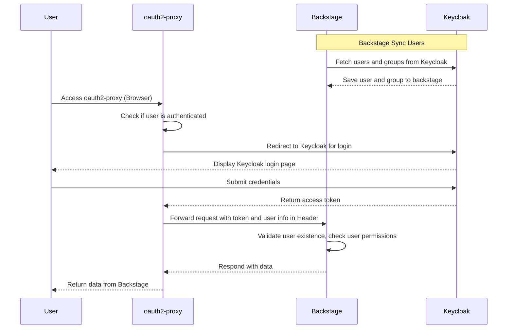

基于 K8S 部署 Backstage， 集成 oauth2-proxy 和 Keycloak，实现用户管理、认证和授权，都是基于开源软件原始功能实现。

如果你有以下类似需求，可以参考此文档。

- [Backstage](https://backstage.io/) 接入 oauth2-proxy 认证。
- Backstage 实现 RBAC、ABAC 授权管理。
- [oauth2-proxy](https://oauth2-proxy.github.io/oauth2-proxy/) 对接 keycloak，功能和参数详解。

在开始之前，我们先了解一个点，Backstage 官方开源有开箱即用的容器镜像，也有丰富的插件生态，然而区别于其他插件类应用，Backstage 有自己的特点：

1. Backstage 插件分为 frontend 和 backend，一个完整的插件可能包含两种，也可能只包含其中一种。
2. 开源发布的开箱即用的容器镜像，只包含基础插件，一般只用来作为初次学习使用。
3. 如果想使用其他插件，需要做一些编码工作，一般步骤如下。

   - 使用 `npx @backstage/create-app@latest` 创建一个基础项目。
   - 按插件要求安装插件，配置插件菜单、UI 效果、权限、认证信息等，每个插件要求不同。
   - 按需开发自己的插件。
   - 编译成新容器镜像，某些插件可能还需要在容器中额外安装一些依赖包，部署时使用此容器镜像。

4. 基本上每个插件都有自己的配置要求，需根据插件文档配置 app-config.yaml。

可以把 Backstage 类别于 Spring Boot，提供了 starter、framework、plugins，如果想真实使用，需要自己引入依赖，编译成自己的镜像发布部署，欢迎 star 我们基于 Backstage 定制的开源项目 [xlabs-developer-platform](https://github.com/xlabs-club/xlabs-developer-platform)。

核心组件介绍：

- 认证使用官方内置的 [OAuth 2 Proxy Provider](https://backstage.io/docs/auth/oauth2-proxy/provider).
- 用户同步使用 Red Hat 贡献的社区开源插件 [@backstage-community/plugin-catalog-backend-module-keycloak](https://github.com/backstage/community-plugins/tree/main/workspaces/keycloak/plugins/catalog-backend-module-keycloak)，将 keycloak 用户同步到 Backstage 数据库，后面我们会提到为什么需要这一步。
- 权限管理 Permissions，支持 RBAC、ABAC， 使用 Red Hat 贡献的社区开源插件 [@backstage-community/plugin-rbac](https://github.com/backstage/community-plugins/tree/main/workspaces/rbac/plugins)。注意 Spotify 的 [RBAC 插件](https://backstage.spotify.com/marketplace/spotify/plugin/rbac/) 需要购买 License 才能用，两个插件别弄混了。

整体架构流程图：



## 安装部署配置详解和原理分析

在开始之前，我们先特别注意几个比较容易踩坑的点：

1. Backstage OAuth 2 Proxy Provider 除了进行用户登录认证外，还会校验用户是否已经存在，如果不存在会返回错误，所以我们需要使用 `@backstage-community/plugin-catalog-backend-module-keycloak` 插件，先将用户同步到 backstage 里。
2. Backstage 的 `Sign In resolver` 依赖 oauth2-proxy 传递的 http header，所以我们把 backstage 作为 oauth2-proxy 的 upstream，网络流量是 User -> oauth2-proxy -> Backstage。下面我们会单独说明这些 Header。
3. oauth2-proxy 以 email 作为用户校验和识别，所以尽量为用户设置 email，否则后续会有很多额外配置。等报错了就知道怎么解决了。

下面的安装部署配置，都在我们的部署脚本 [xlabs-ops](https://github.com/xlabs-club/xlabs-ops/tree/main/xlabs-k8s-starter) 源码里，可供参考，方便复制粘贴。

### Keycloak 配置准备

Keycloak 需要准备两对 client id 和 client secret，都是 `OpenID Connect` , 分别给 Backstage `@backstage-community/plugin-catalog-backend-module-keycloak` 插件同步用户用， 和 oauth2-proxy 登录认证使用。如果你想省事，也可以把两个 client 合并成一个。

给 Backstage 同步用户使用，假设 id 叫 `backstage`，需要在 keycloak 开启 `Authorization`，并在 `Service Account  Roles` 授权查询 users 和 groups 的权限。他的作用就是通过 keycloak 的 api 将 users 和 groups 同步到 backstage，如果没有权限，在 backstage 的日志里应该能看到错误信息。

给 oauth2-proxy 登录认证用，假设 id 叫 `oauth2-proxy`, 需要在 keycloak 设置 `Valid redirect URIs` 为你 backstage 的回调地址，支持通配符，比如 `https://backstage.nxest.com/*`，并设置 `Audience` 和 `Groups` scope， 否则登录失败。具体设置 scope 方式请参考官方文档 [oauth2-proxy-keycloak-oidc](https://oauth2-proxy.github.io/oauth2-proxy/configuration/providers/keycloak_oidc/) 和我的另外一遍博客 [traefik-oauth2-proxy-keycloak](https://www.xlabs.club/blog/traefik-oauth2-proxy-keycloak/)。

### oauth2-proxy 配置

oauth2-proxy 也有很多部署方式，以 K8S 内部署 `bitnami/oauth2-proxy` helm chart 为例，核心配置参考如下。

```yaml
configuration:
  clientID: oauth2-proxy
  clientSecret: copy-from-keycloak-oauth2-proxy-client-secret
  # openssl rand -base64 32 | tr -- '+/' '-_'
  cookieSecret: "Vr0_r5nWZPLAxNgI9ZIU2JnE24brhPbkZ0sUN_phwJo=="
  # https://oauth2-proxy.github.io/oauth2-proxy/configuration/overview
  # oauth2_proxy.cfg 是 toml，注意等号后面 String 类型需要引号
  content: |
    provider = "keycloak-oidc"
    provider_display_name = "Keycloak"
    email_domains = "*"
    pass_access_token = true
    ssl_insecure_skip_verify = true
    ssl_upstream_insecure_skip_verify = true
    insecure_oidc_allow_unverified_email = true
    code_challenge_method = "S256"
    cookie_expire = "30m"
    cookie_refresh = "4m"
    skip_auth_routes = '.*\.(js|css)$'
    upstreams = "http://backstage.backstage.svc:7007"
    silence_ping_logging = true
    backend_logout_url = "<%= keycloakBaseUrl %>/realms/devops/protocol/openid-connect/logout"

  oidcIssuerUrl: <%= keycloakBaseUrl %>/realms/devops
  redirectUrl: ""
  # 白名单支持通配符： *.xxx.com
  whiteList: "*.xxx.com"
```

注意这里几个特别关键的配置：

- devops 是我自定义的 realm 名字，请根据你自己实际的配置设置。
- upstreams：设置为 backstage 的服务地址。我这里设置的是 backstage 的 k8s service 地址。
- cookie_refresh : Keycloak Access-Token lifespan - 1m
- cookie_expire : Keycloak Refresh-Token lifespan (Keycloak client_session_idle)
- skip_auth_routes 对某些 url 不做认证，可写可不写，看你爱好。

关于 keycloak token 过期时间的配置，可以参考 keycloak 官方文档或 [IDaaS Book](https://idaas.xlabs.club/)。

### Backstage 配置

Backstage 需要编码，引入 Keycloak 和 RBAC 插件，修改导航栏菜单，然后才是配置文件。这部分并没有什么难度，参考插件说明即可完成，注意请根据插件的最新版本说明配置，这里提到的一切都可能过时，Backstage 变化实在是太大了。

插件引入。

Backstage 配置。
