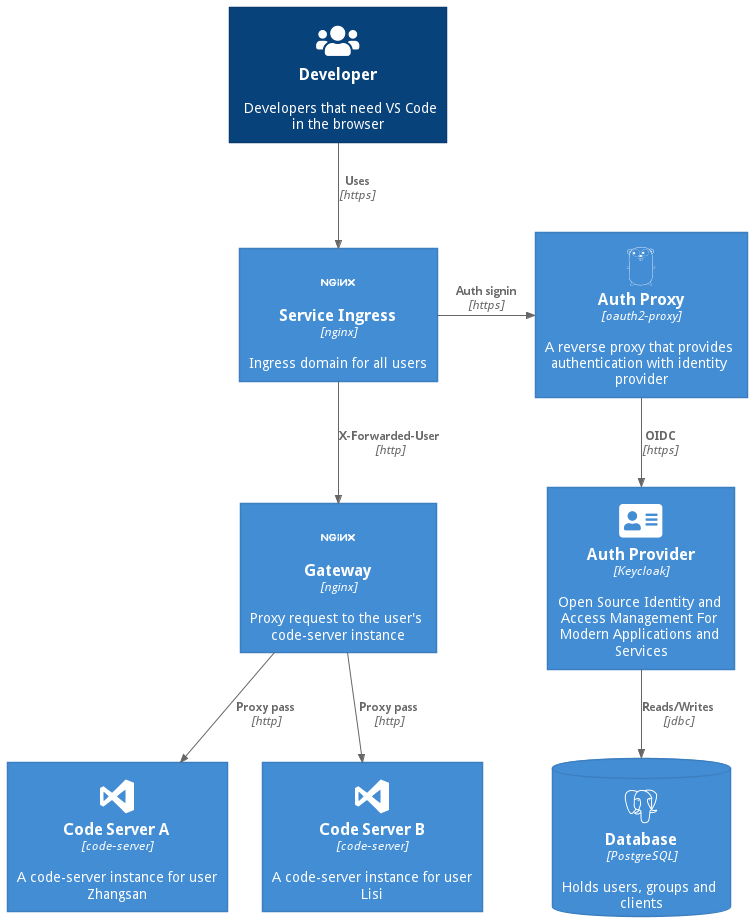

为 VS Code Web 版 [code-server][] 增加外部认证，并支持多用户，不同用户的 code-server 实例完全隔离。

主要为了解决问题：

1. code-server 本身只支持配置文件形式的用户名密码认证（截止目前，以后也许会改进）。所以引入了外部认证系统，Google、GitHub、 okta、CAS、Keycloak 等理论上都是支持的。

2. code-server 默认没有数据隔离，所以又加了一层 auth proxy，为每个用户创建一个（或多个）code-server 实例，通过 proxy 代理到各自的实例，以实现用户间的数据隔离。

3. 使用开源 Auth Proxy，无需自己编码即可实现认证授权流程，比如 `code flow with pkce` 对大部分人来说读懂这个协议都很困难。

此文档源码请参考：[architecture-diagram](https://github.com/xlabs-club/architecture-diagram)

## 使用组件

- [keycloak][]

  Redhat 开源 IAM 系统，目前也是 CNCF 项目，提供用户、组织服务，提供标准 OIDC。

- [oauth2-proxy][]

  认证代理，配合 keycloak 提供完整 OAuth2 Code Flow 认证流程。也可以试试 [pomerium][]，看样子也不错。

架构图如下。



## 核心逻辑

架构图简单解读，所有过程官方文档都有详细说明，都是配置，以官方配置为准。

1. keycloak 创建 client，使用 OIDC 协议，作为 oauth2-proxy 的 provider。
2. ingress(nginx) 使用 auth_request 指令拦截所有请求，从 oauth2-proxy 进行代理认证，配置可参考 [oauth2-proxy auth_request](https://oauth2-proxy.github.io/oauth2-proxy/docs/configuration/overview/#configuring-for-use-with-the-nginx-auth_request-directive) 指导。

   ```yaml
   nginx.ingress.kubernetes.io/auth-signin: https://$host/oauth2/start?rd=$escaped_request_uri
   nginx.ingress.kubernetes.io/auth-url: https://$host/oauth2/auth
   ```

3. 认证通过后，将用户名/ID 作为标识，通过 Http Header （举例如 X-Forwarded-Preferred-Username) 传入 upstream。
4. gateway(nginx) 从 Header 中获取用户标识，代理到此用户对应的 code-server 实例。

   ```nginx
     location / {
       ……
       proxy_pass http://code-server-$http_x_forwarded_for_preferred_username;
     }
   ```

5. code-server 各个实例部署时，以免认证方式部署。
6. 每个 code-server 实例挂载不同的存储，实现完全隔离。

[code-server]: https://github.com/coder/code-server
[keycloak]: https://github.com/keycloak/keycloak
[oauth2-proxy]: https://github.com/oauth2-proxy/oauth2-proxy
[pomerium]: https://github.com/pomerium/pomerium
