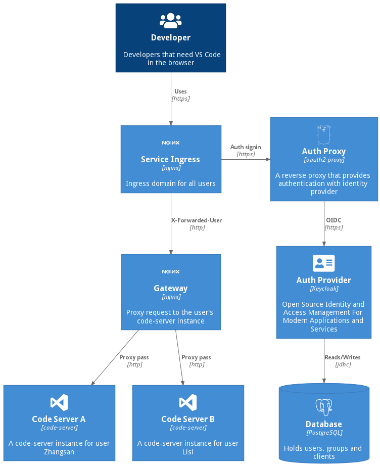

为 VS Code Web 版 [code-server][] 增加外部认证，并支持多用户，不同用户的 code-server 实例完全隔离。

主要为了解决问题：

1. code-server 本身只支持配置文件形式的用户名密码认证（截止目前，以后也许会改进）。所以引入了外部认证系统，Google、GitHub、 okta、CAS、Keycloak 等理论上都是支持的。

2. code-server 默认没有数据隔离，所以又加了一层 auth proxy，为每个用户创建一个（或多个）code-server 实例，通过 proxy 代理到各自的实例，以实现用户间的数据隔离。

3. 使用开源 Auth Proxy，无需自己编码即可实现认证授权流程，比如 `code flow with pkce` 对大部分人来说读懂这个协议都很困难。

此文档源码请参考：[architecture-diagram](https://github.com/xlabs-club/architecture-diagram)

## 使用组件

- [keycloak][]

  Redhat 开源 IAM 系统，目前也是 CNCF 项目，提供用户、组织服务，提供标准 OIDC。

- [oauth2-proxy][]

  认证代理，配合 keycloak 提供完整 OAuth2 Code Flow 认证流程。也可以试试 [pomerium][]，看样子也不错。

架构图如下。



## 核心逻辑

架构图简单解读，所有过程官方文档都有详细说明，都是配置，以官方配置为准。

1. keycloak 创建 client，使用 OIDC 协议，作为 oauth2-proxy 的 provider。
2. ingress(nginx) 使用 auth_request 指令拦截所有请求，从 oauth2-proxy 进行代理认证，配置可参考 [oauth2-proxy auth_request](https://oauth2-proxy.github.io/oauth2-proxy/docs/configuration/overview/#configuring-for-use-with-the-nginx-auth_request-directive) 指导。

   ```yaml
   nginx.ingress.kubernetes.io/auth-signin: https://$host/oauth2/start?rd=$escaped_request_uri
   nginx.ingress.kubernetes.io/auth-url: https://$host/oauth2/auth
   ```

3. 认证通过后，将用户名/ID 作为标识，通过 Http Header （举例如 X-Forwarded-Preferred-Username) 传入 upstream。
4. gateway(nginx) 从 Header 中获取用户标识，代理到此用户对应的 code-server 实例。

   ```nginx
     location / {
       ……
       proxy_pass http://code-server-$http_x_forwarded_for_preferred_username;
     }
   ```

5. code-server 各个实例部署时，以免认证方式部署。
6. 每个 code-server 实例挂载不同的存储，实现完全隔离。

## 完整部署示例

### Docker Compose 快速启动

以下配置为单一用户的 code-server 实例，多用户场景需按上面的代理方案动态路由。

```yaml
# docker-compose.yml
version: "3.8"
services:
  code-server:
    image: lscr.io/linuxserver/code-server:latest
    container_name: code-server
    environment:
      - PUID=1000
      - PGID=1000
      - TZ=Asia/Shanghai
      - PASSWORD=  # 留空表示免认证（网关负责认证）
      - SUDO_PASSWORD=password  # 可选，用于终端 sudo
      - DEFAULT_WORKSPACE=/config/workspace
    volumes:
      - ./code-server-config:/config
      - ./projects:/config/workspace
    ports:
      - "8443:8443"
    restart: unless-stopped
```

### K8S 部署

```yaml
# code-server-user1.yaml
apiVersion: apps/v1
kind: Deployment
metadata:
  name: code-server-user1
  labels:
    app: code-server
    user: user1
spec:
  replicas: 1
  selector:
    matchLabels:
      app: code-server
      user: user1
  template:
    metadata:
      labels:
        app: code-server
        user: user1
    spec:
      containers:
        - name: code-server
          image: lscr.io/linuxserver/code-server:latest
          env:
            - name: PUID
              value: "1000"
            - name: PGID
              value: "1000"
            - name: PASSWORD
              value: ""  # 免认证
          ports:
            - containerPort: 8443
          volumeMounts:
            - name: workspace
              mountPath: /config/workspace
      volumes:
        - name: workspace
          persistentVolumeClaim:
            claimName: code-server-user1-pvc
---
apiVersion: v1
kind: PersistentVolumeClaim
metadata:
  name: code-server-user1-pvc
spec:
  accessModes:
    - ReadWriteOnce
  resources:
    requests:
      storage: 50Gi
---
apiVersion: v1
kind: Service
metadata:
  name: code-server-user1
spec:
  selector:
    app: code-server
    user: user1
  ports:
    - port: 8443
      targetPort: 8443
```

### Traefik IngressRoute 替代 Nginx

如果使用 Traefik 作为网关，可以用 Traefik 的 ForwardAuth 中间件代替 nginx `auth_request`：

```yaml
apiVersion: traefik.io/v1alpha1
kind: Middleware
metadata:
  name: oauth2-proxy-auth
spec:
  forwardAuth:
    address: http://oauth2-proxy.oauth2-proxy.svc.cluster.local:4180/oauth2/auth
    trustForwardHeader: true
    authResponseHeaders:
      - X-Forwarded-Preferred-Username
      - X-Forwarded-User
      - X-Forwarded-Email
---
apiVersion: traefik.io/v1alpha1
kind: IngressRoute
metadata:
  name: code-server
spec:
  entryPoints:
    - websecure
  routes:
    - kind: Rule
      match: Host(`code.example.com`)
      middlewares:
        - name: oauth2-proxy-auth
      services:
        - name: code-server-user1
          port: 8443
```

### oauth2-proxy 配置

```yaml
# oauth2-proxy 的 Helm values
config:
  clientID: "code-server"
  clientSecret: "<keycloak-client-secret>"
  cookieSecret: "<random-32-byte-base64>"
  configFile: |
    provider = "keycloak-oidc"
    oidc_issuer_url = "https://keycloak.example.com/realms/your-realm"
    redirect_url = "https://code.example.com/oauth2/callback"
    scope = "openid email profile"
    email_domains = ["*"]
    pass_authorization_header = true
    pass_access_token = true
    set_authorization_header = true
    pass_user_headers = true
    set_xauthrequest = true
    upstreams = ["file:///dev/null"]
    reverse_proxy = true
    cookie_domains = [".example.com"]
```

核心参数说明：
- `pass_user_headers = true` — 将用户信息通过 Header 传给 upstream，这是网关能获取用户名的前提
- `pass_access_token = true` — 将 Access Token 传递到后端，code-server 可感知当前用户
- `scope = "openid email profile"` — 获取用户基本信息和邮箱

## 多用户动态路由的简化方案

如果用户不多，可以手动为每个用户创建独立的 Deployment/Service。若用户增长到需要自动化，可通过 Operator 方式实现：监听用户创建事件，自动 Provision code-server 实例和 PVC。

也可使用 [cdr/code-server](https://github.com/cdr/code-server) 官方支持的 Helm Chart，结合 Kubernetes Namespace 隔离用户。

## 注意事项

1. code-server 的 `--auth=none` 模式下，任何人能拿到 Pod IP 都可以直接访问。确保 Pod 网络策略仅允许网关访问。
2. 建议为每个用户的 PVC 设置合理的存储上限，避免某个用户占满节点磁盘。
3. code-server 默认以 root 运行容器的环境，`/var/run/docker.sock` 一旦挂载容器就有了 root 权限，小心使用。
4. 定期备份用户的 `/config/workspace` 目录，尤其是用户的 Settings 和已安装插件信息。

[code-server]: https://github.com/coder/code-server
[keycloak]: https://github.com/keycloak/keycloak
[oauth2-proxy]: https://github.com/oauth2-proxy/oauth2-proxy
[pomerium]: https://github.com/pomerium/pomerium
