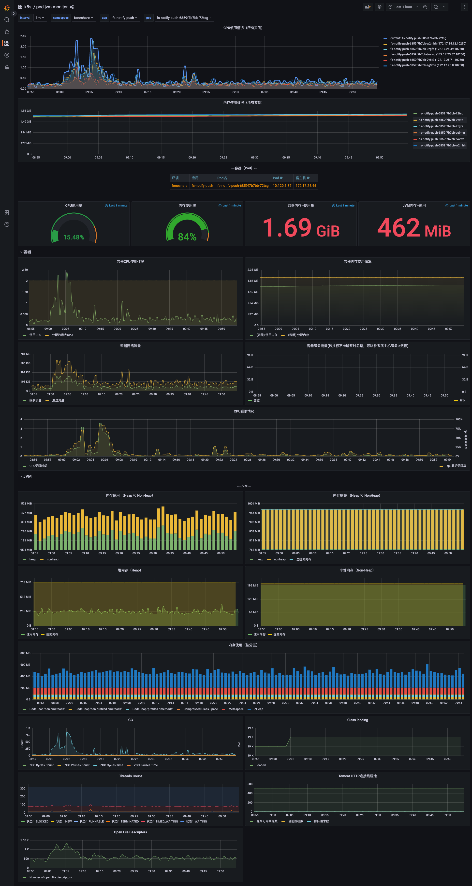
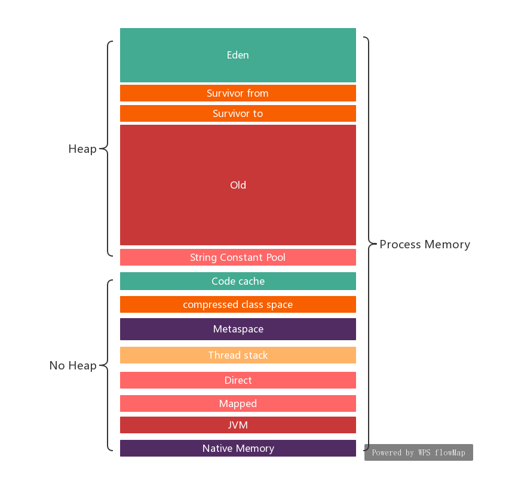
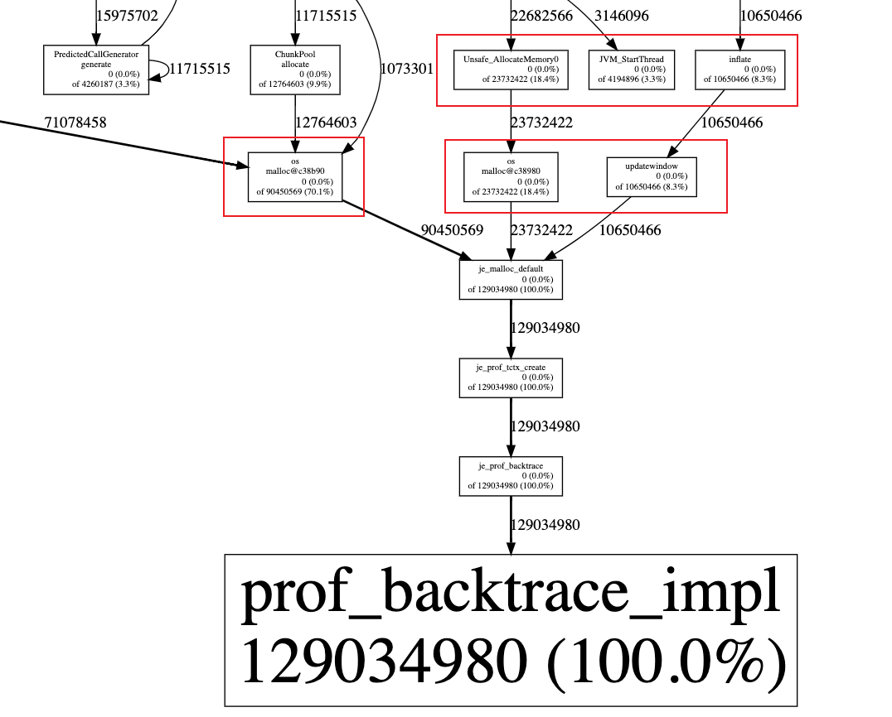
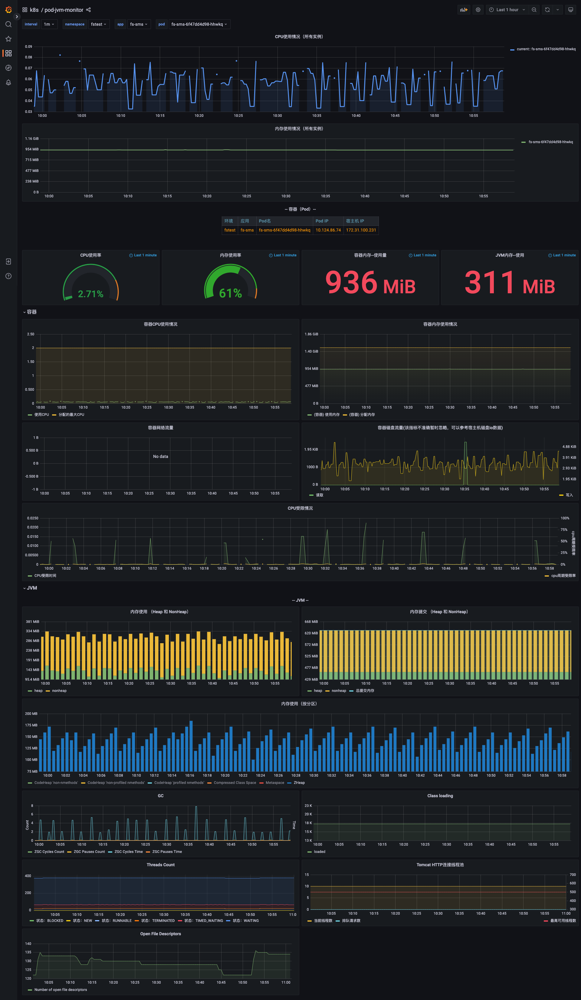
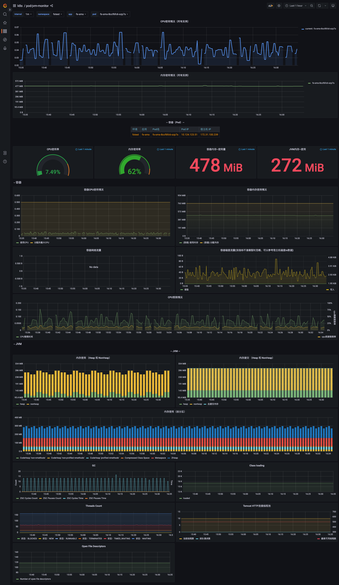
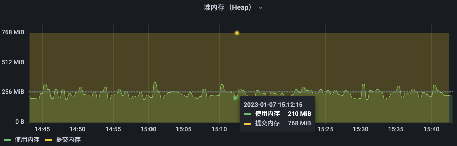
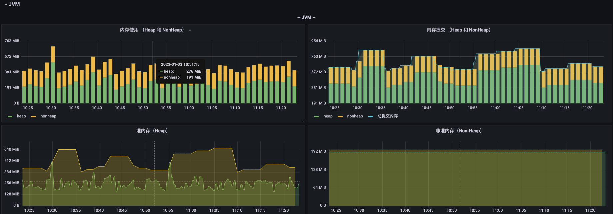

故事背景：

一个 K8S Pod，里面只有一个 Java 进程，K8S request 和 limit memory 都是 2G，Java 进程核心参数包括：`-XX:+UseZGC -Xmx1024m -Xms768m -XX:SoftMaxHeapSize=512m`。

服务启动一段时间后，查看 Grafana 监控数据，Pod 内存使用量约 1.5G，JVM 内存使用量约 500M，通过 jvm dump 分析没有任何大对象，运行三五天后出现 ContainerOOM。

首先区分下 ContainerOOM 和 JvmOOM，ContainerOOM 是 Pod 内存不够，Java 向操作系统申请内存时内存不足导致。

问题来了：

1. Pod 2G 内存，JVM 设置了 `Xmx 1G`，已经预留了 1G 内存，为什么还会 ContainerOOM，这预留的 1G 内存被谁吃了。
2. 正常情况下（无 ContainerOOM），Grafana 看到的监控数据，Pod 内存使用量 1.5G， JVM 内存使用量 500M，差别为什么这么大。
3. Grafana 看到的监控数据，内存使用量、提交量各是什么意思，这些值是怎么算出来的，和 Pod 进程中如何对应，为什么提交量一直居高不小。

Grafana 监控图。

[](./grafana-pod-jvm.png)

## 统计指标

`Pod 内存使用量`统计的指标是 `container_memory_working_set_bytes`：

- container_memory_usage_bytes = container_memory_rss + container_memory_cache + kernel memory
- container_memory_working_set_bytes = container_memory_usage_bytes - total_inactive_file（未激活的匿名缓存页）

container_memory_working_set_bytes 是容器真实使用的内存量，也是资源限制 limit 时的 OOM 判断依据。

另外注意 cgroup 版本差异： `container_memory_cache` reflects `cache (cgroup v1)` or `file (cgroup v2)` entry in memory.stat.

`JVM 内存使用量`统计的指标是 `jvm_memory_bytes_used`： heap、non-heap 以及`其他` 真实用量总和。下面解释其他。

对比一下 top 命令，使用 top 命令看一下 Java 进程真正占了多少。

```console

top -p $(pgrep java)

# 注意下面的数据和截图不是同一时间的

   PID USER      PR  NI    VIRT    RES    SHR S  %CPU %MEM     TIME+ COMMAND
     7 root      20   0   58.2g   1.6g   1.0g S  17.3  2.3 659:42.46 java

```

VIRT：virtual memory usage 虚拟内存

1. 进程“需要的”虚拟内存大小，包括进程使用的库、代码、数据等
2. 假如进程申请 100m 的内存，但实际只使用了 10m，那么它会增长 100m，而不是实际的使用量

RES：resident memory usage 常驻内存

1. 进程当前使用的内存大小，但不包括被换出到交换区的部分
2. 包含其他进程的共享
3. 如果申请 100m 的内存，实际使用 10m，它只增长 10m，与 VIRT 相反
4. 关于库占用内存的情况，它只统计加载的库文件所占内存大小

SHR：shared memory 共享内存

1. 除了自身进程的共享内存，也包括其他进程的共享内存
2. 虽然进程只使用了几个共享库的函数，但它包含了整个共享库的大小
3. 计算某个进程所占的物理内存大小公式：RES – SHR。（JVM 的内存使用量等于 RES-SHR）

container_memory_working_set_bytes 与 Top RES 相等吗。

为什么 container_memory_working_set_bytes 大于 top RES:

因为 container_memory_working_set_bytes 包含 container_memory_cache，这涉及到 `Linux 缓存机制`，延伸阅读：<https://zhuanlan.zhihu.com/p/449630026>。遇到这种场景一般都是文件操作较多，可优先排除文件类操作。

为什么 container_memory_working_set_bytes 小于 top RES:

主要还是算法和数据来源不一样，top 的 `RES=Code + Data`，有些服务 Data 比较大。 当然实际测试会发现 RES!=Code + Data ，延伸阅读：<https://liam.page/2020/07/17/memory-stat-in-TOP/>

另外可能看到的现象，top、granfana、docker stats、JMX 看到的使用量怎么都不一样，都是因为他们统计的维度不一样。

所以通过 top 命令看到的数据不一定是真实的，container_memory_working_set_bytes 指标来自 cadvisor，cadvisor 数据来源 cgroup，可以查看以下文件获取真实的内存情况。

```console
# 老版本使用 cgroup v1
ll /sys/fs/cgroup/memory/
total 0
drwxr-xr-x.  2 root root   0 Dec 24 19:22 ./
dr-xr-xr-x. 13 root root 340 Dec 24 19:22 ../
-rw-r--r--.  1 root root   0 Dec 24 19:22 cgroup.clone_children
--w--w--w-.  1 root root   0 Dec 24 19:22 cgroup.event_control
-rw-r--r--.  1 root root   0 Dec 24 19:22 cgroup.procs
-rw-r--r--.  1 root root   0 Dec 24 19:22 memory.failcnt
--w-------.  1 root root   0 Dec 24 19:22 memory.force_empty
-rw-r--r--.  1 root root   0 Dec 24 19:22 memory.kmem.failcnt
-rw-r--r--.  1 root root   0 Dec 24 19:22 memory.kmem.limit_in_bytes
-rw-r--r--.  1 root root   0 Dec 24 19:22 memory.kmem.max_usage_in_bytes
-r--r--r--.  1 root root   0 Dec 24 19:22 memory.kmem.slabinfo
-rw-r--r--.  1 root root   0 Dec 24 19:22 memory.kmem.tcp.failcnt
-rw-r--r--.  1 root root   0 Dec 24 19:22 memory.kmem.tcp.limit_in_bytes
-rw-r--r--.  1 root root   0 Dec 24 19:22 memory.kmem.tcp.max_usage_in_bytes
-r--r--r--.  1 root root   0 Dec 24 19:22 memory.kmem.tcp.usage_in_bytes
-r--r--r--.  1 root root   0 Dec 24 19:22 memory.kmem.usage_in_bytes
-rw-r--r--.  1 root root   0 Dec 24 19:22 memory.limit_in_bytes
-rw-r--r--.  1 root root   0 Dec 24 19:22 memory.max_usage_in_bytes
-rw-r--r--.  1 root root   0 Dec 24 19:22 memory.memsw.failcnt
-rw-r--r--.  1 root root   0 Dec 24 19:22 memory.memsw.limit_in_bytes
-rw-r--r--.  1 root root   0 Dec 24 19:22 memory.memsw.max_usage_in_bytes
-r--r--r--.  1 root root   0 Dec 24 19:22 memory.memsw.usage_in_bytes
-rw-r--r--.  1 root root   0 Dec 24 19:22 memory.move_charge_at_immigrate
-r--r--r--.  1 root root   0 Dec 24 19:22 memory.numa_stat
-rw-r--r--.  1 root root   0 Dec 24 19:22 memory.oom_control
----------.  1 root root   0 Dec 24 19:22 memory.pressure_level
-rw-r--r--.  1 root root   0 Dec 24 19:22 memory.soft_limit_in_bytes
-r--r--r--.  1 root root   0 Dec 24 19:22 memory.stat
-rw-r--r--.  1 root root   0 Dec 24 19:22 memory.swappiness
-r--r--r--.  1 root root   0 Dec 24 19:22 memory.usage_in_bytes
-rw-r--r--.  1 root root   0 Dec 24 19:22 memory.use_hierarchy
-rw-r--r--.  1 root root   0 Dec 24 19:22 notify_on_release
-rw-r--r--.  1 root root   0 Dec 24 19:22 tasks

# 新版本使用 cgroup v2

ll /sys/fs/cgroup/memory.*
-r--r--r-- 1 root root 0 Jan  6 16:25 /sys/fs/cgroup/memory.current
-r--r--r-- 1 root root 0 Jan  6 16:25 /sys/fs/cgroup/memory.events
-r--r--r-- 1 root root 0 Jan  6 16:25 /sys/fs/cgroup/memory.events.local
-rw-r--r-- 1 root root 0 Jan  7 11:50 /sys/fs/cgroup/memory.high
-rw-r--r-- 1 root root 0 Jan  7 11:50 /sys/fs/cgroup/memory.low
-rw-r--r-- 1 root root 0 Jan  7 11:50 /sys/fs/cgroup/memory.max
-rw-r--r-- 1 root root 0 Jan  6 16:25 /sys/fs/cgroup/memory.min
-r--r--r-- 1 root root 0 Jan  6 16:25 /sys/fs/cgroup/memory.numa_stat
-rw-r--r-- 1 root root 0 Jan  7 11:50 /sys/fs/cgroup/memory.oom.group
-rw-r--r-- 1 root root 0 Jan  6 16:25 /sys/fs/cgroup/memory.pressure
-r--r--r-- 1 root root 0 Jan  6 16:25 /sys/fs/cgroup/memory.stat
-r--r--r-- 1 root root 0 Jan  6 16:25 /sys/fs/cgroup/memory.swap.current
-r--r--r-- 1 root root 0 Jan  6 16:25 /sys/fs/cgroup/memory.swap.events
-rw-r--r-- 1 root root 0 Jan  6 16:25 /sys/fs/cgroup/memory.swap.high
-rw-r--r-- 1 root root 0 Jan  6 16:25 /sys/fs/cgroup/memory.swap.max
```

JVM 关于使用量和提交量的解释。

`Used Size`：The used space is the amount of memory that is currently occupied by Java objects.
当前实际真的用着的内存，每个 bit 都对应了有值的。

`Committed Size`：The committed size is the amount of memory guaranteed to be available for use by the Java virtual machine.  
操作系统向 JVM 保证可用的内存大小，或者说 JVM 向操作系统已经要的内存。站在操作系统的角度，就是已经分出去（占用）的内存，保证给 JVM 用了，其他进程不能用了。 由于操作系统的内存管理是惰性的，对于已申请的内存虽然会分配地址空间，但并不会直接占用物理内存，真正使用的时候才会映射到实际的物理内存，所以 committed > res 也是很可能的。

## Java 进程内存分析

Pod 的内存使用量 1.5G，都包含哪些。

kernel memory 为 0，Cache 约 1100M，rss 约 650M，inactive_file 约 200M。可以看到 Cache 比较大，因为这个服务比较特殊有很多文件操作。

```console
# 这个数据和上面的 1.5G 不是同时的。
cat  /sys/fs/cgroup/memory/memory.stat

cache 1455861760
rss 685862912
rss_huge 337641472
mapped_file 504979456
swap 0
inactive_anon 805306368
active_anon 685817856
inactive_file 299671552
active_file 350883840
total_rss 685862912
total_rss_huge 337641472
total_mapped_file 504979456
total_inactive_file 299671552
total_active_file 350883840

# cgroup v2 变量变了
cat /sys/fs/cgroup/memory.stat
anon 846118912
file 2321530880
kernel_stack 10895360
pagetables 15523840
percpu 0
sock 1212416
shmem 1933574144
file_mapped 1870290944
file_dirty 12288
file_writeback 0
swapcached 0
anon_thp 0
file_thp 0
shmem_thp 0
inactive_anon 2602876928
active_anon 176771072
inactive_file 188608512
active_file 199348224
unevictable 0
slab_reclaimable 11839688
slab_unreclaimable 7409400
slab 19249088
workingset_refault_anon 0
workingset_refault_file 318
workingset_activate_anon 0
workingset_activate_file 95
workingset_restore_anon 0
workingset_restore_file 0
workingset_nodereclaim 0
pgfault 2563565
pgmajfault 15
pgrefill 14672
pgscan 25468
pgsteal 25468
pgactivate 106436
pgdeactivate 14672
pglazyfree 0
pglazyfreed 0
thp_fault_alloc 0
thp_collapse_alloc 0

```

通过 Java 自带的 Native Memory Tracking 看下内存提交量。

```bash
# Java 启动时先打开 NativeMemoryTracking，默认是关闭的。注意不要在生产环境长期开启，有性能损失
java -XX:NativeMemoryTracking=detail -jar
# 查看详情
jcmd $(pgrep java) VM.native_memory detail scale=MB

```

通过 Native Memory Tracking 追踪到的详情大致如下，关注其中每一项 `committed` 值。

```console

Native Memory Tracking:

(Omitting categories weighting less than 1MB)

Total: reserved=68975MB, committed=1040MB
-                 Java Heap (reserved=58944MB, committed=646MB)
                            (mmap: reserved=58944MB, committed=646MB)

-                     Class (reserved=1027MB, committed=15MB)
                            (classes #19551)  #加载类的个数
                            (  instance classes #18354, array classes #1197)
                            (malloc=3MB #63653)
                            (mmap: reserved=1024MB, committed=12MB)
                            (  Metadata:   )
                            (    reserved=96MB, committed=94MB)
                            (    used=93MB)
                            (    waste=0MB =0.40%)
                            (  Class space:)
                            (    reserved=1024MB, committed=12MB)
                            (    used=11MB)
                            (    waste=1MB =4.63%)

-                    Thread (reserved=337MB, committed=37MB)
                            (thread #335) #线程的个数
                            (stack: reserved=336MB, committed=36MB)
                            (malloc=1MB #2018)

-                      Code (reserved=248MB, committed=86MB)
                            (malloc=6MB #24750)
                            (mmap: reserved=242MB, committed=80MB)

-                        GC (reserved=8243MB, committed=83MB)
                            (malloc=19MB #45814)
                            (mmap: reserved=8224MB, committed=64MB)

-                  Compiler (reserved=3MB, committed=3MB)
                            (malloc=3MB #2212)

-                  Internal (reserved=7MB, committed=7MB)
                            (malloc=7MB #31683)

-                     Other (reserved=18MB, committed=18MB)
                            (malloc=18MB #663)

-                    Symbol (reserved=19MB, committed=19MB)
                            (malloc=17MB #502325)
                            (arena=2MB #1)

-    Native Memory Tracking (reserved=12MB, committed=12MB)
                            (malloc=1MB #8073)
                            (tracking overhead=11MB)

-        Shared class space (reserved=12MB, committed=12MB)
                            (mmap: reserved=12MB, committed=12MB)

-                    Module (reserved=1MB, committed=1MB)
                            (malloc=1MB #4996)

-           Synchronization (reserved=1MB, committed=1MB)
                            (malloc=1MB #2482)

-                 Metaspace (reserved=97MB, committed=94MB)
                            (malloc=1MB #662)
                            (mmap: reserved=96MB, committed=94MB)

-           Object Monitors (reserved=8MB, committed=8MB)
                            (malloc=8MB #39137)

```

一图解千愁，盗图。

[](./jvm-memory-structure.png)

- Heap
  Heap 是 Java 进程中使用量最大的一部分内存，是最常遇到内存问题的部分，Java 也提供了很多相关工具来排查堆内存泄露问题，这里不详细展开。Heap 与 RSS 相关的几个重要 JVM 参数如下：
  Xms：Java Heap 初始内存大小。（目前我们用的百分比控制，MaxRAMPercentage)
  Xmx：Java Heap 的最大大小。(InitialRAMPercentage)
  XX:+UseAdaptiveSizePolicy：是否开启自适应大小策略。开启后，JVM 将动态判断是否调整 Heap size，来降低系统负载。

- Metaspace
  Metaspace 主要包含方法的字节码，Class 对象，常量池。一般来说，记载的类越多，Metaspace 使用的内存越多。与 Metaspace 相关的 JVM 参数有：
  XX:MaxMetaspaceSize: 最大的 Metaspace 大小限制【默认无限制】
  XX:MetaspaceSize=64M: 初始的 Metaspace 大小。如果 Metaspace 空间不足，将会触发 Full GC。
  类空间占用评估，给两个数字可供参考：10K 个类约 90M，15K 个类约 100M。
  什么时候回收：分配给一个类的空间，是归属于这个类的类加载器的，只有当这个类加载器卸载的时候，这个空间才会被释放。释放 Metaspace 的空间，并不意味着将这部分空间还给系统内存，这部分空间通常会被 JVM 保留下来。
  扩展：参考资料中的`Java Metaspace 详解`，这里完美解释 Metaspace、Compressed Class Space 等。

- Thread
  NMT 中显示的 Thread 部分内存与线程数与 -Xss 参数成正比，一般来说 committed 内存等于 `Xss *线程数` 。

- Code
  JIT 动态编译产生的 Code 占用的内存。这部分内存主要由-XX:ReservedCodeCacheSize 参数进行控制。

- Internal
  Internal 包含命令行解析器使用的内存、JVMTI、PerfData 以及 Unsafe 分配的内存等等。
  需要注意的是，Unsafe_AllocateMemory 分配的内存在 JDK11 之前，在 NMT 中都属于 Internal，但是在 JDK11 之后被 NMT 归属到 Other 中。

- Symbol
  Symbol 为 JVM 中的符号表所使用的内存，HotSpot 中符号表主要有两种：SymbolTable 与 StringTable。
  大家都知道 Java 的类在编译之后会生成 Constant pool 常量池，常量池中会有很多的字符串常量，HotSpot 出于节省内存的考虑，往往会将这些字符串常量作为一个 Symbol 对象存入一个 HashTable 的表结构中即 SymbolTable，如果该字符串可以在 SymbolTable 中 lookup（SymbolTable::lookup）到，那么就会重用该字符串，如果找不到才会创建新的 Symbol（SymbolTable::new_symbol）。
  当然除了 SymbolTable，还有它的双胞胎兄弟 StringTable（StringTable 结构与 SymbolTable 基本是一致的，都是 HashTable 的结构），即我们常说的字符串常量池。平时做业务开发和 StringTable 打交道会更多一些，HotSpot 也是基于节省内存的考虑为我们提供了 StringTable，我们可以通过 String.intern 的方式将字符串放入 StringTable 中来重用字符串。

- Native Memory Tracking
  Native Memory Tracking 使用的内存就是 JVM 进程开启 NMT 功能后，NMT 功能自身所申请的内存。

观察上面几个区域的分配，没有明显的异常。

NMT 追踪到的 是 Committed，不一定是 Used，NMT 和 cadvisor 没有找到必然的对应的关系。可以参考 RSS，cadvisor 追踪到 RSS 是 650M，JVM Used 是 500M，还有大约 150M 浮动到哪里去了。

因为 NMT 只能 Track JVM 自身的内存分配情况，比如：Heap 内存分配，direct byte buffer 等。无法追踪的情况主要包括：

- 使用 JNI 调用的一些第三方 native code 申请的内存，比如使用 System.Loadlibrary 加载的一些库。
- 标准的 Java Class Library，典型的，如文件流等相关操作（如：Files.list、ZipInputStream 和 DirectoryStream 等）。主要涉及到的调用是 Unsafe.allocateMemory 和 java.util.zip.Inflater.init(Native Method)。

怎么追踪 NMT 追踪不到的`其他内存`，目前是安装了 jemalloc 内存分析工具，他能追踪底层内存的分配情况输出报告。

通过 jemalloc 内存分析工具佐证了上面的结论，Unsafe.allocateMemory 和 java.util.zip.Inflater.init 占了 30%，基本吻合。

[](./jemalloc-jvm.png)

启动 arthas 查看下类调用栈，在 arthas 里执行以下命令：

```bash
# 先设置 unsafe true
options unsafe true
# 这个没有
stack sun.misc.Unsafe allocateMemory
# 这个有
stack jdk.internal.misc.Unsafe allocateMemory
stack java.util.zip.Inflater inflate

```

通过上面的命令，能看到 MongoDB 和 netty 一直在申请使用内存。注意：早期的 mongodb client 确实有无法释放内存的 bug，但是在我们场景，长期观察会发现内存申请了逐渐释放了，没有持续增长。回到开头的 ContainerOOM 问题，可能一个原因是流量突增，MongoDB 申请了更多的内存导致 OOM，而不是因为内存不释放。

```console
ts=2022-12-29 21:20:01;thread_name=ForkJoinPool.commonPool-worker-1;id=22;is_daemon=true;priority=1;TCCL=jdk.internal.loader.ClassLoaders$AppClassLoader@1d44bcfa
    @jdk.internal.misc.Unsafe.allocateMemory()
        at java.nio.DirectByteBuffer.<init>(DirectByteBuffer.java:125)
        at java.nio.ByteBuffer.allocateDirect(ByteBuffer.java:332)
        at sun.nio.ch.Util.getTemporaryDirectBuffer(Util.java:243)
        at sun.nio.ch.NioSocketImpl.tryWrite(NioSocketImpl.java:394)
        at sun.nio.ch.NioSocketImpl.implWrite(NioSocketImpl.java:413)
        at sun.nio.ch.NioSocketImpl.write(NioSocketImpl.java:440)
        at sun.nio.ch.NioSocketImpl$2.write(NioSocketImpl.java:826)
        at java.net.Socket$SocketOutputStream.write(Socket.java:1035)
        at com.mongodb.internal.connection.SocketStream.write(SocketStream.java:99)
        at com.mongodb.internal.connection.InternalStreamConnection.sendMessage(InternalStreamConnection.java:426)
        at com.mongodb.internal.connection.UsageTrackingInternalConnection.sendAndReceive(UsageTrackingInternalConnection.java:99)
        at com.mongodb.internal.connection.DefaultConnectionPool$PooledConnection.sendAndReceive(DefaultConnectionPool.java:444)
        ………………………………
        at com.mongodb.MongoClientExt$1.execute(MongoClientExt.java:42)
        at com.facishare.oms.thirdpush.dao.MongoDao.save(MongoDao.java:31)
        ………………………………
```

总结 Java 进程内存占用：Total=heap + non-heap + 上面说的这个其他。

## jemalloc

jemalloc 是一个比 glibc malloc 更高效的内存池技术，在 Facebook 公司被大量使用，在 FreeBSD 和 FireFox 项目中使用了 jemalloc 作为默认的内存管理器。使用 jemalloc 可以使程序的内存管理性能提升，减少内存碎片。

比如 Redis 内存分配默认使用的 jemalloc，早期版本安装 redis 是需要手动安装 jemalloc 的，现在 redis 应该是在编译期内置好了。

原来使用 jemalloc 是为了分析内存占用，通过 jemalloc 输出当前内存分配情况，或者通过 diff 分析前后内存差，大概能看出内存都分给睡了，占了多少，是否有内存无法释放的情况。

后来参考了这个文章，把 glibc 换成 jemalloc 带来性能提升，降低内存使用，决定一试。

how we’ve reduced memory usage without changing any code：<https://blog.malt.engineering/java-in-k8s-how-weve-reduced-memory-usage-without-changing-any-code-cbef5d740ad>

Decreasing RAM Usage by 40% Using jemalloc with Python & Celery: <https://zapier.com/engineering/celery-python-jemalloc/>

一个服务，运行一周，观察效果。

使用 Jemalloc 之前：
[](./before-jemalloc.png)

使用 Jemalloc 之后（同时调低了 Pod 内存）：
[](./after-jemalloc.png)

注：以上结果未经生产长期检验。

## 内存交还给操作系统

注意：下面的操作，生产环境不建议这么干。

默认情况下，OpenJDK 不会主动向操作系统退还未用的内存（不严谨）。看第一张监控的图，会发现运行一段时间后，Pod 的内存使用量一直稳定在 80%--90%不再波动。

其实对于 Java 程序，浮动比较大的就是 heap 内存。其他区域 Code、Metaspace 基本稳定

```console
# 执行命令获取当前 heap 情况
jhsdb jmap --heap --pid $(pgrep java)
#以下为输出
Attaching to process ID 7, please wait...
Debugger attached successfully.
Server compiler detected.
JVM version is 17.0.5+8-LTS

using thread-local object allocation.
ZGC with 4 thread(s)

Heap Configuration:
   MinHeapFreeRatio         = 40
   MaxHeapFreeRatio         = 70
   MaxHeapSize              = 1287651328 (1228.0MB)
   NewSize                  = 1363144 (1.2999954223632812MB)
   MaxNewSize               = 17592186044415 MB
   OldSize                  = 5452592 (5.1999969482421875MB)
   NewRatio                 = 2
   SurvivorRatio            = 8
   MetaspaceSize            = 22020096 (21.0MB)
   CompressedClassSpaceSize = 1073741824 (1024.0MB)
   MaxMetaspaceSize         = 17592186044415 MB
   G1HeapRegionSize         = 0 (0.0MB)

Heap Usage:
 ZHeap          used 310M, capacity 710M, max capacity 1228M

```

Java 内存不交还，几种情况：

- Xms 大于实际需要的内存，比如我们服务设置了 Xms768M，但是实际上只需要 256，高峰期也就 512，到不了 Xms 的值也就无所谓归还。
  [](./java-heap-use.png)

- 上面 jmap 的结果，可以看到 Java 默认的配置 MaxHeapFreeRatio=70，这个 70% Free 几乎很难达到。（另外注意 Xmx==Xms 的情况下这两个参数无效，因为他怎么扩缩都不会突破 Xms 和 Xmx 的限制）

  ```console
    MinHeapFreeRatio         = 40
    空闲堆空间的最小百分比，计算公式为：HeapFreeRatio =(CurrentFreeHeapSize/CurrentTotalHeapSize) * 100，值的区间为 0 到 100，默认值为 40。如果 HeapFreeRatio < MinHeapFreeRatio，则需要进行堆扩容，扩容的时机应该在每次垃圾回收之后。

    MaxHeapFreeRatio         = 70
    空闲堆空间的最大百分比，计算公式为：HeapFreeRatio =(CurrentFreeHeapSize/CurrentTotalHeapSize) * 100，值的区间为 0 到 100，默认值为 70。如果 HeapFreeRatio > MaxHeapFreeRatio，则需要进行堆缩容，缩容的时机应该在每次垃圾回收之后。
  ```

对于 ZGC，默认是交还给操作系统的。可通过 `-XX:+ZUncommit -XX:ZUncommitDelay=300` 这两个参数控制（不再使用的内存最多延迟 300s 归还给 OS，线下环境可以改小点）。

经过调整后的服务，内存提交在 500--800M 之间浮动，不再是一条直线。

[](./memory-dance.png)

## 问题原因分析和调整

回到开头问题，通过上面分析，2G 内存，RSS 其实占用 600M，为什么最终还是 ContainerOOM 了。

1. kernel memory 为 0，排除 kernel 泄漏的原因。下面的参考资料里介绍了 kernel 泄露的两种场景。
2. Cache 很大，说明文件操作多。搜了一下代码，确实有很多 InputStream 调用没有显式关闭，而且有的 InputSteam Root 引用在 ThreadLocal 里，ThreadLocal 只 init 未 remove。 但是，ThreadLocal 的引用对象是线程池，池不回收，所以这部分可能会无法关闭，但是不会递增，但是 cache 也不能回收。
   优化办法：ThreadLocal 中对象是线程安全的，无数据传递，直接干掉 ThreadLocal；显式关闭 InputStream。运行一周发现 cache 大约比优化前低 200--500M。
   ThreadLocal 引起内存泄露是 Java 中很经典的一个场景，一定要特别注意。
3. 一般场景下，Java 程序都是堆内存占用高，但是这个服务堆内存其实在 200-500M 之间浮动，我们给他分了 768M，从来没有到过这个值，所以调低 Xms。留出更多内存给 JNI 使用。
4. 线下环境内存分配切换到 jemalloc，长期观察大部分效果可以，但是对部分应用基本没有效果。

经过上述调整以后，线下环境 Pod 内存使用量由 1G 降到 600M 作用。线上环境内存使用量在 50%--80%之间根据流量大小浮动，原来是 85% 居高不小。

## 参考资料

Java 进程内存分布：<https://cloud.tencent.com/developer/article/1666640>

Java Metaspace 详解：<https://www.javadoop.com/post/metaspace>

how we’ve reduced memory usage without changing any code：<https://blog.malt.engineering/java-in-k8s-how-weve-reduced-memory-usage-without-changing-any-code-cbef5d740ad>

Spring Boot 引起的堆外内存泄漏排查及经验总结：<https://tech.meituan.com/2019/01/03/spring-boot-native-memory-leak.html>

Pod 进程内存缓存分析：<https://zhuanlan.zhihu.com/p/449630026>

Linux 内存中的 Cache 真的能被回收么：<https://cloud.tencent.com/developer/article/1115557>

Linux kernel memory 导致的 POD OOM killed: <https://www.cnblogs.com/yannwang/p/13287963.html>

cgroup 内存泄露问题：<https://www.cnblogs.com/leffss/p/15019898.html>
