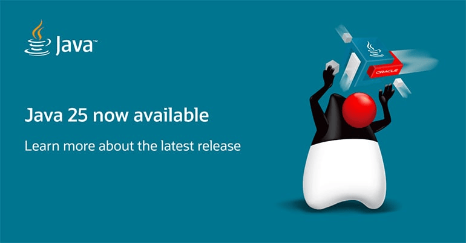
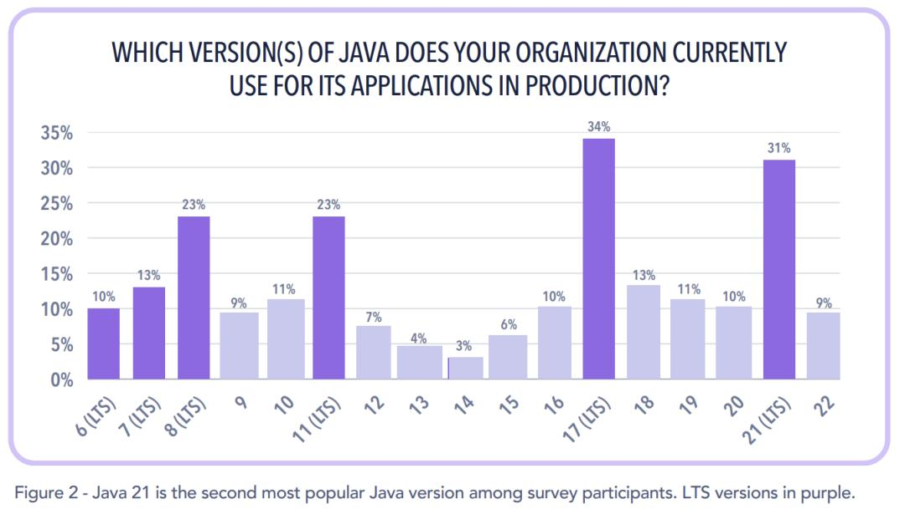
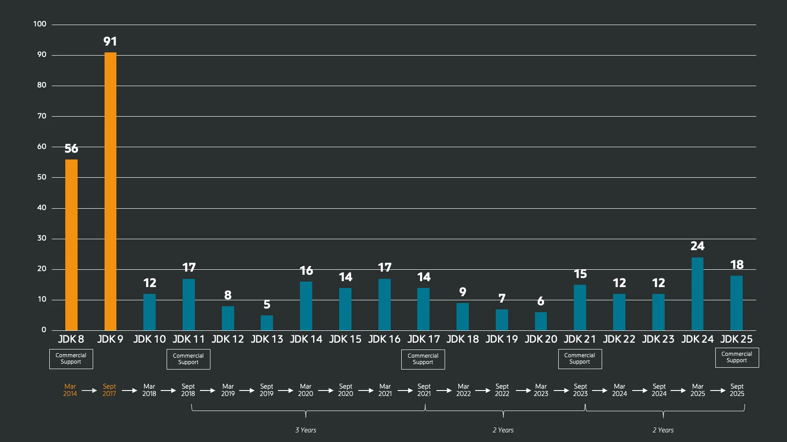

虽然 Java 界流行 **你发任你发，我用 Java 8**。但根据 Azul 组织发布的 [2025 Java 最新使用报告](https://www.azul.com/newsroom/azul-2025-state-of-java-survey-report/) 显示，Java 17 悄悄登上了使用率最高的宝座，Java 21 也紧随其后。
至于新发布的 Java 25， 能不能承担起 `Make Java Great Again` 的艰巨任务，还需要时间的考验，让子弹再飞一会。



今天我们将介绍下，从 Java 8 到 Java 25，有哪些新特性，有什么工具可协助升级，以及在升级过程中遇到的问题和解决办法。

## Java 25 核心特性速览

Java 25 作为 2025 年 3 月发布的最新版本，带来了多项重要特性，特别是在性能优化、开发体验和安全性方面有显著提升：

### Java 25 关键亮点

1. **紧凑对象头 (JEP 519)** - 生产就绪
   - 对象头从 12 字节压缩到 8 字节
   - 内存占用降低 3-5%, 最高可达 22%
   - CPU 使用最多减少 30%(Amazon 实测）
   - 仅需添加 JVM 参数 `-XX:+UseCompactObjectHeaders`, 无需修改代码
   - 特别适合微服务、Spring Boot、JSON 处理等小对象密集场景

2. **简化 main 方法 (JEP 463)** - 降低 Java 学习门槛
   - 支持无类声明的 `void main()` 方法
   - 无需 `public static` 修饰符
   - 适合初学者和脚本化场景

   ```java
   // Java 25 简化写法
   void main() {
       println("Hello, World!");
   }
   ```

3. **灵活构造函数体 (JEP 447)** - 增强代码安全性
   - 允许在 super()/this() 调用前执行参数校验
   - 避免提取静态方法的模板代码
   - 提升对象构建时的安全性

4. **基本类型模式匹配增强** - 扩展模式匹配能力
   - 支持 int、byte、char、boolean 等基本类型的模式匹配
   - 实现基本类型间的安全转换检查

5. **移除 32 位 x86 支持 (JEP 503)** - 专注 64 位优化
   - 简化代码库，专注现代 64 位架构优化
   - 更好地利用 SIMD 指令集
   - G1/ZGC 针对 64 位架构深度优化

6. **Java Flight Recorder 增强**
   - JEP 509: Linux 上高精度 CPU 采样
   - JEP 518: 改进采样机制
   - JEP 520: 方法级执行时间跟踪

### Java 25 vs 其他版本对比

| 特性维度 | Java 8 | Java 11  | Java 17 | Java 21  | Java 25 |
|---------|--------|---------------|---------------|---------------|---------|
| 发布时间 | 2014 | 2018 | 2021 | 2023 | 2025.9 |
| Lambda/Stream | ✅ | ✅ | ✅ | ✅ | ✅ |
| 模块化系统 | ❌ | ✅ | ✅ | ✅ | ✅ |
| Record 类型 | ❌ | ❌ | ✅（预览） | ✅ | ✅ |
| Switch 表达式 | ❌ | ❌ | ✅ | ✅ | ✅ |
| 文本块 | ❌ | ❌ | ✅ | ✅ | ✅ |
| 虚拟线程 | ❌ | ❌ | ❌ | ✅ | ✅（优化） |
| 向量 API | ❌ | ❌ | ❌（孵化） | ✅（孵化） | ✅（正式） |
| 紧凑对象头 | ❌ | ❌ | ❌ | ❌（预览） | ✅ |
| 简化 main | ❌ | ❌ | ❌ | ❌（预览） | ✅ |
| GC 选项 | Parallel/CMS | G1（默认） | G1/ZGC | G1/分代 ZGC | G1/ZGC（增强） |
| 启动性能 | 基准 | +10% | +15% | +20% | +25% |
| 内存效率 | 基准 | +5% | +10% | +15% | +20-25% |
| 安全管理器 | ✅ | ✅ | ⚠️废弃 | ⚠️废弃 | ❌永久禁用 |

### 为什么选择 Java 25

**如果你正在使用 Java 8/11:**

- 获得巨大的性能提升 (20-40% 吞吐量提升）
- 现代化的语法糖让代码更简洁
- 强大的 GC 能力 (G1/ZGC 分代优化）
- 虚拟线程让并发编程更简单

**如果你正在使用 Java 17/21:**

- 紧凑对象头带来免费的性能提升 (3-30%)
- 虚拟线程 + synchronized 问题已解决 (Java 24)
- 向量 API 正式发布，AI/科学计算性能大幅提升
- 更完善的 JFR 监控能力

**性能数据对比 （基于实际生产环境）:**

- 内存占用：Java 25 比 Java 21 减少 5-10%
- GC 停顿：使用紧凑对象头后 GC 频率降低 15%
- JSON 解析：Jackson 性能提升 10%
- 并发性能：虚拟线程优化后提升 20-30%

## Java 8 以来令人心动的特性

下图展示了自 Java 8 以来每个 Java 版本中的 JEP（JDK Enhancement Proposal，即 JDK 增强提案） 数量，下面将摘出几个比较令人心动且使用频率较高的特性进行介绍。



### 语法糖

语法糖特性让代码编写更加简洁优雅，提升开发体验。

- **集合 && Stream API 增强** - Java 8/9/12/16/21
  - Java 8 引入 Stream API，支持函数式数据处理
  - Java 9 新增 `dropWhile()`、`takeWhile()`、`iterate()` 增强、`ofNullable()`
  - Java 12 新增 `Collectors.teeing()` 方法
  - Java 16 新增 `Stream.toList()` 和 `mapMulti()` 方法
  - Java 21 顺序集合语法糖，比如 `List.getFirst()` 和 `List.getLast()` 方法，再也不用小心如何计算 index 了
  - 简洁的集合创建方式，创建不可变集合
  - 代码示例：

    ```java
    // 工厂方法简化，注意：这些集合是不可变的，调用修改方法会抛出异常
    List<String> list = List.of("a", "b", "c");
    Set<String> set = Set.of("x", "y", "z");
    Map<String, Integer> map = Map.of("key1", 1, "key2", 2);

    // Java 9 条件过滤
    List<Integer> numbers = List.of(1, 2, 3, 4, 5, 6);
    List<Integer> taken = numbers.stream()
        .takeWhile(n -> n < 4)  // [1, 2, 3]
        .toList();

    // Java 16+ 简化列表收集
    List<String> result = list.stream()
        .filter(s -> s.length() > 5)
        .toList();

    // Java 9 有限迭代
    Stream.iterate(1, n -> n < 100, n -> n * 2)
        .forEach(System.out::println); // 1, 2, 4, 8, 16, 32, 64

    // Java 16 一对多映射
    Stream.of(1, 2, 3)
        .mapMulti((number, consumer) -> {
            consumer.accept(number);
            consumer.accept(number * 2);
        })
        .forEach(System.out::println); // 1, 2, 2, 4, 3, 6

    // Java 21 List 新方法
    List<String> list = List.of("第一个", "第二个", "第三个", "最后一个");
    String first = list.getFirst();
    String last = list.getLast();
    ```

- **Objects 方法增强** - Java 9
  - 新增多个实用的对象操作方法，简化 null 检查和索引验证
  - 代码示例：

    ```java
    String inputName = null;
    List<String> list = List.of("a", "b", "c", "d", "e");

    // 空值处理
    String name1 = Objects.requireNonNullElse(inputName, "默认名称");
    String name2 = Objects.requireNonNullElseGet(inputName, () -> "动态生成名称");

    // toString 空值安全处理
    String toStringResult = Objects.toString(inputName, "nullDefault value");

    // 索引检查
    int index = Objects.checkIndex(3, list.size());  // 检查索引是否有效
    Objects.checkFromToIndex(1, 4, list.size());     // 检查范围 [1, 4)
    Objects.checkFromIndexSize(1, 3, list.size());   // 检查从索引 1 开始长度为 3 的范围

    ```

- **String 增强方法** - Java 11
  - 新增多个实用的字符串处理方法
  - 代码示例：

    ```java
    String text = "  Hello World  ";

    // 新增方法
    boolean isBlank = text.isBlank();        // 检查是否为空或只包含空白字符
    String stripped = text.strip();          // 去除首尾空白字符
    String repeated = text.repeat(3);        // 重复字符串
    Stream<String> lines = text.lines();     // 按行分割成流
    String indented = text.stripIndent();    // 去除缩进

    ```

- **文本块 && 字符串模板** - Java 15/21
  - 支持多行字符串字面量，无需转义字符
  - Java 21 预览特性：字符串模板（String Templates）支持 `STR.` 嵌入表达式
  - 代码示例：

    ```java
    // 基础文本块
    String json = """
        {
          "name": "张三",
          "age": 25
        }
        """;

    // Java 21 字符串模板（预览特性）
    String name = "张三";
    int age = 25;
    String json = STR."""
        {
          "name": "\{name}",
          "age": \{age}
        }
        """;
    ```

- **Record 类型（JEP 395）** - Java 16
  - 简洁的数据类定义，自动生成构造函数、访问器等
  - 代码示例：

    ```java
    public record Person(String name, int age) {}
    // 使用示例
    Person person = new Person("张三", 25);
    System.out.println(person.name());

    // 注意：fastjson 1.x 不支持序列化，此处输出 {}
    System.out.println(com.alibaba.fastjson.JSON.toJSONString(person));
    // fastjson 2.x 才支持序列化，此处输出 {"age":25,"name":"张三"}
    System.out.println(com.alibaba.fastjson2.JSON.toJSONString(person));
    ```

- **Switch 表达式（JEP 361）** - Java 14
  - Switch 可以作为表达式返回值，支持箭头语法，更加简洁，再也不用担心忘了 return 了
  - 代码示例：

    ```java
    DayOfWeek day = DayOfWeek.MONDAY;
    String result = switch(day) {
        case MONDAY -> "周一";
        case TUESDAY -> "周二";
        case WEDNESDAY -> "周三";
        default -> "其他";
    };
    System.out.println(result);
    ```

- **模式匹配（JEP 394, 433, 441）** - Java 16/17/21/25
  - 增强 instanceof 操作符，支持模式匹配，匹配后直接转换
  - Java 25 新增：支持基本类型（int、byte、char、boolean）的模式匹配
  - 代码示例：

    ```java
    Object obj = "Hello World";

    // Java 16+ 模式匹配
    if (obj instanceof String s && s.length() > 5) {
        System.out.println("长字符串：" + s.toUpperCase());
    }

    // Switch 模式匹配
    String result = switch(obj) {
        case String s when s.length() > 5 -> "长字符串：" + s;
        case String s -> "短字符串：" + s;
        case Integer i -> "数字：" + i;
        default -> "未知类型";
    };

    // Java 25 基本类型模式匹配，基本类型间的安全转换检查
    Object num = 42;
    if (num instanceof int i) {
        System.out.println("是 int 类型：" + i);
    }
    ```

- **简化 main 方法（JEP 463）** - Java 25
  - 支持无类声明的 void main() 方法，无需 public static 修饰符
  - 代码示例：

    ```java
    // 传统写法
    public class HelloWorld {
        public static void main(String[] args) {
            System.out.println("Hello, World!");
        }
    }

    // Java 25 简化写法
    void main() {
         IO.println("Hello, World!");
    }

    // 支持带参数的主方法
    void main(String[] args) {
        System.out.println("参数个数：" + args.length);
    }
    ```

- **直接运行 Java 文件（JEP 330、JEP 458）** - Java 11
  - 支持直接运行单个源文件，无需先编译
  - 支持 Shebang 脚本运行方式，启动多文件源代码程序，一个文件里定义多 classs
  - 代码示例：

    ```java
    // 方式一：直接运行 Java 文件
    // 创建文件 HelloWorld.java
    // 运行命令：java HelloWorld.java
    // 输出：Hello, World!
    public class HelloWorld {
        public static void main(String[] args) {
            System.out.println("Hello, World!");
        }
    }

    // 方式二：Shebang 脚本运行
    // 赋予执行权限：chmod +x hello
    // 直接运行：./hello
    // 输出：Hello from script!
    // 结合 Java 25 简化 main 方法
    #!/usr/bin/java --source 25
    void main() {
        System.out.println("简化的脚本入口！");
    }
    ```

- **灵活构造函数体（JEP 447）** - Java 25
  - 允许在 super() 或 this() 调用前执行初始化逻辑，如参数校验，提升代码可读性和灵活性，避免将校验逻辑提取到静态方法的模板代码，增强对象构建时的安全性。
  - 代码示例：

    ```java
    public class Person {
        private final String name;
        private final int age;

        // Java 25 灵活构造函数体
        public Person(String name, int age) {
            // 可以在 super() 调用前执行初始化逻辑
            if (name == null || name.trim().isEmpty()) {
                throw new IllegalArgumentException("姓名不能为空");
            }
            if (age < 0) {
                throw new IllegalArgumentException("年龄不能为负数");
            }

            // 现在可以调用 super() 或 this()
            this.name = name.trim();
            this.age = age;
        }

        // 调用其他构造函数前的参数校验
        public Person(String name) {
            if (name == null || name.trim().isEmpty()) {
                throw new IllegalArgumentException("姓名不能为空");
            }
            this(name, 0); // 调用上面的构造函数
        }
    }
    ```

### 性能优化

性能优化特性大幅提升了 Java 应用的运行效率，其中垃圾收集器的演进是最重要的改进之一。

#### G1 垃圾收集器演进

G1 自 Java 7 引入，Java 9 成为默认收集器，**持续进化的 G1** 仍是目前最全面最均衡的收集器。

核心特性：

- 分区管理：将堆内存划分为多个独立区域（Region），动态调整年轻代和老年代比例
- 并发标记：在应用线程运行的同时进行垃圾回收标记，减少停顿时间
- 可预测停顿时间：通过 `-XX:MaxGCPauseMillis` 参数控制最大停顿时间

Java 8 到 Java 25，**6 个专门针对 G1 的 JEP**， 主要改进：

- Java 9：成为默认垃圾收集器，优化了混合回收算法
- Java 10：并行 Full GC（JEP 307），提升 Full GC 性能
- Java 12：可中断混合集合（JEP 344）+ 及时返回未使用内存（JEP 346）
- Java 14：NUMA 感知内存分配（JEP 345），优化 NUMA 系统性能
- Java 16：并发线程栈扫描（JEP 376），减少并发标记时间
- Java 17：动态线程栈扫描，进一步优化并发性能
- Java 21：分代 G1 优化，提升年轻代回收效率
- Java 22：可配置卡表大小，支持更大堆区域（最大 512MB）
- Java 23：写入屏障优化，减少吞吐量损失
- Java 24：并发标记周期优化，改进位图使用 + 后期屏障扩展（JEP 475）
- Java 25：进一步优化写入屏障和并发性能

**G1 性能优化 JEP 详解**：

**并行 Full GC（JEP 307）** - Java 10

传统 Full GC 是单线程的，导致长时间停顿。JEP 307 引入并行 Full GC：

- 多线程并行处理 Full GC，停顿时间减少 **60-80%**
- 特别适用于大堆内存应用的紧急回收场景

```bash
# G1 并行 Full GC 参数
-XX:+UseG1GC
-XX:MaxGCPauseMillis=200    # 目标停顿时间
-XX:G1HeapRegionSize=16m    # 堆区域大小
```

**可中断混合集合（JEP 344）** - Java 12

解决混合集合可能导致的长时间停顿问题：

- 允许在混合回收过程中中断，停顿时间控制在 **200ms 以内**
- 提高应用响应性，减少用户体验影响

```bash
# G1 可中断混合集合参数
-XX:+UseG1GC
-XX:G1MixedGCCountTarget=8    # 混合回收目标次数
-XX:G1OldCSetRegionThreshold=10%  # 老年代回收比例
```

**及时返回未使用内存（JEP 346）** - Java 12

G1 能够主动归还未使用的堆内存给操作系统：

- 减少内存占用，提高资源利用率
- 间接减少 GC 频率和停顿时间
- 内存使用效率提升 **20-30%**

```bash
# G1 内存归还参数
-XX:+UseG1GC
-XX:+G1UncommitDelay=300      # 延迟归还时间（秒）
-XX:G1MinHeapFreeRatio=20     # 最小空闲堆比例
```

**NUMA 感知内存分配（JEP 345）** - Java 14

针对 NUMA（现代的多路服务器几乎都采用 NUMA 架构） 架构优化内存分配策略：

- 就近分配原则，减少跨 NUMA 节点访问
- 在 NUMA 系统上性能提升 **10-20%**

```bash
# NUMA 优化参数
-XX:+UseG1GC
-XX:+UseNUMA                  # 启用 NUMA 优化
-XX:+UseNUMAInterleaving      # 启用内存交错分配
```

**并发线程栈扫描（JEP 376）** - Java 16

传统 GC 需要暂停应用线程扫描栈，JEP 376 实现并发扫描：

- 并发扫描线程栈，减少 STW（Stop-The-World）时间
- 吞吐量提升 **15-25%**

**后期屏障扩展（JEP 475）** - Java 24

优化 G1 的写入屏障机制：

- 重新设计垃圾收集器与应用程序的同步机制
- 解决 G1 吞吐量比其他收集器低 20% 的问题
- 显著减少对吞吐量的影响

```bash
# G1 后期屏障优化参数
-XX:+UseG1GC
-XX:+G1UseAdaptiveIHOP        # 自适应 IHOP
-XX:G1MixedGCLiveThresholdPercent=85
```

**写入屏障优化（Java 23）**：

- 重新设计垃圾收集器与应用程序的同步机制
- 显著减少对吞吐量的影响，解决 G1 吞吐量比其他收集器低 20% 的问题
- 通过 JDK-8340827 实现根本性的同步机制改进

**卡表大小配置（Java 22）**：

- 引入可配置的卡表大小（JDK-8272773）
- 支持更大的堆区域，从原来的 32MB 提升到 512MB（JDK-8275056）
- 提供更灵活的内存管理策略

**并发标记优化（Java 24）**：

- 改进位图使用方式，从双位图改为单位图设计
- 减少 G1 原生内存消耗，节省 1.5% 的 Java 堆大小
- 优化并发标记周期的性能

**记忆集优化**：

- 实现记忆集候选集合的早期修剪
- 减少 20% 的记忆集内存使用
- 改进收集集候选对象的管理效率

#### ZGC 垃圾收集器演进

ZGC 专为低延迟设计，适合对响应时间要求极高的场景。

核心特性：

- 超低停顿时间：目标停顿时间 < 10ms，且不随堆大小增长
- 并发处理：几乎所有 GC 工作都并发进行
- 大堆内存支持：支持 8MB 到 16TB 的堆内存

Java 11 到 Java 25 主要改进：

- Java 11：ZGC 首次引入，支持 Linux x64
- Java 13：支持 Windows 和 macOS
- Java 14：支持 macOS 和 Windows
- Java 15：ZGC 正式发布（JEP 377），生产环境可用
- Java 16：支持并发线程栈扫描
- Java 17：支持超大堆（16TB）
- Java 21：开始支持分代 ZGC（JEP 439），大幅提升性能
- Java 22：分代 ZGC 性能进一步优化
- Java 23：默认启用分代 ZGC
- Java 24：JEP 490 移除 ZGC 非世代模式

分代 ZGC 的重大改进（Java 21）：

- 分离年轻代和老年代：针对不同生命周期对象采用不同回收策略
- 性能提升：相比非分代版本，吞吐量提升 20-40%
- 延迟优化：停顿时间进一步降低
- 内存效率：减少内存分配开销，实测至少降低 5%，部分场景降低 20%

ZGC 性能优化 JEP 详解：

**ZGC 正式发布（JEP 377）** - Java 15

可扩展的低延迟垃圾收集器：

- 停顿时间 **< 10ms**，支持 8MB 到 16TB 堆内存
- 并发处理几乎所有 GC 工作
- 特别适合大内存、低延迟要求的应用

```bash
# ZGC 参数配置
-XX:+UnlockExperimentalVMOptions
-XX:+UseZGC
-XX:+ZUncommit                # 及时归还内存
-XX:ZUncommitDelay=300        # 归还延迟时间
```

**分代 ZGC（JEP 439）** - Java 21

ZGC 的分代版本，进一步提升性能：

- 分离年轻代和老年代管理策略
- 吞吐量相比非分代版本提升 **20-40%**
- 停顿时间进一步优化

```bash
# 分代 ZGC 参数
-XX:+UseZGC
-XX:+ZGenerational            # 启用分代 ZGC
-XX:+UseStringDeduplication   # 字符串去重
```

#### 性能内存优化专项

除了垃圾收集器优化外，还有多个通用的性能和内存优化 JEP。

**G1 内存归还（JEP 346）** - Java 12

G1 垃圾收集器的内存归还机制：

- 主动归还未使用的堆内存给操作系统
- 内存使用效率提升 **20-30%**，减少内存占用

**ZGC 内存归还（JEP 377）** - Java 15

ZGC 的主动内存归还功能：

- 默认启用内存归还，及时释放未使用的堆内存
- 通过 `-XX:+ZUncommit` 和 `-XX:ZUncommitDelay` 参数控制
- 特别适合内存使用波动较大的应用

```bash
# ZGC 内存归还参数
-XX:+UseZGC
-XX:+ZUncommit                # 启用内存归还（默认启用）
-XX:ZUncommitDelay=300        # 归还延迟时间（秒）
-XX:MinHeapFreeRatio=20       # 最小空闲堆比例
```

**弹性元空间内存归还（JEP 387）** - Java 16

元空间的内存归还优化：

- 动态调整元空间大小，及时释放未使用的类元数据内存
- 减少内存碎片化，提高内存归还效率
- 内存节省 **20-40%**，特别适合动态类加载场景

```bash
# 弹性元空间参数
-XX:MetaspaceSize=64m          # 初始大小
-XX:MaxMetaspaceSize=256m      # 最大大小
-XX:+UseCompressedClassPointers # 启用类指针压缩
-XX:MetaspaceReclaimPolicy=aggressive  # 积极回收策略
```

**紧凑字符串（JEP 254）** - Java 9

传统 Java String 使用 UTF-16 编码，每个字符占用 2 字节。JEP 254 引入智能编码选择：

- Latin-1 字符（如英文、数字）使用 1 字节存储
- 其他字符仍使用 2 字节存储
- 内存节省：纯 ASCII/Latin-1 字符串可节省 **50% 内存**

```java
// Java 8: 每个字符 2 字节
String english = "Hello World";  // 22 字节

// Java 9+: 智能选择编码
String english = "Hello World";  // 11 字节（节省 50%）
String chinese = "你好世界";      // 8 字节（仍为 UTF-16）
```

**字符串去重（JEP 192）** - Java 8u20

G1 垃圾收集器中的字符串去重功能：

- 自动识别堆中内容相同的字符串对象
- 合并重复字符串，减少内存占用
- 特别适用于大量重复字符串的应用

```java
// 启用字符串去重（G1 默认启用）
-XX:+UseStringDeduplication

// 适用场景：配置文件解析、日志处理、数据导入等
List<String> configs = Arrays.asList("server.port=8080", "server.port=8080", "server.port=8080");
// 三个字符串对象合并为一个，节省 2/3 内存
```

**字符串连接优化（JEP 280）** - Java 9

使用 `invokedynamic` 动态选择最优字符串连接策略：

- 减少临时 StringBuilder 对象创建
- 降低内存分配压力
- 提升字符串连接性能

```java
// Java 8: 可能创建多个临时对象
String result = "Hello" + " " + "World" + "!";

// Java 9+: 动态优化，减少临时对象
String result = "Hello" + " " + "World" + "!";
```

**紧凑对象头（JEP 519）** - Java 24/25

作为 Java 24/25 **最具性价比**特性，仅需一个 JVM 启动参数，即可开启，应用无需改代码，无任何 API 变更。

减少对象头大小，降低每个对象的内存开销：

- 将对象头从原来的 12 字节压缩成 8 字节
- 将类指针从 32-bit 压缩为 22-bit
- 整体内存使用可降低 **3-5%**，最多 22% 堆内存节省
- 最高 30% CPU 减少（Amazon 线上实测）
- GC 频率降低 15%
- Jackson JSON 解析，执行时间减少 10%， [reddit 文档](https://www.reddit.com/r/scala/comments/1jptiv3/xxusecompactobjectheaders_is_your_new_turbo/)
- 特别有利于大量小对象的应用，微服务、Spring Boot、JSON 解析、Map/Set 密集使用等场景

**移除 32 位 x86 移植版本（JEP 503）** - Java 25

移除对 32 位 x86 架构的支持，专注现代 64 位优化：

- **简化代码库**：移除 32 位相关的内存对齐和优化代码
- **专注 64 位优化**：JVM 可以更好地利用现代 64 位架构特性
- **减少维护负担**：开发团队可以专注于 64 位平台的性能优化
- **内存效率提升**：移除 32 位兼容性代码，减少 JVM 内存占用
- **指针优化**：64 位架构下的压缩 OOP 优化更高效
- **SIMD 指令集**：更好地利用现代 CPU 的向量化指令
- **垃圾收集器优化**：G1、ZGC 等收集器针对 64 位架构深度优化

**内存优化效果总结**：

| 优化项目 | 内存节省 | 适用场景 |
|---------|---------|----------|
| G1 内存归还 | 20-30% | 所有 G1 应用 |
| ZGC 内存归还 | 15-25% | 大内存波动应用 |
| 弹性元空间 | 20-40% | 动态类加载 |
| 紧凑字符串 | 50%（纯 ASCII） | 文本处理、配置文件 |
| 字符串去重 | 10-30% | 大量重复字符串 |
| 紧凑对象头 | 3-5% | 大量小对象 |
| 移除 32 位支持 | 5-10% | 所有 64 位应用 |

### 技术变革

30 岁的 Java 还能打吗，未来又能陪我们走多远。

Java 过去被诟病“啰嗦、入门门槛高、内存占用大”，但社区与生态的持续改进，已经大幅改善了这些问题。近年的 OpenJDK 重点项目尤为亮眼：

- Project Loom：引入虚拟线程，让百万级并发连接开发变得简单高效。
- Project Valhalla：增加值类型，减少内存开销，提高数据密集型任务性能。
- Project Panama：让 Java 与 C/C++ 等语言的互操作更安全高效，尤其适配 AI 工作负载。

再加上 Quarkus、Micronaut、Spring Boot 以及 GraalVM 的原生编译，Java 在启动速度、延迟控制等方面的短板正在被迅速补齐。

我们来介绍几个能称得上技术变革的特性。

**架构设计革命：模块系统（JEP 261）** - Java 9

模块系统是 Java 架构设计的根本性变革：

- **强封装**：真正的访问控制，防止内部 API 被误用
- **依赖管理现代化**：显式声明模块依赖，解决 JAR Hell 问题
- **应用架构优化**：支持模块化应用设计，提高可维护性
- **JVM 启动优化**：只加载必要的模块，提升启动性能

```java
// module-info.java
module com.example.myapp {
    requires java.base;
    requires java.logging;
    requires java.net.http;

    exports com.example.api;
    exports com.example.internal to com.example.test;

    provides com.example.spi.ServiceProvider
        with com.example.impl.DefaultServiceProvider;
}
```

**并发编程革命：虚拟线程（JEP 444）** - Java 21

虚拟线程是 Java 并发编程的革命性变革，彻底改变了传统的线程模型：

- **百万级并发支持**：从传统的数千个平台线程扩展到百万级虚拟线程
- **简化异步编程**：消除复杂的回调地狱，让异步代码看起来像同步代码
- **资源效率革命**：虚拟线程消耗极少内存（KB 级别 vs MB 级别）
- **编程模型变革**：从"线程池管理"转向"任务直接提交"

```java
// 传统线程池方式（复杂且资源消耗大）
ExecutorService executor = Executors.newFixedThreadPool(100);
for (int i = 0; i < 10000; i++) {
    executor.submit(() -> {
        // 处理任务
    });
}

// 虚拟线程方式（简洁且高效）
try (var executor = Executors.newVirtualThreadPerTaskExecutor()) {
    for (int i = 0; i < 10000; i++) {
        executor.submit(() -> {
            // 处理任务，每个任务都有自己的虚拟线程
        });
    }
}
```

然而，虚拟线程引入后，开发者发现了一个重要问题：**synchronized 导致的 Pinning**。

当虚拟线程在 `synchronized` 块内发生阻塞操作时，虚拟线程会被"固定"（pinned）到载体线程上，无法释放载体线程供其他虚拟线程使用：

```java
// 问题代码：synchronized 导致 pinning
public class PinningExample {
    private final Object lock = new Object();

    public void problematicMethod() {
        synchronized (lock) {
            // 如果在同步块内发生阻塞，虚拟线程会被固定
            try {
                Thread.sleep(1000);  // 阻塞操作！
                // 或者：Files.readString(path);  // IO 阻塞
            } catch (InterruptedException e) {
                Thread.currentThread().interrupt();
            }
        }
    }
}
```

Java 24 通过优化对象监视器的实现，解决了 synchronized 导致的 pinning 问题：

- **智能 Pinning**：JVM 现在能够智能判断是否需要固定虚拟线程
- **延迟 Pinning**：只在真正需要时才固定虚拟线程到载体线程
- **性能提升**：大幅减少了虚拟线程被固定的情况，提高并发性能

```java
// Java 24+ 优化后的代码
public class OptimizedExample {
    private final Object lock = new Object();

    public void optimizedMethod() {
        synchronized (lock) {
            // Java 24 中，即使有阻塞操作，虚拟线程也能正确释放
            try {
                Thread.sleep(1000);  // 不再导致 pinning
                // 或者：Files.readString(path);  // IO 阻塞也能正确处理
            } catch (InterruptedException e) {
                Thread.currentThread().interrupt();
            }
        }
    }
}

// 推荐做法：使用 ReentrantLock 替代 synchronized
public class BestPracticeExample {
    private final ReentrantLock lock = new ReentrantLock();

    public void bestPracticeMethod() {
        lock.lock();
        try {
            // 使用 ReentrantLock，虚拟线程永远不会被固定
            Thread.sleep(1000);
        } catch (InterruptedException e) {
            Thread.currentThread().interrupt();
        } finally {
            lock.unlock();
        }
    }
}
```

**内存管理革新：外部存储器访问 API（JEP 393, 412, 442, 454）** - Java 16/17/19/20

外部存储器访问 API 是 Java 内存管理的重大变革：

- **安全堆外内存访问**：替代危险的 Unsafe API，提供类型安全的内存操作
- **零拷贝优化**：直接操作堆外内存，避免 JVM 堆与系统内存间的数据拷贝
- **高性能应用支持**：为大数据、机器学习、游戏引擎等高性能场景提供支持
- **资源管理现代化**：基于作用域的资源管理，确保内存安全

```java
// 传统方式：使用 Unsafe（危险且不推荐）
// Unsafe unsafe = Unsafe.getUnsafe();
// long address = unsafe.allocateMemory(size);

// 现代方式：使用外部存储器访问 API
try (MemorySession session = MemorySession.openConfined()) {
    MemorySegment segment = MemorySegment.allocateNative(1024, session);

    // 类型安全的内存访问
    VarHandle handle = MemoryLayout.sequenceLayout(1024, ValueLayout.JAVA_INT)
        .varHandle(MemoryLayout.PathElement.sequenceElement());

    handle.set(segment, 0, 42);  // 设置第一个整数
    int value = (int) handle.get(segment, 0);  // 读取第一个整数
}
```

**平台现代化：GraalVM 原生镜像（JEP 391, 457）** - Java 16/21

GraalVM 原生镜像代表了 Java 平台的现代化方向：

- **AOT 编译**：编译时优化，运行时无需 JIT 编译
- **极致启动速度**：毫秒级启动时间，适合 Serverless 和容器化
- **内存占用优化**：只包含应用需要的代码，显著减少内存占用
- **云原生友好**：完美适配容器和微服务架构

```bash
# 生成原生镜像
native-image --no-fallback \
             --enable-preview \
             -jar myapp.jar \
             myapp-native

# 运行原生镜像（无需 JVM）
./myapp-native
```

**性能监控革命：Java Flight Recorder（JFR）** - Java 8 到 25

Java Flight Recorder（JFR）是 Java 平台的性能监控革命，提供了生产级低开销的事件收集和分析能力。它在生产环境中的开销通常低于 1%，可以长期运行而不影响应用性能，覆盖操作系统、JVM、应用程序级别的详细监控，与 Java Mission Control 集成提供可视化分析，实现内存泄漏、性能瓶颈、GC 问题的一站式诊断。

```java
// 启动 JFR 记录
java -XX:+FlightRecorder \
     -XX:StartFlightRecording=duration=60s,filename=app.jfr \
     -jar MyApp.jar

// 自定义 JFR 事件
@Name("com.example.CustomEvent")
@Label("Custom Business Event")
@Category("Business")
public class CustomEvent extends Event {
    @Label("User ID")
    public long userId;

    @Label("Operation Duration")
    public long duration;

    @Label("Success")
    public boolean success;
}

// 记录自定义事件
public class BusinessService {
    public void processUser(long userId) {
        try (var event = new CustomEvent()) {
            event.userId = userId;
            event.begin();

            // 执行业务逻辑
            doBusinessLogic();

            event.success = true;
        } catch (Exception e) {
            // 异常情况下也会记录事件
        }
    }
}
```

JFR 的发展历程经历了多个重要阶段。

Java 8 首次引入 JFR 作为商业功能，但仅限 Oracle JDK 使用。直到 Java 11 的 JEP 328，JFR 才被集成到 OpenJDK 成为开源功能，提供完整的 JFR API 和事件框架，支持自定义事件和配置。

```bash
# Java 11+ 启动 JFR
java -XX:+FlightRecorder \
     -XX:StartFlightRecording=settings=profile \
     -jar MyApp.jar
```

Java 14 的 JEP 349 引入了事件流 API，支持实时事件处理，允许程序化访问 JFR 事件数据，支持自定义事件处理器。

```java
// 事件流 API 示例
try (var es = FlightRecorder.getFlightRecorder().getEventStream()) {
    es.onEvent("jdk.GarbageCollection", event -> {
        System.out.println("GC: " + event.getString("name") +
                          ", duration: " + event.getDuration());
    });
    es.start();
}
```

Java 17 的 JEP 380 完善了事件流 API 的稳定性，提供更好的错误处理和资源管理，支持更复杂的事件过滤和处理。

Java 25 带来了三个重要的 JFR 增强。

JEP 509 在 Linux 上提供高精度 CPU 时间采样，支持更详细的 CPU 使用分析，帮助识别 CPU 密集型操作。

```bash
# Java 25 CPU 剖析增强
java -XX:+FlightRecorder \
     -XX:+FlightRecorderOption=EnableCPUProfiling \
     -jar MyApp.jar
```

JEP 518 改进了采样机制，减少对应用性能的影响，支持与其他监控工具的协作，提供更准确的性能数据。

JEP 520 添加了方法级别的执行时间跟踪，支持方法调用链分析，帮助识别性能热点方法。

```java
// Java 25 方法跟踪增强
@JfrEvent
public class MethodExecutionEvent extends Event {
    @Label("Method Name")
    public String methodName;

    @Label("Class Name")
    public String className;

    @Label("Execution Time")
    public long executionTime;
}
```

通过 Java 启动命令行监控方法级别的执行：

```bash
# 针对特定包的方法监控
java -XX:+FlightRecorder \
     -XX:StartFlightRecording=settings=profile \
     -XX:FlightRecorderOption=EnableMethodProfiling=true \
     -XX:FlightRecorderOption=MethodProfilingInclude=com.example.business.* \
     -XX:FlightRecorderOption=MethodProfilingExclude=com.example.util.* \
     -jar MyApp.jar
```

对于业务关键事件，可以设计自定义事件来跟踪重要的业务操作：

```java
// 业务关键事件
@Name("com.company.OrderProcessing")
@Label("Order Processing Event")
public class OrderProcessingEvent extends Event {
    @Label("Order ID")
    public String orderId;

    @Label("Processing Stage")
    public String stage;

    @Label("Customer ID")
    public long customerId;
}
```

事件流监控可以实时处理 JFR 事件，实现动态的监控和告警：

```java
// 实时监控示例
public class JFRMonitor {
    public void startMonitoring() {
        try (var es = FlightRecorder.getFlightRecorder().getEventStream()) {
            es.onEvent("jdk.ThreadStart", this::handleThreadStart);
            es.onEvent("jdk.GarbageCollection", this::handleGC);
            es.onEvent("com.company.OrderProcessing", this::handleOrder);
            es.start();
        }
    }
}
```

JFR 的技术价值体现在多个方面：无需停机即可获取详细的性能数据，快速定位内存泄漏、GC 问题、性能瓶颈，基于真实数据做出扩容和优化决策，通过数据驱动的优化提升应用性能。

JFR 代表了 Java 平台监控能力的根本性提升，从传统的日志分析转向了事件驱动的性能分析，为现代 Java 应用提供了强大的可观测性支持。

**AI 计算革命：向量 API（JEP 338, 414, 417, 426, 438, 460, 489）** - Java 16 到 25

向量 API 是 Java 在 AI 时代的重要技术革命，通过 SIMD（单指令多数据）技术实现高性能并行计算：

- **SIMD 并行计算**：单条指令处理多个数据元素，充分利用现代 CPU 的向量处理单元
- **AI 性能提升**：机器学习推理速度提升 30-50%，卷积神经网络训练速度提升约 50%
- **跨平台兼容**：自动适配不同硬件架构，无需深入了解底层实现
- **科学计算优化**：矩阵运算、图像处理等计算密集型任务性能大幅提升

```java
// 向量 API 基础使用
import jdk.incubator.vector.*;

public class VectorAPIExample {
    public static void main(String[] args) {
        // 创建向量
        VectorSpecies<Float> species = FloatVector.SPECIES_256;
        float[] a = {1.0f, 2.0f, 3.0f, 4.0f, 5.0f, 6.0f, 7.0f, 8.0f};
        float[] b = {2.0f, 3.0f, 4.0f, 5.0f, 6.0f, 7.0f, 8.0f, 9.0f};
        float[] c = new float[a.length];

        // 向量化计算
        for (int i = 0; i < a.length; i += species.length()) {
            var va = FloatVector.fromArray(species, a, i);
            var vb = FloatVector.fromArray(species, b, i);
            var vc = va.add(vb);
            vc.intoArray(c, i);
        }
    }
}

// AI 推理中的向量计算
public class AIInference {
    public static void matrixMultiply(float[] a, float[] b, float[] result,
                                     int rows, int cols) {
        VectorSpecies<Float> species = FloatVector.SPECIES_256;

        for (int i = 0; i < rows; i++) {
            for (int j = 0; j < cols; j += species.length()) {
                var va = FloatVector.fromArray(species, a, i * cols + j);
                var vb = FloatVector.fromArray(species, b, j);
                var vc = va.mul(vb);
                vc.intoArray(result, i * cols + j);
            }
        }
    }
}

// 图像处理中的向量操作
public class ImageProcessing {
    public static void applyFilter(float[] pixels, float[] filter,
                                  float[] output, int width, int height) {
        VectorSpecies<Float> species = FloatVector.SPECIES_256;

        for (int y = 0; y < height; y++) {
            for (int x = 0; x < width; x += species.length()) {
                var vpixels = FloatVector.fromArray(species, pixels, y * width + x);
                var vfilter = FloatVector.fromArray(species, filter, 0);
                var vresult = vpixels.mul(vfilter);
                vresult.intoArray(output, y * width + x);
            }
        }
    }
}
```

向量 API 的发展历程体现了 Java 在 AI 时代的持续演进：

Java 16 首次引入向量 API 作为孵化器功能（JEP 338），提供了基础的向量操作能力。Java 17 的 JEP 414 进一步完善了 API 设计，增强了类型安全性和性能。

Java 18 的 JEP 417 和 Java 19 的 JEP 426 持续优化了向量 API 的性能和易用性，支持更多数据类型和操作。Java 20 的 JEP 438 引入了向量掩码和更复杂的向量操作。

Java 21 的 JEP 460 进一步提升了向量 API 的稳定性，Java 22 的 JEP 489 标志着向量 API 从孵化器状态转为正式功能，成为 Java 平台的标准 API。

向量 API 的技术价值在于为 Java 在 AI 和科学计算领域提供了强大的性能支持，通过硬件级别的并行计算，让 Java 应用能够在机器学习、图像处理、科学仿真等高性能计算场景中保持竞争力。

**安全革新：抗量子密码学支持（JEP 496, 497）** - Java 24

随着量子计算技术的快速发展，传统的加密算法面临前所未有的安全威胁。Java 24 引入了抗量子密码学支持，为未来量子计算时代的安全防护做好准备：

- **抗量子攻击**：采用基于格的密码学算法，抵御量子计算机的攻击威胁
- **前瞻性安全**：提前应对量子计算可能带来的加密体系颠覆
- **标准化支持**：遵循 NIST 抗量子密码学标准，确保算法可靠性
- **平滑过渡**：新算法与现有安全框架兼容，便于系统升级

```java
// 抗量子密钥封装机制（KEM）
import java.security.*;
import javax.crypto.*;
import javax.crypto.spec.*;

public class PostQuantumCrypto {
    public static void main(String[] args) throws Exception {
        // 生成基于格的密钥对
        KeyPairGenerator kpg = KeyPairGenerator.getInstance("LatticeKEM");
        kpg.initialize(2048); // 抗量子安全强度
        KeyPair kp = kpg.generateKeyPair();

        PublicKey publicKey = kp.getPublic();
        PrivateKey privateKey = kp.getPrivate();

        // 密钥封装（Key Encapsulation）
        KeyAgreement ka = KeyAgreement.getInstance("LatticeKEM");
        ka.init(privateKey);
        ka.doPhase(publicKey, true);
        byte[] sharedSecret = ka.generateSecret();

        // 使用共享密钥进行加密
        SecretKeySpec secretKey = new SecretKeySpec(sharedSecret, "AES");
        Cipher cipher = Cipher.getInstance("AES/GCM/NoPadding");
        cipher.init(Cipher.ENCRYPT_MODE, secretKey);

        String plaintext = "抗量子加密数据";
        byte[] encryptedData = cipher.doFinal(plaintext.getBytes());

        System.out.println("加密成功，数据长度：" + encryptedData.length);
    }
}

// 抗量子数字签名
public class PostQuantumSignature {
    public static void digitalSignature() throws Exception {
        // 生成基于格的签名密钥对
        KeyPairGenerator kpg = KeyPairGenerator.getInstance("LatticeDSA");
        kpg.initialize(256); // 抗量子安全参数
        KeyPair kp = kpg.generateKeyPair();

        // 创建数字签名
        Signature signature = Signature.getInstance("LatticeDSA");
        signature.initSign(kp.getPrivate());

        String message = "重要文档内容";
        signature.update(message.getBytes());
        byte[] digitalSignature = signature.sign();

        // 验证签名
        signature.initVerify(kp.getPublic());
        signature.update(message.getBytes());
        boolean isValid = signature.verify(digitalSignature);

        System.out.println("签名验证结果：" + isValid);
    }
}

// 混合加密方案（传统 + 抗量子）
public class HybridCrypto {
    public static void hybridEncryption() throws Exception {
        // 使用传统 RSA 加密抗量子的会话密钥
        KeyPairGenerator rsaKpg = KeyPairGenerator.getInstance("RSA");
        rsaKpg.initialize(2048);
        KeyPair rsaKp = rsaKpg.generateKeyPair();

        // 使用抗量子算法生成会话密钥
        KeyPairGenerator latticeKpg = KeyPairGenerator.getInstance("LatticeKEM");
        latticeKpg.initialize(256);
        KeyPair latticeKp = latticeKpg.generateKeyPair();

        // 混合加密流程
        Cipher rsaCipher = Cipher.getInstance("RSA");
        rsaCipher.init(Cipher.ENCRYPT_MODE, rsaKp.getPublic());

        // 用 RSA 加密抗量子密钥
        byte[] encryptedLatticeKey = rsaCipher.doFinal(latticeKp.getPublic().getEncoded());

        System.out.println("混合加密完成，确保向后兼容性");
    }
}
```

Java 24 的抗量子密码学支持标志着 Java 安全体系的重大升级：

**JEP 496：基于格的密钥封装机制**引入了抗量子攻击的密钥协商协议，确保在量子计算环境下密钥交换的安全性。该机制采用基于格的数学结构，即使在量子计算机面前也能保持强大的安全性。

**JEP 497：基于格的数字签名算法**提供了抗量子攻击的数字签名方案，保障数据的完整性和身份验证。新的签名算法在保持高性能的同时，提供了面向未来的安全保障。

抗量子密码学的技术价值体现在多个方面：为 Java 应用提供面向未来的安全防护，确保在量子计算时代的数据安全，通过标准化算法降低安全风险，为关键基础设施提供长期安全保障。

这些安全革新确保了 Java 平台能够在量子计算威胁面前保持强大的安全防护能力，为开发者在未来构建安全可靠的应用系统提供了坚实的技术基础。

## 升级兼容方法措施

下面介绍几种在升级过程中非常有用的方法措施。

### Maven 的 profile 机制

利用 Maven 的 `profile` 机制，配合 JDK 版本号，自动激活不同的配置。

```xml
<profiles>
  <profile>
    <id>Java1.8</id>
    <activation>
      <!-- 在 JDK 1.8 时自动激活-->
      <jdk>1.8</jdk>
    </activation>
    <!-- 设置不同的 properties 和  dependencies -->
    <properties>
      <spring.version>5.3.33</spring.version>
    </properties>
    <!-- 在父 POM 中使用 dependencyManagement 生命 -->
    <!-- 在需要的子模块中可以直接使用 -->
    <dependencyManagement>
      <dependencies>
        <dependency>
          <groupId>javax.servlet</groupId>
          <artifactId>javax.servlet-api</artifactId>
          <version>4.0.1</version>
          <scope>provided</scope>
        </dependency>
      </dependencies>
    </dependencyManagement>
    <build>
      <plugins>
        <plugin>
          <groupId>org.apache.maven.plugins</groupId>
          <artifactId>maven-surefire-plugin</artifactId>
          <version>3.2.5</version>
          <configuration>
            <includes>
              <include>**/*Test.java</include>
            </includes>
          </configuration>
        </plugin>
        <plugin>
          <groupId>org.apache.maven.plugins</groupId>
          <artifactId>maven-compiler-plugin</artifactId>
          <version>3.13.0</version>
          <configuration>
            <showWarnings>true</showWarnings>
            <fork>true</fork>
          </configuration>
        </plugin>
      </plugins>
    </build>
  </profile>

  <profile>
    <id>Java21</id>
    <activation>
      <!-- 在 Java 21 以上激活        -->
      <jdk>[21,)</jdk>
    </activation>
    <properties>
      <spring.version>6.0.19</spring.version>
    </properties>
    <!-- 在父 POM 中使用 dependencyManagement 生命 -->
    <!-- 在需要的子模块中可以直接使用 -->
    <dependencyManagement>
      <dependencies>
        <dependency>
          <groupId>jakarta.servlet</groupId>
          <artifactId>jakarta.servlet-api</artifactId>
          <version>6.0.0</version>
          <scope>provided</scope>
        </dependency>
        <dependency>
          <groupId>org.openjdk.nashorn</groupId>
          <artifactId>nashorn-core</artifactId>
          <version>15.4</version>
        </dependency>
        <dependency>
          <groupId>org.glassfish.jaxb</groupId>
          <artifactId>jaxb-runtime</artifactId>
          <version>2.3.9</version>
        </dependency>
      </dependencies>
    </dependencyManagement>
    <dependencies>
      <dependency>
        <groupId>javax.annotation</groupId>
        <artifactId>javax.annotation-api</artifactId>
        <version>1.3.2</version>
      </dependency>
    </dependencies>
    <build>
      <plugins>
        <plugin>
          <groupId>org.apache.maven.plugins</groupId>
          <artifactId>maven-surefire-plugin</artifactId>
          <version>3.2.5</version>
          <configuration>
            <includes>
              <include>**/*Test.java</include>
            </includes>
            <argLine>
              --add-opens java.base/java.lang=ALL-UNNAMED
              --add-opens java.base/java.util=ALL-UNNAMED
              --add-opens java.base/java.math=ALL-UNNAMED
              --add-opens java.base/java.time=ALL-UNNAMED
            </argLine>
          </configuration>
        </plugin>
        <plugin>
          <groupId>org.apache.maven.plugins</groupId>
          <artifactId>maven-compiler-plugin</artifactId>
          <configuration>
            <showWarnings>true</showWarnings>
            <fork>true</fork>
            <compilerArgs>
              <arg>-J--add-opens=jdk.compiler/com.sun.tools.javac.api=ALL-UNNAMED</arg>
            </compilerArgs>
          </configuration>
        </plugin>
      </plugins>
    </build>
  </profile>
</profiles>

```

### Java Multi-Release JAR

Java Multi-Release JAR（多版本 JAR）是 Java 9 引入的重要特性，允许在同一个 JAR 文件中包含针对不同 Java 版本的类文件。

特点：

- 运行时 JVM 会根据当前 Java 版本自动选择对应的类文件
- 如果指定版本不存在，会回退到默认版本
- 需要确保所有版本的公共 API 保持一致
- 编译时需要指定正确的 Java 版本

Multi-Release JAR 通过在 JAR 的`META-INF/versions/`目录下组织不同版本的类文件：

```console
myapp.jar
├── META-INF/
│   ├── MANIFEST.MF
│   └── versions/
│       ├── 9/
│       │   └── com/example/Utils.class
│       ├── 11/
│       │   └── com/example/Utils.class
│       └── 17/
│           └── com/example/Utils.class
├── com/example/
│   └── Utils.class  # 默认版本（Java 8）
└── com/example/
    └── Main.class
```

#### Maven 配置

```xml
<plugin>
  <groupId>org.apache.maven.plugins</groupId>
  <artifactId>maven-compiler-plugin</artifactId>
  <configuration>
    <release>8</release>
  </configuration>
</plugin>

<plugin>
  <groupId>org.apache.maven.plugins</groupId>
  <artifactId>maven-jar-plugin</artifactId>
  <version>3.3.0</version>
  <configuration>
    <archive>
      <manifestEntries>
        <Multi-Release>true</Multi-Release>
      </manifestEntries>
    </archive>
  </configuration>
</plugin>

<!-- 为不同 Java 版本编译 -->
<profiles>
  <profile>
    <id>java9</id>
    <activation>
      <jdk>9</jdk>
    </activation>
    <build>
      <plugins>
        <plugin>
          <groupId>org.apache.maven.plugins</groupId>
          <artifactId>maven-compiler-plugin</artifactId>
          <configuration>
            <release>9</release>
            <compileSourceRoots>
              <compileSourceRoot>src/main/java9</compileSourceRoot>
            </compileSourceRoots>
          </configuration>
        </plugin>
      </plugins>
    </build>
  </profile>
</profiles>
```

#### 优势与适用场景

- **向后兼容**：同一个 JAR 可以在不同 Java 版本上运行
- **性能优化**：在支持的版本上使用更高效的实现
- **渐进升级**：允许库作者逐步迁移到新特性
- **减少维护**：避免维护多个版本的 JAR 文件

### Java 模块化兼容

初次升级时一定会遇到这种错误。

```console
Caused by: java.lang.reflect.InaccessibleObjectException: Unable to make field protected int[] java.util.Calendar.fields accessible: module java.base does not "opens java.util" to unnamed module @21282ed8
```

也一定知道怎么解决了，将没开放的模块强制对外开放，有两个参数选项：

- `--add-exports` 导出包，意味着其中的所有公共类型和成员都可以在编译和运行时访问。
- `--add-opens` 打开包，意味着其中的所有类型和成员（不仅是公共类型）都可以在运行时访问。

两者的区别在于 `--add-opens` 开放的更加彻底，不仅 public 类型、变量及方法可以访问，就连非 public 元素，也可以通过调用 setAccessible(true) 后也可以访问。简单起见，直接使用 `--add-opens` 即可。

使用 Maven 命令时，配置 maven-surefire-plugin 插件，参考如下：

```xml
  <plugin>
    <groupId>org.apache.maven.plugins</groupId>
    <artifactId>maven-surefire-plugin</artifactId>
    <configuration>
      <argLine>
      --add-opens=java.base/java.lang.reflect=ALL-UNNAMED
      --add-opens=java.base/java.math=ALL-UNNAMED
      </argLine>
    </configuration>
  </plugin>
```

在 IntelliJ IDEA 运行程序如果报错，可以通过在 “VM Option” 配置项中，增加 Java 模块化 `--add-opens` 相关启动参数即可正常启动。

完整 `--add-opens` 列表：

```sh
--add-opens=java.base/java.lang.reflect=ALL-UNNAMED
--add-opens=java.base/java.lang=ALL-UNNAMED
--add-opens=java.base/java.io=ALL-UNNAMED
--add-opens=java.base/java.util=ALL-UNNAMED
--add-opens=java.base/java.util.concurrent=ALL-UNNAMED
--add-opens=java.rmi/sun.rmi.transport=ALL-UNNAMED
--add-opens=java.base/java.math=ALL-UNNAMED
--add-opens=java.base/java.net=ALL-UNNAMED
--add-opens=java.base/java.nio=ALL-UNNAMED
--add-opens=java.base/java.security=ALL-UNNAMED
--add-opens=java.base/java.text=ALL-UNNAMED
--add-opens=java.base/java.time=ALL-UNNAMED
--add-opens=java.base/jdk.internal.access=ALL-UNNAMED
--add-opens=java.base/jdk.internal.misc=ALL-UNNAMED
```

## 辅助迁移工具

从 Java 8 升级到 25，总体风险还是很大，总结起来可能有几个比较关键的节点：

- Java 8 → Java 9（模块系统强制封装）
  - 内部 API 访问限制：`sun.*`、`com.sun.*` 包访问受限
  - 反射访问受限：`setAccessible()` 对模块私有成员失效
  - 正则表达式默认行为变更：如果你使用 `java.util.regex.Pattern`，请一定要关注 Java 9 此特性变更，默认匹配结果有变化，篇幅太长详情请参考 [Behavior Change in Regular Expression Matching](https://docs.oracle.com/en/java/javase/21/migrate/migrating-jdk-8-later-jdk-releases.html#GUID-7DACC239-E71D-4B89-B582-201EA7CEBC38)。

- Java 9 → Java 11（组件移除）
  - Java EE 模块移除：`java.ee.*` 模块被移除
  - JavaFX 移除：桌面应用需要单独安装，有些使用 `javafx.utils` 的代码需要寻找替代品
  - JAXB 移除：`javax.xml.bind.*` 包被移除，需要单独添加依赖
  - JAX-WS 移除：`javax.xml.ws.*` 包被移除，需要单独添加依赖
  - JAX-RS 移除：`javax.ws.rs.*` 包被移除，需要单独添加依赖

- Java 11 → Java 17（更多组件移除）
  - Nashorn JavaScript 引擎移除：`ScriptEngine` 执行 JavaScript 会报错
  - Pack200 工具移除：使用 Pack200 压缩的应用无法运行
  - CORBA 模块移除：`java.corba.*` 模块被完全移除
  - AWT Utilities 移除：`sun.awt.util.*` 工具类被移除

- Java 17 → Java 21（兼容性问题）
  - 安全管理器废弃警告：Java 17 开始标记为废弃，Java 21 警告增强
  - 部分反射、Agent 相关 API 变更，需要仔细测试

- Java 21 → Java 25（安全管理器永久禁用）
  - JEP 486：安全管理器被永久禁用，无法再启用和安装，使用 SecurityManager 的应用将无法启动
  - JEP 498：使用 sun.misc.Unsafe 内存访问方法时发出运行时警告，建议迁移到 VarHandle 或外部函数与内存 API

除了被移除的模块，部分 API 方法级别也有小范围的变更。

推荐最安全的方式：**开发、编译、运行始终使用相同的版本**。

在升级之前，可通过以下工具对总体有一个概览，心里有谱才能安全升级，另外提供一些辅助迁移到新版本的工具，仅供参考。

### SDKMAN

推荐使用 [SDKMAN](https://sdkman.io/) 安装和管理 JDK，方便不同版本切换。除了 JDK，他还提供了 Java 生态里常用的 Maven、Gradle、Groovy、Spring Boot 等很多组件的安装管理。

### jdeps

jdeps 是 Java 自带的命令行工具，可以用来分析依赖关系和生成模块信息文件，这里我们只借用他的其中一项功能。

通过 `jdeps --jdk-internals` 检查是否有使用内部 API，以下例子显示使用了 `sun.net.util.IPAddressUtil` 这个 Java 内部工具类，会显示详细的源码类和 jar 包位置。

可以继续使用 Java 中的内部 API，另外 OpenJDK Wiki 页面 [Java Dependency Analysis Tool](https://wiki.openjdk.org/display/JDK8/Java+Dependency+Analysis+Tool) 推荐了某些常用 JDK 内部 API 的替换项，可参考这些建议替换掉。

```console

$ jdeps -dotoutput <dot-file-dir> -jdkinternals <one-or-more-jar-files....>

$ jdeps --jdk-internals --multi-release 21 --class-path . target/xxx.jar
. -> java.base
   com.my.SecurityChecker -> sun.net.util.IPAddressUtil  JDK internal API (java.base)

Warning: JDK internal APIs are unsupported and private to JDK implementation that are
subject to be removed or changed incompatibly and could break your application.
Please modify your code to eliminate dependence on any JDK internal APIs.
For the most recent update on JDK internal API replacements, please check:
https://wiki.openjdk.org/display/JDK8/Java+Dependency+Analysis+Tool

```

### jdeprscan

jdeprscan 也是 Java 自带分析工具，可查看是否使用了已弃用或已删除的 API。使用已弃用的 API 不是阻塞性问题，还能接着跑，但是建议替换掉。使用已删除的 API，那就彻底跑不起来了。

```console

# 了解自 Java 8 到 25 废弃的具体 API
$ jdeprscan --release 25 --list

# 如果只想看一删除的，加上 --for-removal ，列出已删除的 API
$ jdeprscan --release 25 --list --for-removal

@Deprecated(since="9", forRemoval=true) class javax.security.cert.Certificate
@Deprecated(since="9", forRemoval=true) class javax.security.cert.CertificateEncodingException

……

@Deprecated(since="18", forRemoval=true) void java.lang.Enum.finalize()

@Deprecated(since="17", forRemoval=true) void java.lang.System.setSecurityManager(java.lang.SecurityManager)
@Deprecated(since="17", forRemoval=true) java.lang.SecurityManager java.lang.System.getSecurityManager()

@Deprecated(since="21", forRemoval=true) javax.management.MBeanServerConnection javax.management.remote.JMXConnector.getMBeanServerConnection(javax.security.auth.Subject)

@Deprecated(since="25", forRemoval=true) class java.net.URLPermission
@Deprecated(since="25", forRemoval=true) class java.net.NetPermission

```

扫描自己的代码中是否有使用废弃 API：

```console

# 注意通过 --class-path 增加依赖的 jar 包

$ jdeprscan --release 21 --class-path log4j-api-2.13.0.jar my-application.jar

error: cannot find class sun/misc/BASE64Encoder
class com/company/Util uses deprecated method java/lang/Double::<init>(D)V

```

以上例子，com.company.Util 类在调用 java.lang.Double 类的已弃用构造函数。 javadoc 会建议用来代替已弃用 API 的 API。 但是无法解决"error: cannot find class sun/misc/BASE64Encoder"问题，因为它是已删除的 API， 自 Java 8 发布以来，应使用 java.util.Base64。

注意使用 jdeprscan 需要通过 --class-path 指定依赖项，可先执行 `mvn dependency:copy-dependencies` 命令，此时会 copy 依赖项到 `target/dependency` 目录。

如果你加了 --class-path 依赖，大概率还是报错误 `error: cannot find class`，目测寻找依赖项是根据 `target/dependency` 中的名字顺序找的，不是常规的 java 进程一次性加载完，不知道这算不算 jdeprscan 的设计 Bug，具体解决办法可参考 [jdeprscan-throws-cannot-find-class-error](https://stackoverflow.com/questions/49525496/jdeprscan-throws-cannot-find-class-error)。

我采用的解决方式是把所有依赖 jar 文件都接到某个文件夹，解压成 classes，然后 class-path 使用此文件。这样还有个好处，扫描报告里只有我真正要扫描的当前项目的报告，不包含第三方 jar 的。

以上过程命令行参考：

```bash
mvn dependency:copy-dependencies  -Dsilent=true

mkdir -p target/dependency-classes
for jar in target/dependency/*.jar; do
    unzip -o "$jar" -d target/dependency-classes
done

jdeprscan --class-path target/dependency-classes  target/really-project.jar

```

除了使用 jdeprscan 命令行以外，也可在你项目的 maven pom 文件中引入 `maven-jdeps-plugin`，如下示例，引入后如果有使用废弃 API，将在 `mvn package` 的时候直接失败报错，避免有人无意引入废弃 API。

```xml
<project>
  <build>
    <plugins>
      <plugin>
        <groupId>org.apache.maven.plugins</groupId>
        <artifactId>maven-jdeps-plugin</artifactId>
        <version>3.1.2</version>
        <executions>
          <execution>
            <goals>
              <!-- verify main classes -->
              <goal>jdkinternals</goal>
              <!-- verify test classes -->
              <goal>test-jdkinternals</goal>
            </goals>
          </execution>
        </executions>
        <configuration>
          <multiRelease>21</multiRelease>
          <!-- 其他参数按需配置 -->
        </configuration>
      </plugin>
    </plugins>
  </build>
</project>

```

### forbiddenapis

maven forbiddenapis 除了提供自定义 API 检查以外，其实还内置了一些 jdk-unsafe、jdk-deprecated、jdk-internal 检查规则。

另外与以上 jdeps、jdeprscan 的主要区别是，forbiddenapis 能做到在编译期就直接禁止，确保只要编译成功就能安全运行。

更详细使用参考 [Maven 如何在编译时禁止调用某些特定 API](/blog/ci-maven-forbidden-api/)。

### EMT4J

[Eclipse Migration Toolkit for Java (EMT4J)](<https://github.com/adoptium/emt4j>) 也是一个静态分析工具，可输出分析报告，也可直接 apply 到 git，支持通过 maven 插件、cli 命令行、Java Agent 3 种方式分析。

目前发布比较慢，已 Realease 版本只分析到 Java 17，只有 master 分支支持 Java 21，可以基于 master 分支自己编译构建。

```console

# 以下示例自己编译构建，master 分支还不太稳定，可能出错

$ git clone git@github.com:adoptium/emt4j.git
$ cd emt4j
$ mvn clean package -Prelease
# 以上步骤生成 emt4j-${version}.zip 在 emt4j-assembly/target 目录下。
# 解压以上 zip 后，得到

emt4j tree -L 2
.
├── bin
│   ├── analysis.bat
│   └── analysis.sh
└── lib
    ├── agent
    ├── analysis
    └── maven-plugin

# 注意 emt4j 需要使用 Java 8 运行，所以先把自己的 Java 环境切换到 Java 8
$ sh bin/analysis.sh -f 8 -t 17 -o report.html my-java-project-dir

# 在 report.html 能看到分析内容和建议，如

Issues Context
Location: refclass:file:my-java-project-dir/target/classes/com/mypackage/spring/BaseAbstractDataSource.class!/com.mypackage.spring.BaseAbstractDataSource!/, Target: java.lang.Class.newInstance()Ljava/lang/Object;

```

可通过 emt4j-maven-plugin 进行检查。增加以下 plugin，执行 `mvn emt4j:check` 成功后查看报告。

注意 emt4j-maven-plugin 目前版本 0.8.0 比较老，请使用 Java 8 或 Java 17 跑 mvn 命令，版本太高会失败。

```xml
<plugin>
  <groupId>org.eclipse.emt4j</groupId>
  <artifactId>emt4j-maven-plugin</artifactId>
  <version>0.8.0</version>
  <configuration>
      <!-- 当前版本 -->
      <fromVersion>8</fromVersion>
      <!-- 期望升级版本，0.8.0 还不支持 Java 21 -->
      <toVersion>17</toVersion>
      <outputFile>target/report.html</outputFile>
  </configuration>
</plugin>
```

不想使用 xml 配置的，可参考以下命令行直接 run plugin。

```sh
# 官方当前发布的版本
mvn process-test-classes org.eclipse.emt4j:emt4j-maven-plugin:0.8.0:check -DfromVersion=8 -DtoVersion=17 -DoutputFile=emt4j-report.html
# 这个是我自己基于 master 分支编译的 0.91 版本，支持 Java21
mvn process-test-classes org.eclipse.emt4j:emt4j-maven-plugin:0.91:process -DfromVersion=8 -DtoVersion=21 -DoutputFile=emt4j-report.html

```

检查结果错误可能很多，根据优先级修改，比如以下我的检查结果，检查结果支持中英文展示。

```console

Non-heap memory footprint increasing

Description

Priority: p1 Issue Count: 1
Netty uses the direct byte buffer internally. There 2 ways to manage the direct buffer lifecycle, the first it's managed by Netty self, and the second is managed by JVM. In JDK 8, netty uses the first way, but in JDK 11, netty uses the second. The first cannot be monitored through MXBean, but the second can be monitored.

How to fix

If you want keep the first way,add the option to JVM:"-Dio.netty.tryReflectionSetAccessible=true --add-opens=java.base/jdk.internal.misc=ALL-UNNAMED --add-opens=java.base/java.nio=ALL-UNNAMED" when running on JDK 11.But if use the second way,the netty should upgrade to a version at least 4.1.33. Because the older netty use a remove API tht release byte buffer.

Issues Context

Target: file:/Users/l10178/.m2/repository/io/netty/netty/3.10.0.Final/netty-3.10.0.Final.jar

优先级：p1
有一些 class 已经被删除了需要修改代码替换成为新的 API
位置：file:xxx/Base64Util.class, 目标：sun.misc.BASE64Decoder

优先级：p3
通过测试已知的一些不兼容的 jar
如何修复：
file:/root/.m2/repository/dom4j/dom4j/1.6.1/dom4j-1.6.1.jar 不匹配规则 "Version should >= '2.0' "

```

### OpenRewrite

[OpenRewrite](https://docs.openrewrite.org/) 一键升级依赖包，直接修改重构源码。

比如 BigDecimal 部分 API 标记为废弃，如 `java.math.BigDecimal.divide(Ljava/math/BigDecimal;II)`，需要替换为明确枚举类型的 `RoundingMode`, 就可使用 [OpenRewrite bigdecimalroundingconstantstoenums](https://docs.openrewrite.org/recipes/staticanalysis/bigdecimalroundingconstantstoenums) 一键替换。

```bash
mvn -U org.openrewrite.maven:rewrite-maven-plugin:run -Drewrite.recipeArtifactCoordinates=org.openrewrite.recipe:rewrite-static-analysis:RELEASE -Drewrite.activeRecipes=org.openrewrite.staticanalysis.BigDecimalRoundingConstantsToEnums -Drewrite.exportDatatables=true
```

OpenRewrite 除了作为一个强大的工具使用外，还有一个我特别喜欢的地方，就是它实际上是一个丰富的经验输出，其实他本身已经演变成了一个 SaaS 产品。

比如通过查看 `Migrate to Java 25` 的列表定义，就能知道 Java 25 有哪些主要的变更。

```yaml

type: specs.openrewrite.org/v1beta/recipe
name: org.openrewrite.java.migrate.UpgradeToJava25
displayName: Migrate to Java 25
description: |
  This recipe will apply changes commonly needed when migrating to Java 25. This recipe will also replace deprecated API with equivalents when there is a clear migration strategy. Build files will also be updated to use Java 25 as the target/source and plugins will be also be upgraded to versions that are compatible with Java 25.
tags:
  - java25
recipeList:
  - org.openrewrite.java.migrate.UpgradeToJava21
  - org.openrewrite.java.migrate.UpgradeJavaVersion:
      version: 25
  - org.openrewrite.java.migrate.lang.MigrateProcessWaitForDuration
  - org.openrewrite.java.migrate.lang.ReplaceUnusedVariablesWithUnderscore
  - org.openrewrite.java.migrate.util.MigrateInflaterDeflaterToClose
  - org.openrewrite.java.migrate.AccessController
  - org.openrewrite.java.migrate.RemoveSecurityPolicy
  - org.openrewrite.java.migrate.RemoveSecurityManager
  - org.openrewrite.java.migrate.SystemGetSecurityManagerToNull
  - org.openrewrite.java.migrate.MigrateZipErrorToZipException

```

入门指导可参考我的另一篇博客：[智能代码重构](https://www.xlabs.club/docs/platform/smart-code/)。

相比于以上几个工具，OpenRewrite 更成熟易用，与 IDEA 业已集成，使用起来相对友好。

### JaCoLine

[JaCoLine](https://jacoline.dev/inspect) 检查 Java 命令行选项参数有没有问题，识别出已经过时不支持的参数。

### Java 参数查询工具

Java 参数太多，到 [VM Options Explorer - Corretto JDK21](https://chriswhocodes.com/corretto_jdk21_options.html) 中参照，里面根据 JDK 的版本以及发行商，列出来所有的相关参数，选择好对应发行商的正确版本，就可以搜索或者查看 java 命令支持的所有参数了。

## 生产环境参数配置

查看当前 Java 版本支持的参数和系统默认值：

```console

$ java -XX:+PrintFlagsFinal -version

   size_t MinMetaspaceExpansion                    = 327680                                    {product} {default}
     uint MinMetaspaceFreeRatio                    = 40                                        {product} {default}
   double MinRAMPercentage                         = 50.000000                                 {product} {default}
    uintx MinSurvivorRatio                         = 3                                         {product} {default}
   size_t MinTLABSize                              = 2048                                      {product} {default}
     intx MultiArrayExpandLimit                    = 6                                      {C2 product} {default}
    uintx NUMAChunkResizeWeight                    = 20                                        {product} {default}
   size_t NUMAInterleaveGranularity                = 2097152                                   {product} {default}
   size_t NUMASpaceResizeRate                      = 1073741824                                {product} {default}
     bool NUMAStats                                = false                                     {product} {default}
    ccstr NativeMemoryTracking                     = off                                       {product} {default}
     bool NeverActAsServerClassMachine             = false                                  {pd product} {default}
     bool NeverTenure                              = false                                     {product} {default}
    uintx NewRatio                                 = 2                                         {product} {default}
   size_t NewSize                                  = 5570560                                   {product} {ergonomic}

```

查看当前运行 Java 程序最终生效的参数配置，可通过以下命令行：

```console

$ jcmd $(pgrep java) VM.flags | tr ' ' '\n'

-XX:MaxRAM=1073741824
-XX:MaxRAMPercentage=75.000000
-XX:+UseCompressedOops
-XX:+UseG1GC
-XX:+UseStringDeduplication

// 省略……

```

升级到 Java 25 以后以下是根据我们公司常规经验推荐的配置，非普世可用，请根据自己的应用情况臻选。

- 如果是 Java 21 在使用 ZGC，推荐启用分代 `-XX:+ZGenerational` ，对稳定性、吞吐量、内存占用都有很大优化。Java 23 默认启用分代 ZGC，Java 24 已废弃非分代 ZGC，以后就只有分代 ZGC。
- 在很多场景下 G1 仍然是最稳的选择，内存占用比 ZGC 低，CPU 更稳定。大部分场景下小内存应用，并不需要 ZGC。
- 亲测大部分应用 Java 25 比 Java 21 内存占用约少 5%-10%，GC 更稳定。

基础参数：

- `-server` - 使用服务器模式 JVM
- `-XX:+UnlockExperimentalVMOptions` - 解锁实验性 VM 选项
- `-XX:+UseStringDeduplication` - 启用字符串去重优化
- `-XX:+UseCompactObjectHeaders` - 使用紧凑对象头，Java 24 以后
- `-XX:ParallelGCThreads=4` - STW 期间，并行 GC 线程数为 4
- `-XX:ConcGCThreads=4` - 并发标记阶段，并发 GC 线程数为 4
- `-XX:InitialRAMPercentage=20.0` - 初始堆内存占物理内存 20%，作用等效于 Xms，Xms 优先级更
- `-XX:MaxRAMPercentage=50.0` - 最大堆内存占物理内存 50%，作用等效于 Xmx
- `-XX:+ExitOnOutOfMemoryError` - OOM 时退出 JVM
- `-Djava.security.egd=file:/dev/./urandom` - 使用非阻塞随机数生成器
- `-Dfile.encoding=UTF-8` - 设置文件编码为 UTF-8
- `-Dsun.jnu.encoding=UTF-8` - 设置 JNU 编码为 UTF-8
- `-Dio.netty.tryReflectionSetAccessible=true` - Netty 反射访问设置
- `-Djdk.nio.maxCachedBufferSize=1048576` - NIO 缓存缓冲区大小限制为 1MB

G1 相关参数：

- `-XX:MaxGCPauseMillis=500` - 设置 GC 的目标最大停顿时间为 500 毫秒，默认值：200 毫秒，降低停顿目标会降低吞吐量，反之亦然。作为**智能的现代化 GC**，G1 会尝试自动调整各种 GC 行为（控制年轻代大小、混合 GC 次数等）来满足这个停顿时间目标，如果无法达到目标，会记录在 GC 日志中。
- `-XX:InitiatingHeapOccupancyPercent=25` - 当堆内存使用率达到 25% 时启动并发 GC 周期，默认值：45%，提前启动 GC 避免 STW。

MaxGCPauseMillis 调整策略：

- 如果你的应用对延迟非常敏感，可以设置一个较小的值，比如 50 或 100 毫秒，以减少每次 GC 的停顿时间。
- 如果应用更注重吞吐量而不是延迟，可以适当增加这个值，比如 200 或 300 毫秒，以提高垃圾回收的效率。
- 设置太小的值可能导致系统花费更多的时间进行垃圾回收，因为 JVM 会为了满足最大暂停时间而频繁触发 GC，这可能会导致更高频率的 GC 。
- 设置较大的值可能会增加停顿时间，但可以减少 GC 的频率，从而提高应用的整体吞吐量。

ZGC 相关参数：

- `-XX:+UseZGC` - 使用 ZGC
- `-XX:+ZUncommit` - 归还未使用的内存
- `-XX:ZUncommitDelay=300` - 设置 ZGC 归还延迟为 300 秒

可选参数：

- `-Xss512k` - 设置每个线程的栈大小为 512KB，减少内存占用。默认 1MB 太大了。
- `-XX:MinHeapFreeRatio=10` - 设置 GC 后堆内存最小**空闲比例** 10%，当堆内存空闲比例低于 20%时，JVM 会扩展堆大小。默认 40%。
- `-XX:MaxHeapFreeRatio=30` - 设置 GC 后堆内存最大空闲比例 30%，当堆内存空闲比例高于 30%时，JVM 会收缩堆大小。促进 Java 内存更快交还给操作系统，但同时 CPU 可能偏高。默认 70%。
- `-XX:+AlwaysPreTouch` - JVM 启动时立即为所有堆内存（按照 Xms 大小）分配物理内存并写入零值，启动时间变长，但运行时性能更稳定。避免因内存分配导致的 GC 停顿波动，操作系统更容易分配连续物理内存页，减少内存碎片。

堆空间的空闲百分比计算公式为：`HeapFreeRatio =(CurrentFreeHeapSize/CurrentTotalHeapSize) * 100`，值的区间为 0 到 100。如果 `HeapFreeRatio < MinHeapFreeRatio`，则需要进行堆扩容，如果 `HeapFreeRatio > MaxHeapFreeRatio`，则需要进行堆缩容，扩缩容的时机应该在每次垃圾回收之后。

如果 `Xmx==Xms InitialRAMPercentage==MaxRAMPercentage` 这两个 HeapFreeRatio 参数就失去了意义，他怎么扩缩都不会突破 Xms 和 Xmx 的限制。

## 遇见问题和解决办法

- Java 目标版本不匹配：有些项目设置 `<java.version>21</java.version>` 运行同时给别人提供了 SDK，但是 SDK 使用者还是 Java 8。此时就需要明确设置编译目标版本为 Java 8，否者使用者就会报错。而且这个报错可能会延迟到运行期，比如 MQ 反序列化的时候才触发，这样就很危险。

  ```xml
  <java.version>21</java.version>
  <maven.compiler.release>8</maven.compiler.release>
  ```

- 一定要升级依赖包吗，不升级能编译通过，直接用 Java 21 能不能跑起来，会不会有问题。

  以我们实际经验来看，确实有很多应用不升级可直接运行，也没有问题，取决于有没有使用已删除 API。**开发、编译、运行始终使用相同的版本**能避免很多不必要的麻烦。

- 序列化：alibaba fastjson 1.x **不支持 Java record**, 将一个 record 对象转为 String 结果是 `{}`, 而且不报错！fastjson2 才支持。

- 字节码之类的工具包比如 javassist、asm、byte-buddy 一定要升级到配套的版本，否则可能出现编译期错误，设置是运行期错误比如 dubbo。

- 升级到 Java 21 以后，内存占用反而更高了，运行一段时间内存递增最后 OOM，后来定位是命中了 netty 的 Bug，详细介绍参考：[jdk17 下 netty 导致堆内存疯涨原因排查](https://www.cnblogs.com/jingdongkeji/p/17678977.html)。

- 升级到 Java 21 以后，再次内存占用更高，从 dump 文件里，看到了有大约 800 个 ThreadLocal 和 BufferCache 对象，最终定位命中了 [JAVA NIO 这个问题](https://cwiki.apache.org/confluence/pages/viewpage.action?pageId=195728187)，所以我们在启动命令行增加了 `-Djdk.nio.maxCachedBufferSize=1048576` 参数后不再 OOM。

- 内存占用高，与预期严重不符，最终定位是 glibc 内存不归还问题：从 trace 来看 JVM 进程本身释放了内存，但是 glibc 并没有归还操作系统，最后把 glibc 切换成 jemalloc，内存立马下降 30%。定位过程和解决办法参考：[K8S Pod 容器内 Java 进程内存分析，内存虚高以及容器 OOM 或 Jave OOM 问题定位](https://www.xlabs.club/blog/java-memory/)。

- TLS 不兼容问题，很多老系统，比如老版本 MySQL、SQLServer，还是使用老版本 TLS，就会出现类似如下错误。JDK 17 是支持 TLS1.0 ~ TLS1.3 的，但是默认使用的 TLS 版本是 TLS 1.3, 老版本被禁用了，需要主动放开。

  ```console
  # 错误日志
  The server selected protocol version TLS10 is not accepted by client preferences [TLS13, TLS12]。

  # 配置文件
  $JAVA_HOME/conf/security/java.security

  # 找到里面的一行配置：
  jdk.tls.disabledAlgorithms=SSLv3, TLSv1, TLSv1.1, RC4, DES, MD5withRSA, \
      DH keySize < 1024, EC keySize < 224, 3DES_EDE_CBC, anon, NULL

  # 说明：JDK 中的 jdk.tls.disabledAlgorithms 参数用于禁用不安全或不需要的 TLS 密码算法，
  以提高系统的安全性。通过配置这个参数，可以指定 JDK 不支持的密码算法或协议，以降低它们的优先级，
  减少被攻击的风险。

  # 我们把 TLSv1，TLSv1.1 这两个删除掉，变成如下：
  jdk.tls.disabledAlgorithms=SSLv3, RC4, DES, MD5withRSA, \
      DH keySize < 1024, EC keySize < 224, 3DES_EDE_CBC, anon, NULL

  ```

  原理如上，实际操作时，不建议直接去改原 java.security 文件，可按以下方式操作。

  ```console
  # 自定义一个新文件 custom.java.security，内容只包含 disabledAlgorithms 配置
  jdk.tls.disabledAlgorithms=RC4, DES, MD5withRSA, \
     DH keySize < 1024, EC keySize < 224, 3DES_EDE_CBC, anon, NULL, \
     include jdk.disabled.namedCurves
  # 然后启动的命令行增加以下参数配置，指定自定义的 java.security 文件覆盖文件里有的值
  -Djava.security.properties=$JAVA_HOME/conf/security/custom.java.security
  # 注意注意，用两个等号 == 指定自定义的 java.security 文件，是覆盖整个 Java 默认的 java.security 文件，原文件全部失效，只用自定义文件里的配置
  -Djava.security.properties==$JAVA_HOME/conf/security/custom.java.security
  ```

- 使用自定义 classloader 的请关注，在 JDK 8 中 system classloader 是 URLClassLoader 的子类，但是在 JDK 11 中则不再成立。实际上它已经变成了一个内部的 class loader 如果将 system classloader 转换为 URLClassLoader 会导致抛出异常。

- 从 JDK 8 到 JDK 9， Arrays.asList(x).toArray() 返回类型生发生变化。Arrays.asList(x).toArray().getClass() 根据 javadoc 应该返回的是 Object[], 但是在 JDK 8 中，如果 x 是 String[], 返回的类型也是 String[]. 下面的代码在 JDK 8 不会有异常，但是在 JDK 9 会抛出 ClassCastException 异常。解决办法：使用支持泛型的方法 T[] toArray(T[] a) 进行转换。

- Java 21 虚拟线程 + synchronized 可能导致 block 的坑，在 Java 24 已解决，具体描述参考 [virtual thread synchronized](https://www.bvmem.com/archives/1408)。

- 在 Java 21 公共线程池的 ContextClassLoader 是 AppClassloader，而不是从调用线程继承的。这可能会导致类加载问题。当你在使用 `java.util.concurrent.CompletableFuture.runAsync、java.util.stream.Stream.parallel()、List.parallelStream()、Thread.currentThread().getContextClassLoader().getResource()` 时，请关注。    一个典型的可能带来的 Bug 参考 [使用 CompletableFuture 时，关于 ClassLoader 引起的问题](https://juejin.cn/post/6909445190642040846)。

- module jdk.proxy3 does not "opens jdk.proxy3" to unnamed module.

  网上包括人工智能推荐的答案都是 add-opens，这也是我想到的第一个方式，毕竟以前遇见 unnamed module 都是这么干的。

  ```console
  -–add-opens=jdk.proxy3=ALL-UNNAMED
  --add-opens=java.base/java.lang.reflect=ALL-UNNAMED
  --add-opens=java.base/java.lang=ALL-UNNAMED
  --add-opens=java.base/java.lang.reflect=ALL-UNNAMED
  ```

  实际上都不生效。Java 里并没有一个真的叫 `jdk.proxy3` 的模块，这是由 Dynamic Proxy 动态生成的一个虚拟方法。最根本的解决办法还是升级代码，不要调用 Java 过时的方法。我这里是因为 Groovy 调用产生，升级了一下 Groovy，完美解决。

## 参考资料

- 从 Java 15 到 23 关于 G1 GC 的优化

  <https://tschatzl.github.io/>

- Oracle 出的 Java 21 迁移指南，包含新特性介绍、Removed APIs、Removed Tools and Components 等

  <https://docs.oracle.com/en/java/javase/21/migrate/getting-started.html>

- Microsoft transition from java 8 to java 11

  <https://learn.microsoft.com/en-us/java/openjdk/transition-from-java-8-to-java-11>

- Java Dependency Analysis Tool

  <https://wiki.openjdk.org/display/JDK8/Java+Dependency+Analysis+Tool>

- 什么是多版本 Jar（Multi Release Jar）

  <https://docs.oracle.com/en/java/javase/11/docs/specs/jar/jar.html#multi-release-jar-files>

- Java G1 重要参数设置参考

  <https://gceasy.io/gc-recommendations/important-g1-gc-arguments.jsp>

- 地瓜哥 JVM GC 性能测试（三）：真实流量

  <https://www.diguage.com/post/gc-performance-real-qps/>

- 地瓜哥 OpenJDK 21 升级指南

  <https://www.diguage.com/post/upgrade-to-openjdk21/>

- jdeprscan can not find class 解决办法

  <https://stackoverflow.com/questions/49525496/jdeprscan-throws-cannot-find-class-error/>

- 从 Java 8 升级到 Java 17 踩坑全过程

  <https://cloud.tencent.com/developer/article/2257886>

- 阿里云开发者社区 Java 升级总结

  <https://www.zhihu.com/tardis/zm/art/585377119?source_id=1003>
