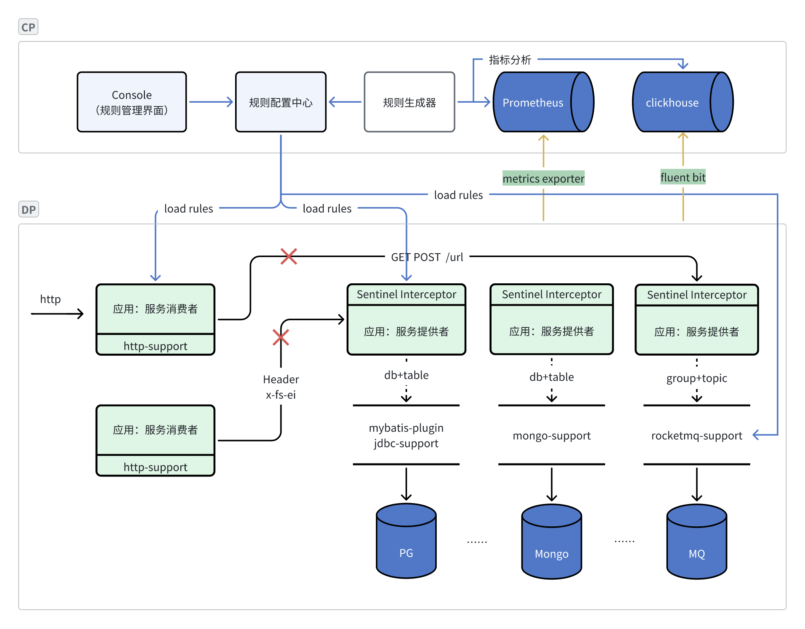

基于 Alibaba Sentinel 实现的分布式限流中间件服务。主要对服务提供者提供限流、系统保护，对服务调用者提供熔断降级、限流排队等待效果。

实现目标：

1. 作为服务提供者，保护自己不被打死，服务可以慢不可以挂。
2. 作为客户端及时限速和熔断，防止对服务提供方包含 Http、数据库、MQ 等造成太大压力，防止把糟糕的情况变得更糟。
3. 以用户、租户、对象等更细粒度进行流量精细控制。
4. 服务预热，应用新发布上线，缓存尚未完全建立，防止流量一下子把服务打死。
5. 能够根据 Prometheus、ClickHouse、Elasticsearch 提供的监控指标，动态生成规则，自适应调整规则。

## 概述

Sentinel 的基础知识请参考官方文档描述，这里单独介绍一些与我们定制相关的内容。

限流简单来说就三个点：资源、规则、效果。

资源：就是一个字符串，这个字符串可以自己定义、可以用注解自动生成、可以通过拦截器按规则生成。

规则：Sentinel 定义的一系列限流保护规则，比如流量控制规则、自适应保护规则。

效果：实际上“效果”也是“规则”定义的一部分。任何一条请求，命中某些资源规则后产生的效果，比如直接抛出异常、匀速等待。

### Sentinel 全局注意事项和使用限制

使用开源默认 Sentinel 组件，有一些坑，或者说需要关注的注意事项：

1. 单个进程内资源数量阈值是 6000，多出的资源规则将不会生效（因为是懒加载，资源先到先得），也不提示错误而是直接忽略，资源数量太多建议使用热点参数控制。
2. 对于限流的链路模式，context 阈值是 2000，所以默认的 WEB_CONTEXT_UNIFY 为 true，如果需要链路限流需要把这个改为 false。
3. 自定义时，资源名中不要带 `|` 线， 这个日志中要用，日志以此作为分割符。
4. Sentinel 支持按来源限流，注意 `origin` 数量不能太多，否则会导致内存暴涨。
5. 一个资源可以有多个规则，一条请求能否通过，取决于规则里阈值最小的限制条件。
6. 限流的目的是保护系统，计数计量并不准确，所以不要拿限流做计量或配额控制。
7. 增加限流一定程度上通过时间换空间，降低了 CPU、内存负载，对 K8S HPA 策略会有一定影响。后续我们也会考虑根据 Sentinel 限流指标进行扩缩容。
8. 限流中如果有增加等待效果会使接口变慢，各调用链需要关注调用超时和事务配置。
9. 目前 sentinel-web-servlet 和 sentinel-spring-webmvc-adapter 均不支持热点参数限流。为了支持热点参数需要自行扩展。
10. sentinel-web-servlet 和 sentinel-spring-webmvc-adapter 会将每个到来的不同的 URL 都作为不同的资源处理，因此对于 REST 风格的 API，需要自行实现 UrlCleaner 接口清洗一下资源（比如将满足 /foo/:id 的 URL 都归到 /foo/\* 资源下）。否则会导致资源数量过多，超出资源数量阈值（目前是 6000）时多出的资源的规则将不会生效。
11. Java 中 `sentinel-time-tick-thread` 线程会额外多占用约 1-2% CPU，详细代码参考 `com.alibaba.csp.sentinel.util.TimeUtil`。

一些文档中尚未更新但是大家可能关心的内容：

1. 从 1.8.7 版本开始资源匹配支持正则表达式，使用的是 Java 自带的正则引擎。
2. 从 1.8.7 版本对 QPS 限流做了优化，支持 QPS 大于 1000 了。
3. 热点参数限流已经支持按照线程数限流，文档尚未更新，文档中说只支持 QPS。

## 接入指导

总体架构图。



我们所有组件，规则加载都是由 Datasource 组件统一加载，配置是懒加载的，在第一次访问的时候加载，如果需要定义规则请在配置中心定义，这是由 Sentinel 在第一次初始化的时候（参考源码：com.alibaba.csp.sentinel.Env.java）通过 SPI 加载的。

注意：如果你有自编码使用 Sentinel SDK 自带的 XxxRuleManager.loadRules 加载规则，会被远端配置中心覆盖掉，远端配置变更自动刷新后会以远端配置为准，把 XxxRuleManager.loadRules 加载的规则覆盖掉。

### 底层限流策略实现

Sentinel 底层限流策略共有 2 种，另外有 2 个 WARMUP 的变体，总共 4 个。参考源码 `com.alibaba.csp.sentinel.slots.block.flow.TrafficShapingController` 。

1. 基于绝对值的 DefaultController，只要总值校验通过即可，比如 QPS 10，1s 内可以前 500ms 通过 10 个，后 500ms 通过 0 个，只要在这 1s 内没超标就行。
2. 基于频率的 ThrottlingController，漏桶算法，比如 QPS 10，要求以每 100ms 一个的固定频率执行。如果前 500ms 有 10 个请求，最多通过 5 个，其他的都要排队。

关于这几种策略支持的范围，有兴趣的可以查看源码 `com.alibaba.csp.sentinel.slots.block.flow.FlowRuleUtil#generateRater`，核心代码如下。

```java
  private static TrafficShapingController generateRater(FlowRule rule) {
        if (rule.getGrade() == RuleConstant.FLOW_GRADE_QPS) {
            switch (rule.getControlBehavior()) {
                case RuleConstant.CONTROL_BEHAVIOR_WARM_UP:
                    return new WarmUpController(rule.getCount(), rule.getWarmUpPeriodSec(),
                            ColdFactorProperty.coldFactor);
                case RuleConstant.CONTROL_BEHAVIOR_RATE_LIMITER:
                    return new ThrottlingController(rule.getMaxQueueingTimeMs(), rule.getCount());
                case RuleConstant.CONTROL_BEHAVIOR_WARM_UP_RATE_LIMITER:
                    return new WarmUpRateLimiterController(rule.getCount(), rule.getWarmUpPeriodSec(),
                            rule.getMaxQueueingTimeMs(), ColdFactorProperty.coldFactor);
                case RuleConstant.CONTROL_BEHAVIOR_DEFAULT:
                default:
            }
        }
        return new DefaultController(rule.getCount(), rule.getGrade());
    }
```

根据以上代码，可以确定限流各个参数适用的范围，比如 “按照并发线程数限流，实现匀速等待效果” 就做不到了。

### 规则参数详解

Sentinel 规则的资源名字匹配支持正则表达式，但是不知道为什么文档里从未提及，可能是考虑到性能。如果要为某个规则启用正则，需主动设置 xxRule.setRegex(true)，另外注意用的是 Java 正则匹配，不要和 Spring Path 的正则匹配混了。比如 Java 里 `.*` 代表任意匹配，Spring `*` 表达任意匹配。

#### 系统自适应保护规则

参数示例：

```json
{
  "avgRt": 500,
  "highestSystemLoad": 100,
  "highestCpuUsage": 90.0,
  "maxThread": 100,
  "qps": 200.0
}
```

- highestSystemLoad：当系统 load1 超过阈值，且系统当前的并发线程数超过系统容量时才会触发系统保护。系统容量由系统的 `maxQps * minRt` 计算得出。设定参考值一般是 `CPU cores * 2.5`。
- highestCpuUsage：当系统 CPU 使用率超过阈值即触发系统保护（取值范围 0.0-1.0）。
- avgRt ：当单台机器上所有入口流量的平均 RT 达到阈值即触发系统保护，单位是毫秒。
- maxThread：当单台机器上所有入口流量的并发线程数达到阈值即触发系统保护。
- qps：当单台机器上所有入口流量的 QPS 达到阈值即触发系统保护。

以上参数默认是 `-1`，代表无限制。

注意：

1. 在 K8S 环境下，Sentinel 读取当前指标值时，highestSystemLoad 获取的是宿主机的 load1，不是 Pod 的。参考：<https://github.com/alibaba/Sentinel/issues/2260>
2. Sentinel 读取当前指标值时，获取的 CPU 指标取的是 Pod Cpu 和宿主机 CPU 的最大值，也就是说如果 `宿主机 CPU 占用太高，Pod CPU 很低`，会误伤，会触发限流。
3. highestSystemLoad 相当于要不要自适应的开关，达到条件后会计算下是否还能承受流量，不行才拒绝。这就是所谓的“自适应”。除 highestSystemLoad 外，其他几个参数是达到阈值就拒绝。
4. 规则中的几个参数，可以在一条规则里全部设置，也可以分多个规则配置不同参数，也可以只设置某个，Sentinel 会自行合并参数计算。

#### 流量控制

参数示例：

```json
{
  "resource": "spring-cloud-samples:GET:/api-provider/pets/{id}",
  "count": 100.0,
  "grade": 1,
  "controlBehavior": 0,
  "warmUpPeriodSec": 10,
  "maxQueueingTimeMs": 5000,
  "limitApp": "default",
  "strategy": 0
}
```

- resource：资源名，即限流规则的作用对象
- count: 限流阈值
- grade: 限流阈值类型，QPS（RuleConstant.FLOW_GRADE_QPS = 1） 或线程数（RuleConstant.FLOW_GRADE_THREAD = 0）。
- controlBehavior：限流效果，有直接拒绝（RuleConstant.CONTROL_BEHAVIOR_DEFAULT = 0）、冷启动（RuleConstant.CONTROL_BEHAVIOR_WARM_UP=1）、匀速器（RuleConstant.CONTROL_BEHAVIOR_RATE_LIMITER=2）、冷启动-匀速器（RuleConstant.CONTROL_BEHAVIOR_WARM_UP_RATE_LIMITER=3）。
- warmUpPeriodSec：冷启动时间，单位秒，默认 10s。
- maxQueueingTimeMs：最大排队等待时长，默认 500ms。（仅在匀速排队模式 + QPS 下生效）
- limitApp: 按来源限流，默认 default 表示忽略来源，所有来源都限流。如果 limitApp 为 null，将忽略此条规则，不限流直接放行。
- strategy: 根据调用关系选择策略：根据调用方限流（STRATEGY_DIRECT=0），根据调用链路入口限流（STRATEGY_CHAIN=1），具有关系的资源流量控制（STRATEGY_RELATE=2）。

注意：

1. 匀速器模式的时候根据实际情况设置 maxQueueingTimeMs，处理好排队超时情况，如果太长客户端可能超时，如果太短直接抛出超时异常了，达不到匀速的效果。

#### 热点参数限流

热点参数限流会统计传入参数中的热点参数，并根据配置的限流阈值与模式，对包含热点参数的资源调用进行限流。热点参数限流可以看做是一种特殊的流量控制，仅对包含热点参数的资源调用生效。
Sentinel 利用 LRU 策略统计最近最常访问的热点参数，结合令牌桶算法来进行参数级别的流控。

参数示例：

```json
{
  "resource": "spring-cloud-samples:GET:/api-provider/pets/{id}",
  "count": 100.0,
  "grade": 1,
  "paramIdx": 0,
  "controlBehavior": 0,
  "warmUpPeriodSec": 1,
  "maxQueueingTimeMs": 5000,
  "durationInSec": 1,
  "burstCount": 0,
  "limitApp": "default",
  "paramFlowItemList": [
    {
      "object": "ea-vip",
      "classType": "String",
      "count": 1000
    }
  ],
  "strategy": 0
}
```

- 默认参数参考流量控制规则的解释。
- paramIdx：热点参数的索引，必填，对应 SphU.entry(xxx, args) 中的 args 参数索引位置，从 0 开始。
- durationInSec：统计窗口时间长度（单位为秒），默认 1s。
- paramFlowItemList：参数例外项，可以针对指定的参数值单独设置限流阈值，不受前面 count 阈值的限制。仅支持基本类型和字符串类型。
- burstCount: 为应对突发流量"额外允许"的流量，在原 count 的基础上再额外加上这个值，相当于保底。默认为 0，仅在 `快速失败|Warm UP` + QPS 下生效。（Java 文档中未提及，代码中支持）

注意：

1. 可以通过 paramFlowItemList 设置例外项，比如为 VIP 单独设置限流阈值。
2. 每个参数索引 (paramIdx) 对应的不同值最多统计 4000（ParameterMetric.BASE_PARAM_MAX_CAPACITY）个。
3. 在统计窗口时间长度（durationInSec）内最多允许统计 20 万个。可以理解为 LRU 的 Top N。

#### 来源访问控制

参数示例：

```json
{
  "resource": "spring-cloud-samples:GET:/api-provider/pets/{id}",
  "limitApp": "default",
  "strategy": 0
}
```

- resource：资源名，即限流规则的作用对象
- limitApp：对应的黑名单/白名单，不同 origin 用 , 分隔，如 appA,appB
- strategy：限制模式，AUTHORITY_WHITE=0 为白名单模式，AUTHORITY_BLACK=1 为黑名单模式，默认为白名单模式。

#### 熔断降级

现代微服务架构都是分布式的，由非常多的服务组成。不同服务之间相互调用，组成复杂的调用链路。以上的问题在链路调用中会产生放大的效果。复杂链路上的某一环不稳定，就可能会层层级联，最终导致整个链路都不可用。因此我们需要对不稳定的弱依赖服务调用进行熔断降级，暂时切断不稳定调用，避免局部不稳定因素导致整体的雪崩。熔断降级作为保护自身的手段，通常在客户端（调用端）进行配置。

Sentinel 提供以下几种熔断策略：

- 慢调用比例 (SLOW_REQUEST_RATIO)：选择以慢调用比例作为阈值，需要设置允许的慢调用 RT（即最大的响应时间），请求的响应时间大于该值则统计为慢调用。当单位统计时长（statIntervalMs）内请求数目大于设置的最小请求数目，并且慢调用的比例大于阈值，则接下来的熔断时长内请求会自动被熔断。经过熔断时长后熔断器会进入探测恢复状态（HALF-OPEN 状态），若接下来的一个请求响应时间小于设置的慢调用 RT 则结束熔断，若大于设置的慢调用 RT 则会再次被熔断。
- 异常比例 (ERROR_RATIO)：当单位统计时长（statIntervalMs）内请求数目大于设置的最小请求数目，并且异常的比例大于阈值，则接下来的熔断时长内请求会自动被熔断。经过熔断时长后熔断器会进入探测恢复状态（HALF-OPEN 状态），若接下来的一个请求成功完成（没有错误）则结束熔断，否则会再次被熔断。异常比率的阈值范围是 [0.0, 1.0]，代表 0% - 100%。
- 异常数 (ERROR_COUNT)：当单位统计时长内的异常数目超过阈值之后会自动进行熔断。经过熔断时长后熔断器会进入探测恢复状态（HALF-OPEN 状态），若接下来的一个请求成功完成（没有错误）则结束熔断，否则会再次被熔断。

```json
{
  "resource": "spring-cloud-samples:GET:/api-provider/pets/{id}",
  "grade": 0,
  "count": 100.0,
  "timeWindow": 10,
  "minRequestAmount": 5,
  "statIntervalMs": 1000,
  "slowRatioThreshold": 1
}
```

- grade：熔断策略，支持慢调用比例/异常比例/异常数策略。默认慢调用比例。
- count：慢调用比例模式下为慢调用临界 RT（超出该值计为慢调用）；异常比例/异常数模式下为对应的阈值。
- timeWindow：熔断时长，单位为秒。
- minRequestAmount：熔断触发的最小请求数，请求数小于该值时即使异常比率超出阈值也不会熔断。默认 5。
- statIntervalMs：统计时长（单位为 ms），如 60\*1000 代表分钟级。默认 1000ms。
- slowRatioThreshold：慢调用比例阈值，仅慢调用比例模式有效。

注意事项：

1. 熔断降级规则在服务端时，Spring 的全局异常处理器一般会消化掉异常转换成一个合法的 Response，会导致熔断规则中的异常数规则失效，我们在 Server 端并不准备支持，参考 [Issue](https://github.com/alibaba/Sentinel/issues/2461)。

### 对象类型作为热点参数

在热点参数限流规则说明中，有单独提到一点 “参数只支持基本类型和字符串类型”。

很多场景下，我们的接口是 POST 类型，请求参数是一个 Request Body，能不能以此作为热点参数呢。

能。实现方式是对此对象实现 `com.alibaba.csp.sentinel.slots.block.flow.param.ParamFlowArgument` 接口，在接口中通过 paramFlowKey 返回真正作为热点的数据。

```java
class User implements ParamFlowArgument {
    Integer id;
    String name;
    String address;

    public User(Integer id, String name, String address) {
        this.id = id;
        this.name = name;
        this.address = address;
    }

    @Override
    public Object paramFlowKey() {
        return name;
    }
}
```

以上例子将使用 name 作为真正的热点参数。

当然，若需要配置例外项或者使用集群维度流控，则传入的参数只支持基本类型，要不然例外项的规则里没法配置。

### 集群限流

集群限流功能就不复制粘贴了，这里着重提几个注意事项：

1. 集群 Token Server 不支持高可用，生产环境需自己做高可用改造。
2. 客户端获取 Token 失败会降级到本地限流。
3. 集群限流只是解决限流问题，不解决流量不均衡问题，这是网络层面的问题。常见的如 http 长连接情况下，客户端和服务器连接保持，一个客户端所有请求可能会发给同一个服务器节点，单机限流阈值是 10 QPS，部署了 3 个节点，理论上集群的总 QPS 可以达到 30，但是实际上由于流量不均匀导致集群总 QPS 还没有达到 30 就已经触发限流了。

### 关联限流

在 Sentinel 限流规则中，有一个大家容易忽略的属性：流控模式之关联模式。可实现类似于进程内的“背压”模型。

限流规则可以选择三种流控模式：

1. 直接：统计当前资源的请求，触发阈值时对当前资源直接限流，也是默认的模式。
2. 关联：统计与当前资源相关的另一个资源，触发阈值时，对当前资源限流。
3. 链路：统计从指定链路访问到本资源的请求，触发阈值时，对指定链路限流。

典型应用场景：

1. 数据库读写竞争：比如对数据库同一个字段的读操作和写操作存在争抢，读的速度过高会影响写得速度，写的速度过高会影响读的速度。如果放任读写操作争抢资源，则争抢本身带来的开销会降低整体的吞吐量。可使用关联限流来避免具有关联关系的资源之间过度的争抢，限制某一方。
2. 保证优先级任务：比如用户支付时需要修改订单状态，同时用户要查询订单。查询和修改操作会争抢数据库锁，产生竞争。业务需求是有限支付和更新订单的业务，因此当修改订单业务触发阈值时，需要对查询订单业务限流。
3. 阻止请求放大：比如接口 A 本身流量很小，但是一次接口 A 又调用了其他 10 个接口，相当于请求放大了 10 倍，如果任由 A 随意调用，后端服务则无法承担压力，需要对 A 进行限流。

举例：

比如 http 接口 /create 作为入口流量，调用一次，需要对数据库（我们暂定数据库操作生产资源名是 /database）执行 10 次操作，如果不限制 /create，就会把数据库压崩溃。
那么可以在数据库资源/database 到达阈值 N 时，对/create 进行限流。注意这里：阈值是数据库资源 /database 的阈值，限流的却是资源 /create，数据库资源 /database 并不触发限流。

注意使用限制：关联限流仅限于“流量控制”规则，不支持热点参数限流规则。

### 日志和监控模块

我们自定义了日志模块，在 block 和 metrics 日志中增加 trace id、user id 等更多参数，通过 fluent-bit 收集到 ClickHouse 中。

可在 Granfana 中以 ClickHouse 作为数据源配置自己需要的视图，并结合告警组件配置告警，比如应用 1 分钟 block 次数超过 10 次触发告警。

### 自定义实现

如果各个 adapter 模块不能满足你的要求，可以自己编码实现，一个典型的示例代码如下，按需选择。

```java
public void sample() {
    String resource = anyStringName();
    Entry entry = null;
    try {
      //支持按照来源设置规则，指定自己的来源，不需要来源的时候不写这行
      ContextUtil.enter(SAMPLE_CONTEXT, APP_NAME);
      // 执行 Sentinel 流程，判断是否放行。最后一个 anyArgsArray 是热点参数，如果不需要热点参数限流就可以不写
      entry = SphU.entry(resource, ResourceTypeConstants.COMMON_WEB, EntryType.OUT, anyArgsArray());
      //开始执行自己真正的代码逻辑
      doJobHere();
    } catch (BlockException e) {
      //根据情况处理异常
      handleBlockException(e);
    } catch (Exception ex) {
      //如果需要熔断降级规则，需要通过这个 traceEntry 方法把异常数统计上，否则熔断降级里不能按照异常降级
      Tracer.traceEntry(ex, entry);
      throw ex;
    } finally {
      if (entry != null) {
        entry.close();
      }
      ContextUtil.exit();
    }

  }
```

## FAQ

- Q：Sentinel 资源生成时如何忽略某些资源。

  A：自定义 UrlCleaner，对想忽略的资源返回空字符。

- Q：Sentinel DataSource adapter 和 XxxRuleManager.loadRules 两种加载规则的方式能不能同时使用。

  A：不能。比如 Nacos DataSource adapter，远端配置有变更后自动刷新，会以远端配置为准，覆盖掉 XxxRuleManager.loadRules 主动加载的规则。

- Q：对于限流的冷启动效果，冷启动结束进入稳定状态后，还会不会重新回到冷启动阶段。

  A：会，一段时间流量较小或无流量后会回到冷启动阶段。通俗来讲就是会先判断一下“冷不冷”，很久没有流量或者流量很小，不就很冷。Sentinel 固定速率产生令牌再消费，服务第一次启动时，或者接口很久没有被访问，都会导致当前时间与上次生产令牌的时间相差甚远，所以第一次生产令牌将会生产 maxPermits 个令牌，直接将令牌桶装满。由于令牌桶已满，接下来 N 秒就是冷启动阶段。具体查看参考资料里的冷启动算法详解。

- Q: 很多开发通过错误码来处理流程，而非通过异常。这种写法，导致 Sentinel 不能拦截到异常，无法触发降级。对于这种情况，有没有什么好的处理方法。

  A: 实际上 Sentinel 是通过 Tracer.trace(e) 来统计业务异常的，因此可以收到错误码就调用此函数来统计业务异常。

- Q: 我的服务响应有时快有时慢，为了尽可能保证服务可用，我能不能向未来“借”指标，或者某些接口比较重要能否优先处理。

  A：QPS 模式下能。但是各个 adapter 都不支持，需要自己实现，参考 com.alibaba.csp.sentinel.slots.block.flow.controller.DefaultController#canPass(com.alibaba.csp.sentinel.node.Node, int, boolean) 和 com.alibaba.csp.sentinel.SphU#entryWithPriority(java.lang.String, com.alibaba.csp.sentinel.EntryType)，核心在于需要 prioritized 为 true。

## 参考资料

- 令牌桶算法在 Sentinel 中的应用：<https://blog.51cto.com/morris131/6506314>
- Sentinel 中的冷启动限流算法：<https://cloud.tencent.com/developer/article/1674916>
