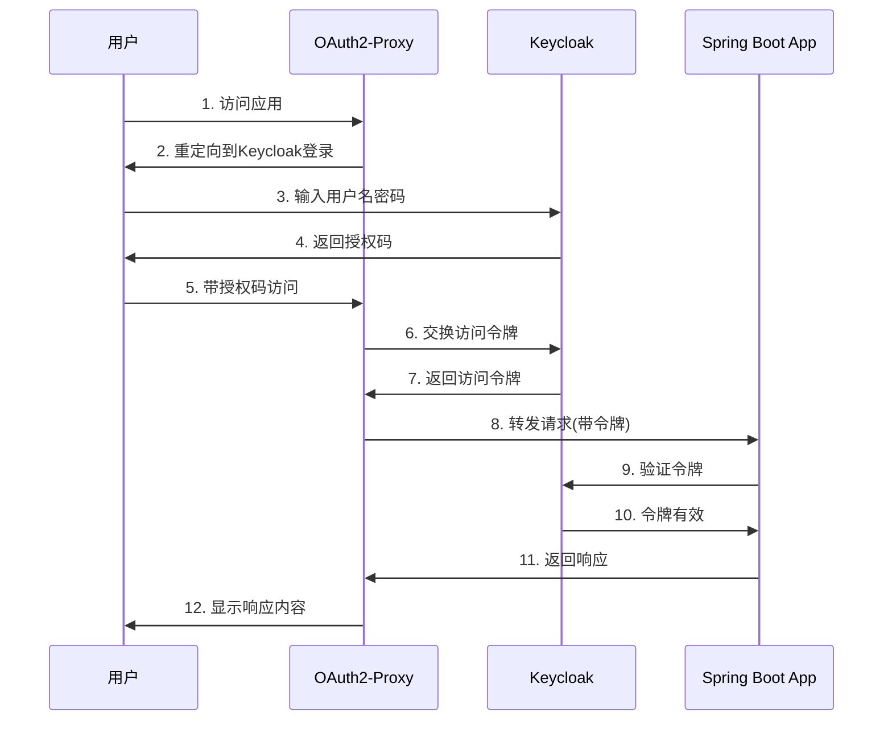

在构建企业级应用时，安全性和身份认证是最重要的考虑因素之一。Spring Security 作为 Java 生态系统中最流行的安全框架，为应用提供了全面的安全解决方案。而 Keycloak 则是一个强大的开源身份和访问管理解决方案，它提供了单点登录（SSO）、OAuth2、OpenID Connect 等现代认证和授权功能。

本文将介绍如何在 Spring Boot 应用中集成 Keycloak 作为 OAuth2 认证服务器，实现安全的用户认证和授权管理。

## 认证流程



## 为什么选择 Keycloak？

在选择身份认证解决方案时，Keycloak 具有以下优势：

1. **完整的身份管理解决方案**：Keycloak 提供了用户管理、角色管理、组管理等完整功能。
2. **标准协议支持**：支持 OAuth 2.0、OpenID Connect、SAML 2.0 等标准协议。
3. **社会化登录**：内置支持 Google、GitHub、Facebook 等第三方登录。
4. **高度可定制**：提供主题定制、工作流定制、认证流程定制等功能。
5. **企业级特性**：支持高可用部署、集群管理、审计日志等企业级功能。

## Spring Boot 项目配置

首先，我们需要在 Spring Boot 项目中添加必要的依赖。这里使用 Maven 作为构建工具。

```xml
<dependencies>
    <!-- Spring Boot Starter -->
    <dependency>
        <groupId>org.springframework.boot</groupId>
        <artifactId>spring-boot-starter-web</artifactId>
    </dependency>

    <!-- Spring Security -->
    <dependency>
        <groupId>org.springframework.boot</groupId>
        <artifactId>spring-boot-starter-security</artifactId>
    </dependency>

    <!-- OAuth2 Client -->
    <dependency>
        <groupId>org.springframework.boot</groupId>
        <artifactId>spring-boot-starter-oauth2-client</artifactId>
    </dependency>
</dependencies>
```

接下来，在 `application.yml` 中配置 OAuth2 客户端：

```yaml
spring:
  security:
    oauth2:
      client:
        provider:
          keycloak:
            issuer-uri: http://localhost:8080/realms/spring-app
            user-name-attribute: preferred_username
        registration:
          keycloak:
            client-id: spring-client
            client-secret: your-client-secret
            scope: openid,profile,email
            authorization-grant-type: authorization_code
```

## Spring Security 配置

Spring Security 配置是实现 OAuth2 认证的核心部分。我们需要创建一个配置类来设置安全规则：

```java
@Configuration
@EnableWebSecurity
public class SecurityConfig {

    @Bean
    public SecurityFilterChain filterChain(HttpSecurity http) throws Exception {
        http
            .authorizeHttpRequests(authorize -> authorize
                .requestMatchers("/", "/public/**").permitAll()
                .requestMatchers("/api/**").authenticated()
                .anyRequest().authenticated()
            )
            .oauth2Login(oauth2 -> oauth2
                .userInfoEndpoint(userInfo -> userInfo
                    .userAuthoritiesMapper(this.userAuthoritiesMapper())
                )
            )
            .oauth2Client();

        return http.build();
    }

    private GrantedAuthoritiesMapper userAuthoritiesMapper() {
        return (authorities) -> {
            Set<GrantedAuthority> mappedAuthorities = new HashSet<>();

            authorities.forEach(authority -> {
                if (authority instanceof OidcUserAuthority oidcUserAuthority) {
                    OidcIdToken idToken = oidcUserAuthority.getIdToken();

                    // 从 ID token 中提取角色信息
                    Map<String, Object> claims = idToken.getClaims();
                    List<String> groups = (List<String>) claims.get("groups");
                    if (groups != null) {
                        groups.forEach(role ->
                            mappedAuthorities.add(new SimpleGrantedAuthority("ROLE_" + role.toUpperCase()))
                        );
                    }
                }
            });

            return mappedAuthorities;
        };
    }
}
```

这个配置类实现了以下功能：

1. **URL 访问控制**：
   - 公共路径（`/`和`/public/**`）允许匿名访问
   - API 路径（`/api/**`）需要认证
   - 其他所有路径都需要认证

2. **OAuth2 登录配置**：
   - 启用 OAuth2 登录功能
   - 配置用户信息端点
   - 实现权限映射器，将 Keycloak 角色转换为 Spring Security 权限

3. **权限映射**：
   - 从 ID Token 中提取用户角色信息
   - 将 Keycloak 角色转换为 Spring Security 的 `GrantedAuthority`
   - 添加 `ROLE_` 前缀以符合 Spring Security 的约定

有了这些配置，我们的应用就可以使用 Keycloak 进行身份认证了。当用户访问需要认证的资源时，会被重定向到 Keycloak 的登录页面。登录成功后，用户会被重定向回我们的应用，并且携带着认证信息。

## 资源控制器实现

让我们创建一些 REST 接口来演示如何使用 Spring Security 和 Keycloak 进行权限控制：

```java
@RestController
@RequestMapping("/api")
public class ResourceController {

    @GetMapping("/public")
    public String publicResource() {
        return "This is a public resource";
    }

    @GetMapping("/user")
    @PreAuthorize("hasRole('USER')")
    public String userResource(@AuthenticationPrincipal OidcUser oidcUser) {
        return String.format("Hello, %s! This is a user resource", oidcUser.getPreferredUsername());
    }

    @GetMapping("/admin")
    @PreAuthorize("hasRole('ADMIN')")
    public String adminResource() {
        return "This is an admin resource";
    }

    @GetMapping("/me")
    public Map<String, Object> getUserInfo(@AuthenticationPrincipal OidcUser oidcUser) {
        Map<String, Object> userInfo = new HashMap<>();
        userInfo.put("username", oidcUser.getPreferredUsername());
        userInfo.put("email", oidcUser.getEmail());
        userInfo.put("fullName", oidcUser.getFullName());
        userInfo.put("roles", oidcUser.getAuthorities().stream()
            .map(GrantedAuthority::getAuthority)
            .collect(Collectors.toList()));
        return userInfo;
    }
}
```

在这个控制器中：

1. `/api/public` 端点可以被任何人访问
2. `/api/user` 端点需要 `USER` 角色
3. `/api/admin` 端点需要 `ADMIN` 角色
4. `/api/me` 端点返回当前认证用户的详细信息

## 获取和使用认证用户信息

Spring Security 提供了多种方式来获取当前认证用户的信息：

```java
@Service
public class UserService {

    // 方式1：使用 @AuthenticationPrincipal 注解
    @GetMapping("/method1")
    public String method1(@AuthenticationPrincipal OidcUser oidcUser) {
        return oidcUser.getPreferredUsername();
    }

    // 方式2：使用 SecurityContextHolder
    public String method2() {
        Authentication authentication = SecurityContextHolder.getContext().getAuthentication();
        if (authentication.getPrincipal() instanceof OidcUser oidcUser) {
            return oidcUser.getPreferredUsername();
        }
        return null;
    }

    // 方式3：注入 Authentication
    public String method3(Authentication authentication) {
        if (authentication.getPrincipal() instanceof OidcUser oidcUser) {
            return oidcUser.getPreferredUsername();
        }
        return null;
    }
}
```

## 自定义权限评估

有时我们需要更复杂的权限控制逻辑，可以通过自定义方法安全表达式来实现：

```java
@Component
public class CustomSecurityExpressions {

    public boolean hasResourceAccess(Authentication authentication, String resourceId) {
        if (authentication.getPrincipal() instanceof OidcUser oidcUser) {
            // 从 token 中获取资源访问权限
            Map<String, Object> claims = oidcUser.getClaims();
            List<String> resourceAccess = (List<String>) claims.get("resource_access");
            return resourceAccess != null && resourceAccess.contains(resourceId);
        }
        return false;
    }
}

@Configuration
@EnableMethodSecurity
public class MethodSecurityConfig extends GlobalMethodSecurityConfiguration {

    @Autowired
    private CustomSecurityExpressions customSecurityExpressions;

    @Override
    protected MethodSecurityExpressionHandler createExpressionHandler() {
        DefaultMethodSecurityExpressionHandler expressionHandler =
            new DefaultMethodSecurityExpressionHandler();
        expressionHandler.setPermissionEvaluator(new CustomPermissionEvaluator());
        return expressionHandler;
    }
}

// 在控制器中使用自定义表达式
@RestController
public class ResourceController {

    @GetMapping("/resource/{resourceId}")
    @PreAuthorize("@customSecurityExpressions.hasResourceAccess(authentication, #resourceId)")
    public String getResource(@PathVariable String resourceId) {
        return "Resource: " + resourceId;
    }
}
```

## 异常处理

为了提供更好的用户体验，我们可以自定义认证和授权异常的处理：

```java
@RestControllerAdvice
public class SecurityExceptionHandler {

    @ExceptionHandler(AccessDeniedException.class)
    @ResponseStatus(HttpStatus.FORBIDDEN)
    public Map<String, String> handleAccessDeniedException(AccessDeniedException ex) {
        Map<String, String> response = new HashMap<>();
        response.put("error", "access_denied");
        response.put("message", "您没有权限访问此资源");
        return response;
    }

    @ExceptionHandler(OAuth2AuthenticationException.class)
    @ResponseStatus(HttpStatus.UNAUTHORIZED)
    public Map<String, String> handleOAuth2AuthenticationException(OAuth2AuthenticationException ex) {
        Map<String, String> response = new HashMap<>();
        response.put("error", "authentication_error");
        response.put("message", "认证失败：" + ex.getMessage());
        return response;
    }
}
```

通过以上配置和实现，我们的应用已经具备了完整的认证和授权功能：

1. 基于角色的访问控制（RBAC）
2. 细粒度的方法级安全控制
3. 自定义的权限评估逻辑
4. 友好的异常处理

用户可以通过 Keycloak 进行登录，系统会根据其角色和权限决定其可以访问哪些资源。同时，我们也可以方便地获取和使用用户信息，实现更复杂的业务逻辑。
