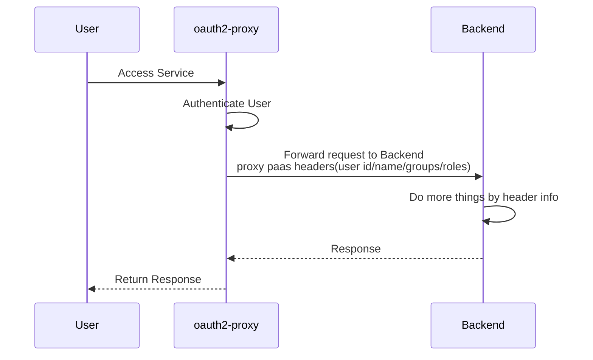
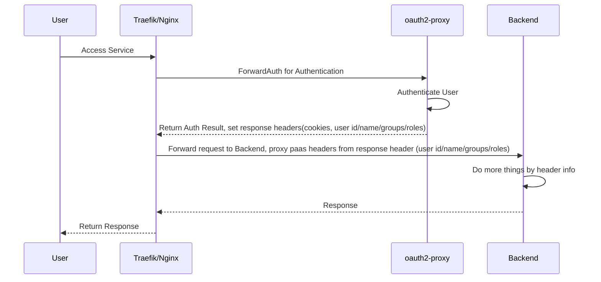
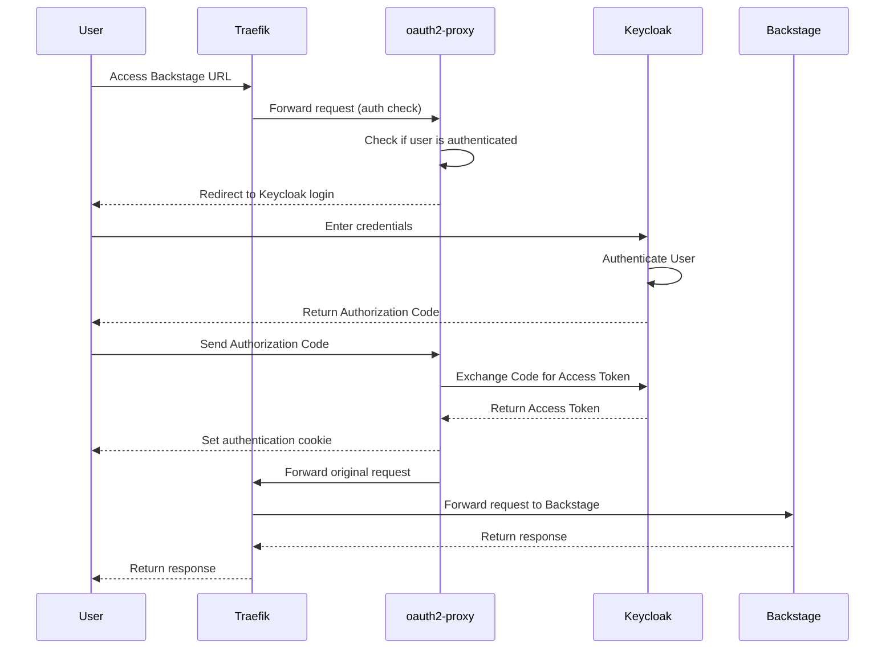

作为一个程序员，在日常开发中永远避免不了认证鉴权，而我们开发的某些应用，并不需要太复杂的鉴权，比如可能只要求必须是登录用户，或者只需要根据角色进行 RBAC 鉴权。有没有方法简化此流程，让应用开发者只关注业务开发，这就是本文档要解决的问题。

如果你有类似以下的需求，都可以参考此文档，原理是一样的，组件也可复用。

1. 为原本没有登录验证的服务提供认证服务，比如某些开源组件不支持认证但是又因携带一些危险数据而不想公开访问。
2. 实现统一的单点登录认证、并支持简单的 RBAC、UBAC 鉴权。
3. 为 Kubernetus Ingress 提供统一的认证入口，一键实现所有入口必须登录才可访问，类似第一条只是场景更简单。
4. 为 Kubernetus Pod 增加认证 Sidecar，实现 Zero Trust，任意 API 均需要认证，不仅仅是对外入口。
5. 基于用户、角色等不同属性，路由到不同服务。

写在前面：

1. 本文档里的示例代码是以 k3s 为基础，使用 traefik 作为 ingress controller，整体完善但略显复杂，如果没有 K3S/K8S，以其他方式部署也是完全可以的，基本原理都是一样的，都是开源软件，开箱即用。
2. 对于某些场景下可选的配置，会单独说明，请注意分别。
3. 这里提到的每个组件都是可替换的，比如 nginx 代替 traefik，Pomerium 代替 oauth2-proxy，可根据爱好选择，后面也会适当补充几种不同方式的对比和部署差异，更详细内容请参考本站另外一篇文档 [统一身份认证](https://www.xlabs.club/docs/platform/iam/)。
4. 示例中的代码都是从真实环境拷贝经过检验的，完整的安装部署源码请参考我们的部署脚本 [xlabs-club/xlabs-ops](https://github.com/xlabs-club/xlabs-ops)。
5. 需要懂一些 K8S、OIDC 基础知识，此处只提供链接不展开说明。

## 组件介绍

1. Keycloak
   Keycloak 是一个开源的身份和访问管理解决方案，支持 OAuth 2.0、OpenID Connect、SAML 等协议。它提供用户管理、角色管理、单点登录（SSO）、身份提供服务等功能，在本示例中担任 Auth Provider 角色。关于 Keycloak 的中文介绍，可参考本站单独的博客 [IDaaS Book](https://idaas.xlabs.club/)。

2. [oauth2-proxy](https://oauth2-proxy.github.io/oauth2-proxy/)
   顾名思义它是一个关于 oauth 反向代理，主要用来为后端服务增加身份验证层。它支持多种 OAuth 2.0 提供者（如 Google、OIDC、Keycloak 等），可以保护未提供身份验证的应用。oauth2-proxy 在请求进入后端服务之前，会先进行 OAuth 2.0 登录认证，确保请求者具有访问权限。它承担了登录的合法性校验、重定向、登录成功后的 cookie、response 设置等功能。

3. Backstage
   Backstage 是一个开源的开发者门户平台。在此文档里你可以理解为是一个普通的应用，类似你自己写的应用，这里只是拿他来举例而已。关于 Backstage 集成 oauth2-proxy 的详情文档可参考 [Backstage OAuth 2 Proxy Provider](https://backstage.io/docs/auth/oauth2-proxy/provider)。

在开始之前，建议先了解下 oauth2-proxy 的基本功能，并需要特别关注一下他的这几个功能设置。

1. oauth2-proxy 的 set header 设置的是 response header，这在下面提到的 nginx auth_request 模块和 traefik forwardAuth Middleware 会用到。
2. pass header 是认证通过后，将一些基本信息，比如 Access Token、User ID、User Group 通过 Http Header 传递到 upstream（代理的目标应用），upstream 可以拿到 Header 信息后做更多的事情。
3. 目标应用 `--upstream` 一般就是一个或多个具体的后端服务地址，也可以是静态文件。还有一种特殊的文件 `file:///dev/null`, 相当于舍弃 upstream，下面我们会用他结合 traefik forwardAuth 使用。
4. 关注下 oauth2-proxy 的 [Endpoints](https://oauth2-proxy.github.io/oauth2-proxy/features/endpoints)，主要使用 start、auth、sign_in、sign_out 等几个，另外 auth endpoint 后面可以追加 query parameters `allowed_groups/allowed_emails`，这样不就组成了一个简单的基于 Group 的权限认证。
5. 注意看文档中关于 proxy 的设置，比如 `--reverse-proxy`，很多错误都是因为认证和配置没问题，但是到了后端 OAuth 本身校验失败，Token 的校验对 scheme、host 都有要求。

## 基本原理和流程

目前 oauth2-proxy 有几种主流的使用方式。

第一种，直接使用 oauth2-proxy 对外提供服务，承担认证流程并提供简单的权限校验，认证通过后通过 Header 传递一些用户信息到 upstream，流量由 oauth2-proxy 分发。
他的网络流量大概类似如下方式。



第二种，借助 traefik forwardAuth Middleware 或 nginx auth_request Module，进行认证重定向，认证通过后流量的分发仍然由 traefik/nginx 执行。
他的网络流量大概类似如下方式，此文档中提到的就是这种方式。



本文档部署示例使用的是第二种方式。

## 部署配置详解

此处的 Traefik 使用的 K3S Traefik ingress controller，相关的功能是 ingress 标准注解实现，如果你使用 docker/bin 方式部署，请参考 [Traefik 文档](https://doc.traefik.io/traefik/routing/providers/kubernetes-ingress/) 转换为对应的 yaml 配置。

<!-- ## Thanks

<https://www.leejohnmartin.co.uk/infrastructure/kubernetes/2022/05/31/traefik-oauth-proxy.html>

<https://joeeey.com/blog/selfhosting-sso-with-traefik-oauth2-proxy-part-2/>

<https://oauth2-proxy.github.io/oauth2-proxy/configuration/providers/keycloak_oidc> -->

```yaml
#  kubectl -n kube-system edit deployments.apps traefik
#  --providers.kubernetescrd.allowCrossNamespace=true
# providers:
#   kubernetesCRD:
#     enabled: true
#     allowCrossNamespace: true
# https://doc.traefik.io/traefik/routing/providers/kubernetes-ingress/
---
apiVersion: traefik.io/v1alpha1
kind: IngressRoute
metadata:
  name: backstage-ingress-route
  namespace: backstage
  annotations:
    cert-manager.io/issuer: selfsigned-issuer
spec:
  entryPoints:
    - web
    - websecure
  routes:
    - match: "Host(`app.nxest.com`) && PathPrefix(`/oauth2`)"
      kind: Rule
      services:
        - name: oauth2-proxy
          namespace: oauth2-proxy
          port: http
      middlewares:
        - name: oauth-errors
    - match: Host(`app.nxest.com`)
      kind: Rule
      middlewares:
        - name: oauth-errors
        - name: oauth2-proxy
      services:
        - name: backstage
          namespace: backstage
          port: http-backend

---
apiVersion: networking.k8s.io/v1
kind: Ingress
metadata:
  annotations:
    cert-manager.io/cluster-issuer: selfsigned-issuer
    traefik.ingress.kubernetes.io/router.middlewares: oauth-errors
  labels:
    app.kubernetes.io/component: oauth2-proxy
    app.kubernetes.io/instance: oauth2-proxy
    app.kubernetes.io/name: oauth2-proxy
  name: oauth-errors
  namespace: oauth2-proxy
spec:
  ingressClassName: traefik
  rules:
    - host: "*.nxest.com"
      http:
        paths:
          - backend:
              service:
                name: oauth2-proxy
                port:
                  name: http
            path: /oauth2
            pathType: Prefix
  tls:
    - hosts:
        - "*.nxest.com"
      secretName: "widles-place.nxest.com-tls"
---
apiVersion: traefik.io/v1alpha1
kind: Middleware
metadata:
  name: oauth-errors
  namespace: oauth2-proxy
spec:
  errors:
    status:
      - "401-403"
    service:
      name: oauth2-proxy
      port: 4180
    query: "/oauth2/sign_in"
---
apiVersion: traefik.io/v1alpha1
kind: Middleware
metadata:
  name: oauth-errors
  # namespace: backstage
spec:
  errors:
    status:
      - "401-403"
    service:
      name: oauth2-proxy
      namespace: oauth2-proxy
      port: 4180
    query: "/oauth2/sign_in"
---
apiVersion: traefik.io/v1alpha1
kind: Middleware
metadata:
  name: oauth2-proxy
  # namespace: backstage
spec:
  forwardAuth:
    address: http://oauth2-proxy.oauth2-proxy.svc:4180/oauth2/auth
    trustForwardHeader: true
    authResponseHeaders:
      - X-Auth-Request-User
      - Set-Cookie
```

下面是使用 Mermaid JS 描述上述几个组件（Keycloak、oauth2-proxy、Traefik、Backstage）登录流程的代码：



流程描述：

1. 用户访问 Backstage URL，请求被 Traefik 捕获。
2. Traefik 将请求转发给 oauth2-proxy，检查用户是否已认证。
3. 如果用户未认证，oauth2-proxy 会将用户重定向到 Keycloak 登录页面。
4. 用户在 Keycloak 上输入凭证并进行认证。
5. 认证成功后，Keycloak 返回鉴权码给用户。
6. 用户将鉴权码发送给 oauth2-proxy，oauth2-proxy 使用鉴权码向 Keycloak 请求访问令牌。
7. Keycloak 返回访问令牌给 oauth2-proxy，oauth2-proxy 设置身份验证 cookie。
8. oauth2-proxy 将原始请求转发给 Traefik。
9. Traefik 将请求发送给 Backstage。
10. Backstage 返回响应，最终由 Traefik 返回给用户。

## K3S Traefik 对接 oauth2-proxy 特别说明

如果以上你的所有应用都部署在 K8S 同一个 namespace 里，就不用关注这个了。

K3S Traefik 默认未开启 `allowCrossNamespace`, 不允许跨 namespace 访问，所以如果你给其他 namespace 的应用也加上 auth Middleware，在应用上访问看不到错误就是一直没有 Auth 功能，以为是配置不生效，其实查看 K3S Traefik log 可以看到有关于 Middleware 找不到或无法访问的错误日志。

以下解决办法任选其一：

1. 在应用所在的 namespace 都创建 Middleware，创建 K8S ExternalName Service 指定 oauth2-proxy Service。
2. 为 Traefik 开启 `allowCrossNamespace` 配置。

   ```console
   $ kubectl -n kube-system edit deployments.apps traefik
   # 在 args 中增加 `--providers.kubernetescrd.allowCrossNamespace=true`
   ```

   ```yaml
   # vi /var/lib/rancher/k3s/server/manifests/traefik-config.yaml
   apiVersion: helm.cattle.io/v1
   kind: HelmChartConfig
   metadata:
     name: traefik
     namespace: kube-system
   spec:
     valuesContent: |-
       providers:
         kubernetesCRD:
           enabled: true
           allowCrossNamespace: true
   ```

## Keycloak 对接 oauth2-proxy 特别说明

<!-- audience mapper  -->
<!-- Group Scope -->
<!-- Configure a dedicated audience mapper for your client by navigating to Clients -> <your client's id> -> Client scopes. -->

## Backstage 对接 oauth2-proxy 特别说明

## nginx 使用 auth_request 对接 oauth2-proxy

原理同 Traefik，将 /oauth2 相关请求交给 oauth2-proxy 服务，认证通过后 proxy_pass 到后端服务，注意设置 Header 和 Cookie。

```nginx

server {

  location /oauth2/ {
    proxy_pass       http://oauth2-proxy.svc:4180;
    proxy_set_header Host                    $host;
    proxy_set_header X-Real-IP               $remote_addr;
    proxy_set_header X-Scheme                $scheme;
    proxy_set_header X-Auth-Request-Redirect $request_uri;
    # or, if you are handling multiple domains:
    # proxy_set_header X-Auth-Request-Redirect $scheme://$host$request_uri;
  }
  location = /oauth2/auth {
    proxy_pass       http://oauth2-proxy.svc:4180;
    proxy_set_header Host             $host;
    proxy_set_header X-Real-IP        $remote_addr;
    proxy_set_header X-Scheme         $scheme;
    # nginx auth_request includes headers but not body
    proxy_set_header Content-Length   "";
    proxy_pass_request_body           off;
  }

  location / {
    auth_request /oauth2/auth;
    error_page 401 = /oauth2/sign_in;

    # pass information via X-User and X-Email headers to backend,
    # requires running with --set-xauthrequest flag
    auth_request_set $user   $upstream_http_x_auth_request_user;
    auth_request_set $email  $upstream_http_x_auth_request_email;
    proxy_set_header X-User  $user;
    proxy_set_header X-Email $email;

    # if you enabled --pass-access-token, this will pass the token to the backend
    auth_request_set $token  $upstream_http_x_auth_request_access_token;
    proxy_set_header X-Access-Token $token;

    # if you enabled --cookie-refresh, this is needed for it to work with auth_request
    auth_request_set $auth_cookie $upstream_http_set_cookie;
    add_header Set-Cookie $auth_cookie;

    # When using the --set-authorization-header flag, some provider's cookies can exceed the 4kb
    # limit and so the OAuth2 Proxy splits these into multiple parts.
    # Nginx normally only copies the first `Set-Cookie` header from the auth_request to the response,
    # so if your cookies are larger than 4kb, you will need to extract additional cookies manually.
    auth_request_set $auth_cookie_name_upstream_1 $upstream_cookie_auth_cookie_name_1;

    # Extract the Cookie attributes from the first Set-Cookie header and append them
    # to the second part ($upstream_cookie_* variables only contain the raw cookie content)
    if ($auth_cookie ~* "(; .*)") {
        set $auth_cookie_name_0 $auth_cookie;
        set $auth_cookie_name_1 "auth_cookie_name_1=$auth_cookie_name_upstream_1$1";
    }

    # Send both Set-Cookie headers now if there was a second part
    if ($auth_cookie_name_upstream_1) {
        add_header Set-Cookie $auth_cookie_name_0;
        add_header Set-Cookie $auth_cookie_name_1;
    }

    proxy_pass http://backend/;
    # or "root /path/to/site;" or "fastcgi_pass ..." etc
  }
}
```
