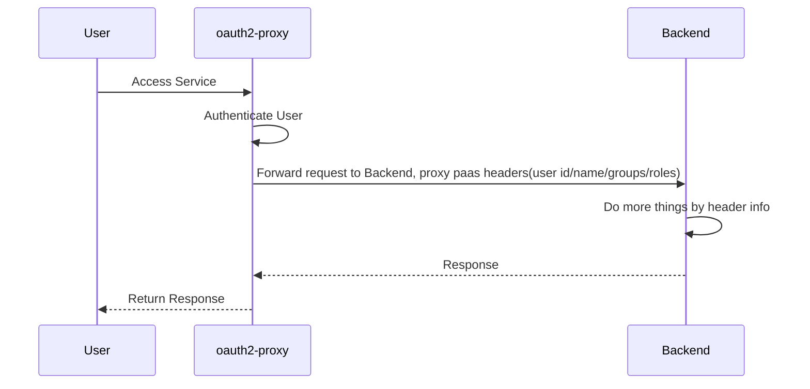
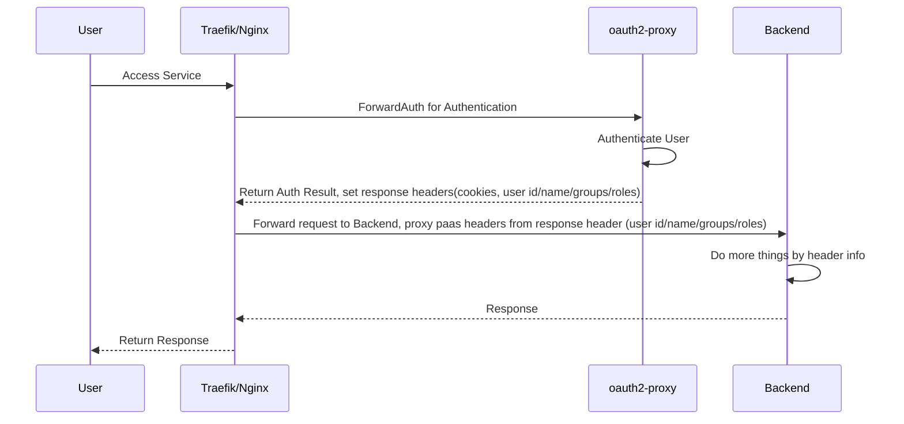
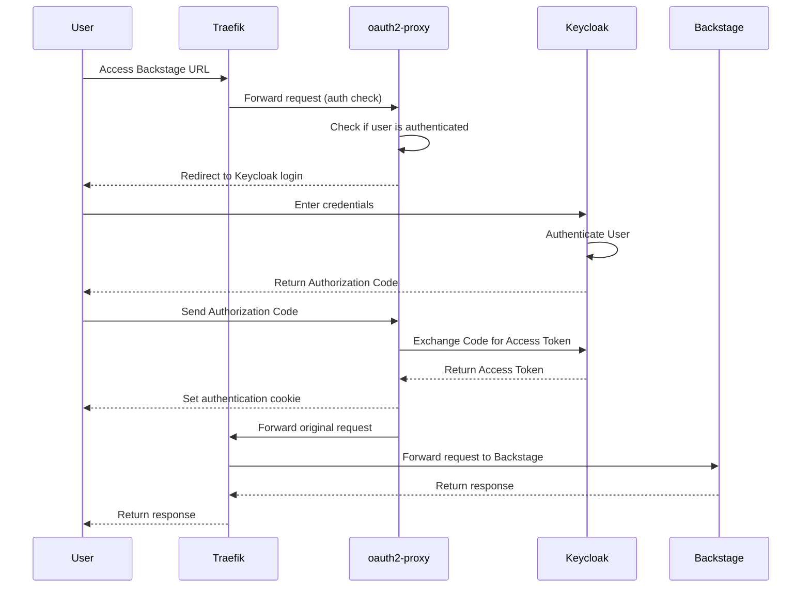

作为一个程序员，在日常开发中永远避免不了认证授权，而我们开发的某些应用，并不需要太复杂的授权，比如可能只要求必须是登录用户，或者只需要根据角色进行 RBAC 授权。有没有方法简化此流程，让应用开发者只关注业务开发，这就是本文档要解决的问题。

如果你有类似以下的需求，都可以参考此文档，原理是一样的，组件也可复用。

1. 实现基于 OAuth2 的单点登录、认证、授权。
2. 为 Kubernetus Ingress 提供统一的认证入口，一键实现所有入口必须登录才可访问。
3. 为 Kubernetus Pod 增加认证 Sidecar，实现 Zero Trust。
4. 基于用户、角色等不同属性，路由到不同服务。比如另一篇博客中提到的这种场景：[使用 Visual Studio Code 搭建多用户远程 IDE](https://www.xlabs.club/blog/code-server/)。

写在前面：

1. 本文档里的示例代码是以 k3s 为基础，融合了 traefik ingress controller、oauth2-proxy、keycloak、backstage 这几个组件，完善略显复杂，如果没有 K3S/K8S，以其他方式部署也是完全可以的，基本原理都是一样的，都是开源软件，开箱即用。
2. 对于某些场景下可选的配置，会单独说明，请注意分别。
3. 这里提到的每个组件都是可替换的，比如 nginx 代替 traefik，Pomerium 代替 oauth2-proxy，可根据爱好选择，后面也会适当补充几种不同方式的对比和部署差异，更详细内容请参考本站另外一篇文档 [统一身份认证](https://www.xlabs.club/docs/platform/iam/)。
4. 示例中的代码都是从真实环境拷贝经过检验的，完整的安装部署源码请参考我们的部署脚本 [xlabs-club/xlabs-ops](https://github.com/xlabs-club/xlabs-ops)。
5. 需要懂一些 K8S、OIDC 基础知识，此处只提供链接不展开说明。

## 组件介绍

1. Keycloak
   Keycloak 是一个开源的身份和访问管理解决方案，支持 OAuth 2.0、OpenID Connect、SAML 等协议。它提供用户管理、角色管理、单点登录（SSO）、身份提供服务等功能。关于 Keycloak 的中文介绍，可参考本站单独的博客 [IDaaS Book](https://idaas.xlabs.club/)。

2. [oauth2-proxy](https://oauth2-proxy.github.io/oauth2-proxy/)
   顾名思义它是一个关于 oauth 反向代理，主要用来为后端服务增加身份验证层。它支持多种 OAuth 2.0 提供者（如 Google、OIDC、Keycloak 等），可以保护未提供身份验证的应用。oauth2-proxy 在请求进入后端服务之前，会先进行 OAuth 2.0 登录认证，确保请求者具有访问权限。它承担了登录的合法性校验、重定向、登录成功后的 cookie、response 处理。

3. Backstage
   Backstage 是一个开源的开发者门户平台。在此文档里你可以理解为是一个普通的应用，类似你自己写的应用，这里只是拿他来举例而已。关于 Backstage 集成 oauth2-proxy 的详情文档可参考 [Backstage OAuth 2 Proxy Provider](https://backstage.io/docs/auth/oauth2-proxy/provider)。

另外特别补充一点，关于 oauth2-proxy 的 set header 和 paas header。

## 基本原理和流程

目前使用 oauth2-proxy 有几种主流的模式。

第一种，Docker 或 bin 方式部署，直接使用 oauth2-proxy 对外提供服务，承担认证流程并提供简单的权限校验，认证通过后通过 Header 传递一些用户信息到 upstream，流量由 oauth2-proxy 分发。
他的网络流量大概类似如下模式。



第二种，借助 traefik forwardAuth Middleware 或 nginx auth_request Module，进行认证重定向，认证通过后流量的分发仍然由 traefik/nginx 执行。
他的网络流量大概类似如下模式，此文档中提到的就是这种模式。



## 基于 traefik ingress controller 部署代码实例

## 扩展：nginx 集合 oauth2-proxy

<!-- ## Thanks

<https://www.leejohnmartin.co.uk/infrastructure/kubernetes/2022/05/31/traefik-oauth-proxy.html>

<https://joeeey.com/blog/selfhosting-sso-with-traefik-oauth2-proxy-part-2/>

<https://oauth2-proxy.github.io/oauth2-proxy/configuration/providers/keycloak_oidc> -->

<!-- audience mapper  -->
<!-- Group Scope -->
<!-- Configure a dedicated audience mapper for your client by navigating to Clients -> <your client's id> -> Client scopes. -->

```yaml
#  kubectl -n kube-system edit deployments.apps traefik
#  --providers.kubernetescrd.allowCrossNamespace=true
# providers:
#   kubernetesCRD:
#     enabled: true
#     allowCrossNamespace: true
# https://doc.traefik.io/traefik/routing/providers/kubernetes-ingress/
---
apiVersion: traefik.io/v1alpha1
kind: IngressRoute
metadata:
  name: backstage-ingress-route
  namespace: backstage
  annotations:
    cert-manager.io/issuer: selfsigned-issuer
spec:
  entryPoints:
    - web
    - websecure
  routes:
    - match: "Host(`app.nxest.com`) && PathPrefix(`/oauth2`)"
      kind: Rule
      services:
        - name: oauth2-proxy
          namespace: oauth2-proxy
          port: http
      middlewares:
        - name: oauth-errors
    - match: Host(`app.nxest.com`)
      kind: Rule
      middlewares:
        - name: oauth-errors
        - name: oauth2-proxy
      services:
        - name: backstage
          namespace: backstage
          port: http-backend

---
apiVersion: networking.k8s.io/v1
kind: Ingress
metadata:
  annotations:
    cert-manager.io/cluster-issuer: selfsigned-issuer
    traefik.ingress.kubernetes.io/router.middlewares: oauth-errors
  labels:
    app.kubernetes.io/component: oauth2-proxy
    app.kubernetes.io/instance: oauth2-proxy
    app.kubernetes.io/name: oauth2-proxy
  name: oauth-errors
  namespace: oauth2-proxy
spec:
  ingressClassName: traefik
  rules:
    - host: "*.nxest.com"
      http:
        paths:
          - backend:
              service:
                name: oauth2-proxy
                port:
                  name: http
            path: /oauth2
            pathType: Prefix
  tls:
    - hosts:
        - "*.nxest.com"
      secretName: "widles-place.nxest.com-tls"
---
apiVersion: traefik.io/v1alpha1
kind: Middleware
metadata:
  name: oauth-errors
  namespace: oauth2-proxy
spec:
  errors:
    status:
      - "401-403"
    service:
      name: oauth2-proxy
      port: 4180
    query: "/oauth2/sign_in"
---
apiVersion: traefik.io/v1alpha1
kind: Middleware
metadata:
  name: oauth-errors
  # namespace: backstage
spec:
  errors:
    status:
      - "401-403"
    service:
      name: oauth2-proxy
      namespace: oauth2-proxy
      port: 4180
    query: "/oauth2/sign_in"
---
apiVersion: traefik.io/v1alpha1
kind: Middleware
metadata:
  name: oauth2-proxy
  # namespace: backstage
spec:
  forwardAuth:
    address: http://oauth2-proxy.oauth2-proxy.svc:4180/oauth2/auth
    trustForwardHeader: true
    authResponseHeaders:
      - X-Auth-Request-User
      - Set-Cookie
```

下面是使用 Mermaid JS 描述上述几个组件（Keycloak、oauth2-proxy、Traefik、Backstage）登录流程的代码：



流程描述：

1. 用户访问 Backstage URL，请求被 Traefik 捕获。
2. Traefik 将请求转发给 oauth2-proxy，检查用户是否已认证。
3. 如果用户未认证，oauth2-proxy 会将用户重定向到 Keycloak 登录页面。
4. 用户在 Keycloak 上输入凭证并进行认证。
5. 认证成功后，Keycloak 返回授权码给用户。
6. 用户将授权码发送给 oauth2-proxy，oauth2-proxy 使用授权码向 Keycloak 请求访问令牌。
7. Keycloak 返回访问令牌给 oauth2-proxy，oauth2-proxy 设置身份验证 cookie。
8. oauth2-proxy 将原始请求转发给 Traefik。
9. Traefik 将请求发送给 Backstage。
10. Backstage 返回响应，最终由 Traefik 返回给用户。
