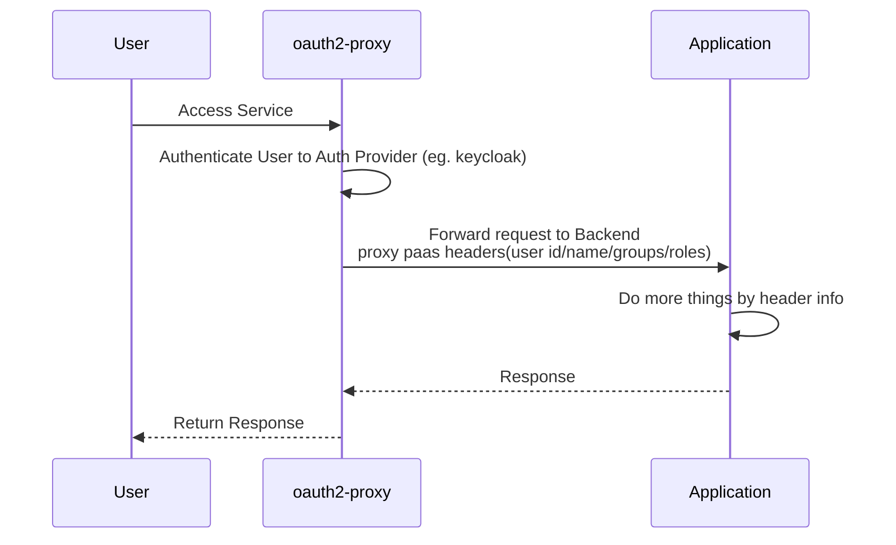
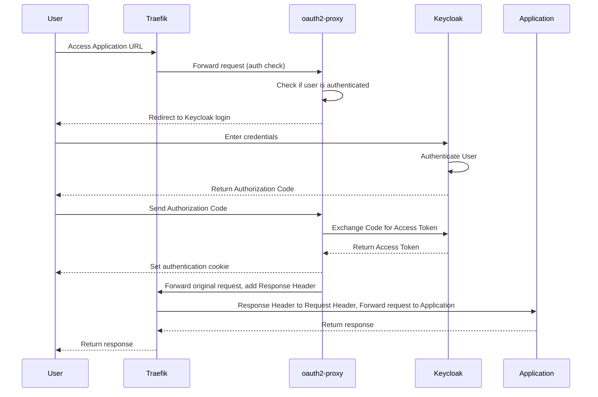

作为一个程序员，在日常开发中永远避免不了认证鉴权，而我们开发的某些应用，并不需要太复杂的鉴权，比如可能只要求必须是登录用户，或者只需要根据角色进行 RBAC 鉴权。有没有方法简化此流程，让应用开发者只关注业务开发，这就是本文档要解决的问题。

如果你有类似以下的需求，都可以参考此文档，原理是一样的，组件也可复用。

1. 为原本没有登录验证的服务提供认证服务，比如某些开源组件不支持认证但是又因携带一些危险数据而不想公开访问。
2. 实现统一的单点登录 SSO、并支持简单的 RBAC、UBAC 鉴权。
3. 为 Kubernetus Traefik Nginx Ingress 提供统一的认证入口，一键实现所有入口必须登录才可访问。
4. 配置 Traefik 使用 Forward Auth，Nginx 使用 auth_request 实现认证，也可以一并参考。
5. 在 K8S 或应用网关，基于用户、角色等不同属性，路由到不同服务。
6. 如果你凑巧也在用 [Backstage](https://backstage.io/)，请参考 [另一篇博客](https://www.xlabs.club/blog/backstage-oauth2-proxy-keycloak/)。

写在前面：

1. 本文档里的示例代码是以 k3s 为基础，使用 traefik 作为 ingress controller，整体完善但略显复杂，如果没有 K3S/K8S，以其他方式部署也是完全可以的，基本原理都是一样的。
2. 对于某些场景下可选的配置，会单独说明，请注意分别。
3. 这里提到的每个组件都是可替换的，比如 nginx 代替 traefik，Pomerium 代替 oauth2-proxy，可根据爱好选择，后面也会适当补充几种不同方式的对比和部署差异，更详细内容请参考本站另外一篇文档 [统一身份认证](https://www.xlabs.club/docs/platform/iam/)。
4. 示例中的代码都是从真实环境拷贝经过检验的，但为了便于理解可能裁剪无关紧要的内容，完整的安装部署源码请参考我们的部署脚本 [xlabs-club/xlabs-ops](https://github.com/xlabs-club/xlabs-ops)。
5. 需要懂一些 K8S、OIDC 基础知识，此处只提供链接不展开说明。

## 组件介绍

1. Keycloak

   Keycloak 是一个开源的身份和访问管理解决方案，支持 OAuth 2.0、OpenID Connect、SAML 等协议。它提供用户管理、角色管理、单点登录（SSO）、身份提供服务等功能，在本示例中担任 Auth Provider 角色。关于 Keycloak 的中文介绍，可参考本站单独的博客 [IDaaS Book](https://idaas.xlabs.club/)。

2. [oauth2-proxy](https://oauth2-proxy.github.io/oauth2-proxy/)

   顾名思义它是一个关于 oauth 反向代理，主要用来为后端服务增加身份验证层。它支持多种 OAuth 2.0 提供者（如 Google、OIDC、Keycloak 等），可以保护未提供身份验证的应用。oauth2-proxy 在请求进入后端服务之前，会先进行 OAuth 2.0 登录认证，确保请求者具有访问权限。它承担了登录的合法性校验、重定向、登录成功后的 cookie、response 设置等功能。

3. Application

   应用代号，可以是任何应用，UI 也好，API 也好，都可以，只要想拦截都行。

在开始之前，建议先了解下 oauth2-proxy 的基本功能，并需要特别关注一下他的这几个容易令人疑惑的设置。

1. oauth2-proxy 的 set header 和 pass header 的区别， set header 设置的是 response header，这在下面提到的 nginx auth_request 模块和 traefik forwardAuth Middleware 会用到。
2. pass header 是认证通过后，将一些基本信息，比如 Access Token、User ID、User Group 通过 Http Request Header 传递到 upstream（代理的目标应用），upstream 可以拿到 Header 信息后做更多的事情。
3. 目标应用 `--upstream` 一般就是一个或多个具体的后端服务地址，也可以是静态文件。还有一种特殊的文件 `file:///dev/null`, 相当于舍弃 upstream，下面我们会用他结合 traefik forwardAuth 使用。
4. 关注下 oauth2-proxy 的 [Endpoints](https://oauth2-proxy.github.io/oauth2-proxy/features/endpoints)，主要使用 start、auth、sign_in、sign_out 等几个，另外 auth endpoint 后面可以追加 query parameters `allowed_groups/allowed_emails`，这样不就组成了一个简单的基于 Group 的权限认证。
5. 注意看文档中关于 proxy 的设置，比如 `--reverse-proxy`，很多错误都是因为认证和配置没问题，但是到了后端 OAuth 本身校验失败，Token 的校验对 scheme、host 都有要求，如果经过了 proxy，要透传 header 中的 scheme、host。

## 基本原理和流程

目前 oauth2-proxy 有几种主流的使用方式。

第一种，直接使用 oauth2-proxy 对外提供服务，承担认证流程并提供简单的权限校验，认证通过后通过 Header 传递一些用户信息到 upstream application，流量由 oauth2-proxy 分发。

这种方式网络流量大概类似如下方式。



第二种，借助 traefik forwardAuth 认证插件 或 nginx auth_request 认证模块，结合 oauth2-proxy 提供的认证相关 Endpoints，承担认证流程，认证通过后流量的分发仍然由 traefik/nginx 执行。此方案的优点很明显，就是 traefik/nginx 的流量分发能力远超过 oauth2-proxy，不破坏 traefik/nginx 本身的功能。

他的网络流量和流程大概类似如下方式。



流程描述：

1. 用户访问 Application URL，请求被 Traefik 捕获。
2. Traefik 将请求转发给 oauth2-proxy，检查用户是否已认证。
3. 如果用户未认证，oauth2-proxy 会将用户重定向到 Keycloak 登录页面。
4. 用户在 Keycloak 上输入凭证并进行认证。
5. 认证成功后，Keycloak 返回鉴权码给用户。
6. 用户将鉴权码发送给 oauth2-proxy，oauth2-proxy 使用鉴权码向 Keycloak 请求访问令牌。
7. Keycloak 返回访问令牌给 oauth2-proxy，oauth2-proxy 设置身份验证 cookie。
8. oauth2-proxy 认证通过后，设置 Response Header 给 Traefik，Traefik 将 Response Header 转成 Request Header 传递给 Application。
9. Application 返回响应，最终由 Traefik 返回给用户。

本文档部署示例使用的是第二种方式。

## 部署配置详解

此处的 Traefik 使用的 K3S Traefik ingress controller，相关的功能通过 ingress annotations 实现，如果你使用其他方式部署，请参考 [Traefik 文档](https://doc.traefik.io/traefik/routing/providers/kubernetes-ingress/) 转换为对应的 yaml 配置。

### Keycloak 配置

首先，我们需要在 Keycloak 中创建一个 client，用于允许 [oauth2-proxy 使用 Keycloak](https://oauth2-proxy.github.io/oauth2-proxy/configuration/providers/keycloak_oidc) 验证用户身份验证。

OIDC 客户端必须配置 `audience mapper`，以将客户端的名称包含在 JWT 令牌的 aud 声明中。
aud 声明指定令牌的预期接收者，oauth2-proxy 期望与 --client-id 或 --oidc-extra-audience 的值匹配。
在 Keycloak 中，通过使用 `client scopes` 或 `dedicated` 将声明添加到 JWT Token 中。

1. 登录 Keycloak admin 控制台，切换到你自己的 realm。
2. 通过 `Clients -> Create client` （注： -> 连接代表 Keycloak 的菜单和按钮导航）来创建新客户端，核心参数如下，注：app.example.com 为我的应用地址。

   - Client type： OpenID Connect
   - Client ID：oauth2-proxy
   - Client authentication 勾选，打开
   - Authentication flow 勾选 Standard flow
   - Valid redirect URIs: 设置为你的应用 callback 地址，`https://app.example.com/oauth2/callback`，可以设置多个，也可以设置正则匹配，如 `https://app.example.com/*`
   - Valid post logout redirect URIs：`https://app.example.com/oauth2/sign_out`

3. 以上点保存后，从 `Clients -> oauth2-proxy -> Credentials` 页面，复制客户端密钥，下面会用到。
4. 配置一个 `audience mapper`, 在 `Clients -> oauth2-proxy -> Client scopes`页签，此时在列表应该看到一个名字叫 `oauth2-proxy-dedicated`的，点击进去，通过 `Configure a new mapper` 按钮创建一个新的 mapper。

   - 类型选择 `Audience`
   - 名字叫 `aud-mapper-oauth2-proxy`
   - Included Client Audience：选择 oauth2-proxy
   - 勾选 `Add to ID token`、`Add to access token`、`Add to token introspection`

5. 如果想使用 oauth2-proxy 的 `--allowed-group` 验证，需要在 `Client scopes -> Create client scope` 创建一个名字叫 `groups` 的 scope，下面参数是保持 groups 后才能使用，在 groups 的 detail -> mapper 里创建 `Group Membership` 类型的 mapper。

   - name：groups-mapper
   - Token Claim Name: groups
   - 勾选 `Add to xxx`，全勾上。

6. 再回到 `Clients -> oauth2-proxy -> Client scopes`页签， `Add client scope`选择我们上一步创建的 `groups`, Add 类型选择 `Optional`。这样就能把用户的 group 加到 JWT token 里了。

### oauth2-proxy 配置

在开始之前我们先做出两个选择：

1. oauth2-proxy 对接 keycloak，可以选择 `Keycloak OIDC` provider，也可以选择 `OpenID Connect` provider，这里我们选择 `Keycloak OIDC`，他比 `OpenID Connect` 多了按照 role 和 group 授权。
2. oauth2-proxy 对接 Traefik，可以使用 `errors middlewares` 实现，也可以使用 Redirect 实现，这两种方式在 oauth2-proxy 的文档里都有详细的说明，两种方式都能实现根据情况选择一个，配置上稍有差别，返回值对 401 和 403 的处理也不同。

这里我们使用 bitnami/oauth2-proxy helm chart 部署，values.yaml 主要配置如下。

```yaml
# service 默认 port 4180
service:
  port: 4180

## Configuration section
##
configuration:
  clientID: oauth2-proxy
  clientSecret: <%= 替换成上面创建的 clientSecret %>
  # cookieSecret 创建命令： openssl rand -base64 32 | tr -- '+/' '-_'
  cookieSecret: "iSGfyi0EbDrkg6eNJpAXGLmwN1jZDZossmElq5GgXeI="
  ## content 会映射到 oauth2-proxy.cfg 配置文件里
  ## 各个参数含义请参考 https://oauth2-proxy.github.io/oauth2-proxy/configuration/overview
  content: |
    reverse_proxy = true
    provider = "keycloak-oidc"
    provider_display_name = "Keycloak"
    email_domains = "*"
    set_xauthrequest = true
    set_authorization_header = true
    ssl_insecure_skip_verify = true
    insecure_oidc_allow_unverified_email = true
    code_challenge_method = "S256"
    upstreams = "file:///dev/null"

  # 填你自己的 keycloak 服务地址
  oidcIssuerUrl: https://keycloak.example.com/realms/master
  # 不需要填 redirectUrl，由 Traefik 帮我们处理
  redirectUrl: ""
```

再次强调，因为我们是使用 Traefik 做流量分发，oauth2-proxy 仅提供认证功能，所以这几个参数很重要。

```yaml
redirectUrl: ""
content: |
  reverse_proxy = true
  upstreams = "file:///dev/null"
```

为了配合下面的 Traefik forwardAuth 实现 `authResponseHeaders`，还需要开启这两个参数。

```yaml
content: |
  set_xauthrequest = true
  set_authorization_header = true
```

开启后，在 backend 服务里就能通过 Header 获取到当前用户的登录信息，以 keycloak-oidc provider 为例，获取到的 Header 如下。

```yaml
x-auth-request-user: af188bba-0388-2623-8cdb-39422e8be30a # user database id
x-auth-request-preferred-username: lisan123 # user login name
x-auth-request-groups: admin,test-group # user groups
x-auth-request-access-token: xxx # Access Token
authorization: Bearer token xxx # 注意这个是 ID Token，不是 Access Token
cookie: xxx
```

### Traefik 配置

Traefik 我们需要两个 Middleware：

- errors: 将 http 返回状态码是 401-403 的请求，重定向到 oauth2-proxy `/oauth2/sign_in` 端点。
- forwardAuth：检查登录状态并设置 cookie 和 Header。

先创建这两个 Middleware。

```yaml
apiVersion: traefik.io/v1alpha1
kind: Middleware
metadata:
  name: errors-sign-in
  namespace: oauth2-proxy
spec:
  errors:
    status:
      - "401-403"
    service:
      name: oauth2-proxy
      namespace: oauth2-proxy
      port: 4180
    query: "/oauth2/sign_in"
---
apiVersion: traefik.io/v1alpha1
kind: Middleware
metadata:
  name: forward-auth
  namespace: oauth2-proxy
spec:
  forwardAuth:
    # oauth2-proxy k8s service 地址
    address: http://oauth2-proxy.oauth2-proxy.svc:4180/oauth2/auth
    trustForwardHeader: true
    # 增加 header，可用 header 参考 oauth2-proxy 文档
    authResponseHeaders:
      - X-Auth-Request-User
      - X-Auth-Request-Preferred-Username
      - X-Auth-Request-Access-Token
      - X-Auth-Request-Groups
      - Authorization
      - Set-Cookie
```

创建完了，在 k8s 里可使用 traefik IngressRoute 对外暴露服务，也可使用标准 traefik ingress，看个人爱好。

因为 IngressRoute 看起来比较直观，好理解，我们先看下 IngressRoute 配置。

```yaml
apiVersion: traefik.io/v1alpha1
kind: IngressRoute
metadata:
  name: app-ingress-route
  namespace: oauth2-proxy
  # annotations:
  #   cert-manager.io/issuer: selfsigned-issuer
spec:
  entryPoints:
    - web
    - websecure
  routes:
    - match: "Host(`app.example.com`) && PathPrefix(`/oauth2`)"
      kind: Rule
      services:
        - name: oauth2-proxy
          namespace: oauth2-proxy
          port: http
      middlewares:
        - name: errors-sign-in
    # 需要代理的应用对外暴露服务
    - match: Host(`app.example.com`)
      kind: Rule
      middlewares:
        - name: errors-sign-in
        - name: forward-auth
      services:
        # 后端应用
        - name: backend
          namespace: oauth2-proxy
          port: http-backend
```

使用 k8s ingress 实现，annotations 请参考 [traefik.ingress.kubernetes.io](https://doc.traefik.io/traefik/routing/providers/kubernetes-ingress/)。

注意这里有两个关键点：

1. 因为 ingress 没办法像 IngressRoute 那样，为不同 path 设置不同的 middlewares，所以我们拆分成两个 ingress 定义。
2. traefik annotations 的 middlewares 名字定义格式为：namespace-middleware@@kubernetescrd，一定要加 namespace 前缀，如果是 default namespace 的话，也要加 `default-`前缀，否则查看 traefik 日志会看到一些 middlewares 找不到的错误，从而导致服务不生效。

```yaml
# 第一个 ingress，对应 match: "Host(`app.example.com`) && PathPrefix(`/oauth2`)"，使用 errors-sign-in middleware
apiVersion: networking.k8s.io/v1
kind: Ingress
metadata:
  annotations:
    traefik.ingress.kubernetes.io/router.middlewares: oauth2-proxy-errors-sign-in@kubernetescrd
  name: errors-sign-in
  # namespace: oauth2-proxy
spec:
  ingressClassName: traefik
  rules:
    # traefik 支持泛域名拦截，如果你想给所有的 ingress 都设置 oauth2，此处可以设置为 "*.example.com"
    - host: "app.example.com"
      http:
        paths:
          - backend:
              service:
                name: oauth2-proxy
                port:
                  name: http
            path: /oauth2
            pathType: Prefix
  # 根据你自己的情况设置 TLS
  # tls:
  #   - hosts:
  #       - "app.example.com"
  #     secretName: "app.example.com-tls"
---
# 第二个 ingress，对应 match: "Host(`app.example.com`)，使用 errors-sign-in,oauth2-proxy 两个 middleware
apiVersion: networking.k8s.io/v1
kind: Ingress
metadata:
  annotations:
    # 这里设置 errors-sign-in,oauth2-proxy 两个 middleware
    traefik.ingress.kubernetes.io/router.middlewares: oauth2-proxy-errors-sign-in@kubernetescrd,oauth2-proxy-forward-auth@kubernetescrd
  name: errors-sign-in-ingress
  namespace: oauth2-proxy
spec:
  ingressClassName: traefik
  rules:
    # traefik 支持泛域名拦截，如果你想给所有的 ingress 都设置 oauth2，此处可以设置为 "*.example.com"
    - host: "app.example.com"
      http:
        paths:
          - backend:
              service:
                name: backend
                port:
                  name: http-backend
            path: /
            pathType: Prefix
```

## K3S Traefik 对接 oauth2-proxy 特别说明

如果以上你的所有应用都部署在 K8S 同一个 namespace 里，就不用关注这个了。

K3S Traefik 默认未开启 `allowCrossNamespace`, 不允许跨 namespace 访问，所以如果你给其他 namespace 的应用也加上 auth Middleware，在应用上访问看不到错误就是一直没有 Auth 功能，以为是配置不生效，其实查看 K3S Traefik log 可以看到有关于 Middleware 找不到或 Service 无法访问的错误日志。

以下解决办法任选其一：

1. 在应用所在的 namespace 都创建 Middleware，创建 K8S ExternalName Service 指定 oauth2-proxy Service，这样 Middleware 和 Service 都在同 namespace 了。
2. 为 Traefik 开启 `allowCrossNamespace` 配置，关于 K3S 如何使用 HelmChartConfig 定制 Traefik 配置，可参考官方文档 [Customizing Packaged Components with HelmChartConfig](https://docs.k3s.io/helm#customizing-packaged-components-with-helmchartconfig)。

   ```console
   # 手动临时改配置，不推荐，可能后续更新丢失
   $ kubectl -n kube-system edit deployment traefik
   # 在 args 中增加 --providers.kubernetescrd.allowCrossNamespace=true
   ```

   ```yaml
   # 永久生效配置
   # vi /var/lib/rancher/k3s/server/manifests/traefik-config.yaml
   apiVersion: helm.cattle.io/v1
   kind: HelmChartConfig
   metadata:
     name: traefik
     namespace: kube-system
   spec:
     valuesContent: |-
       providers:
         kubernetesCRD:
           enabled: true
           allowCrossNamespace: true
   ```

## Keycloak 对接 oauth2-proxy 特别说明

Keycloak 需要创建 audience mapper 和 groups scope mapper，这在 [oauth2-proxy 官方文档](https://oauth2-proxy.github.io/oauth2-proxy/configuration/providers/keycloak_oidc) 中有详细的说明和创建步骤。

## oauth2-proxy 自动重定向到 keycloak 登录

以上使用 traefik errors middlewares 实现的方案，有两个弊端：

1. 登录成功后的回调，无法回到原始请求页面，会丢失 oauth2-proxy 的 `rd`，只能回到根目录。
2. 每次需要登录的时候，先停在 oauth2-proxy 的 sign-in 登录页，等着你点 `Sign in with`，需要点击一下才会跳转到 keycloak 的登录页。

为了解决这个问题，我们可以定制 oauth2-proxy 的登录页 `sign_in.html`，在登录页面直接重定向，`sign_in.html` 内容如下。

```html
{{define "sign_in.html"}}
<!doctype html>
<html lang="en" charset="utf-8">
  <head>
    <meta charset="utf-8" />
    <meta name="viewport" content="width=device-width, initial-scale=1, maximum-scale=1, user-scalable=no" />
    <title>Redirecting</title>
    <script>
      window.location = "{{.ProxyPrefix}}/start?rd=" + encodeURI(window.location);
    </script>
  </head>
  <body></body>
</html>
{{end}}
```

然后给 oauth2-proxy 增加环境变量 OAUTH2_PROXY_CUSTOM_TEMPLATES_DIR 放置以上登录页面。

如果在 k8s 里，可以通过重编 oauth2-proxy 镜像，或者通过 initContainers 挂载目录复制以上文件，我已做好了一个这样的镜像，在此 [GitHub](https://github.com/l10178/x-container)。

使用方式类似如下。

```yaml
initContainers:
  # copy 自定义模板，不需要点击 `Sign in` 按钮，自动重定向到登录页
  - name: auto-sign-in
    # 源码： https://github.com/l10178/x-container
    image: docker.io/nxest/oauth2-proxy-auto-sign-in:v7.7.1
    imagePullPolicy: IfNotPresent
    env:
      - name: OAUTH2_PROXY_CUSTOM_TEMPLATES_DIR
        value: /bitnami/oauth2-proxy/templates
    volumeMounts:
      - mountPath: /bitnami/oauth2-proxy/templates
        name: templates
```

## nginx 使用 auth_request 对接 oauth2-proxy

原理同 Traefik，将 /oauth2 相关请求交给 oauth2-proxy 服务，认证通过后 proxy_pass 到后端服务，注意设置 Header 和 Cookie。

另外注意下这一行 `auth_request /oauth2/auth;`，前面我们提到 auth endpoint 后面可以追加 query parameters `allowed_groups/allowed_emails`，在 nginx 里我们可以根据不同 server 或 location 设置不同的 group，类似 `auth_request /oauth2/auth?allowed_groups=cms-admin;`, 这样不就组成了一个简单的基于 Group 的权限认证。

如果想根据用户属性代理到不同的服务实例或路径，把 `proxy_pass http://backend/;` 用 lua if else 包装一下，不就实现了一个简单的路由功能。

```nginx

server {

  location /oauth2/ {
    proxy_pass       http://oauth2-proxy.svc:4180;
    proxy_set_header Host                    $host;
    proxy_set_header X-Real-IP               $remote_addr;
    proxy_set_header X-Scheme                $scheme;
    proxy_set_header X-Auth-Request-Redirect $request_uri;
    # or, if you are handling multiple domains:
    # proxy_set_header X-Auth-Request-Redirect $scheme://$host$request_uri;
  }
  location = /oauth2/auth {
    proxy_pass       http://oauth2-proxy.svc:4180;
    proxy_set_header Host             $host;
    proxy_set_header X-Real-IP        $remote_addr;
    proxy_set_header X-Scheme         $scheme;
    # nginx auth_request includes headers but not body
    proxy_set_header Content-Length   "";
    proxy_pass_request_body           off;
  }

  location / {
    auth_request /oauth2/auth;
    error_page 401 = /oauth2/sign_in;

    # pass information via X-User and X-Email headers to backend,
    # requires running with --set-xauthrequest flag
    auth_request_set $user   $upstream_http_x_auth_request_user;
    auth_request_set $email  $upstream_http_x_auth_request_email;
    proxy_set_header X-User  $user;
    proxy_set_header X-Email $email;

    # if you enabled --pass-access-token, this will pass the token to the backend
    auth_request_set $token  $upstream_http_x_auth_request_access_token;
    proxy_set_header X-Access-Token $token;

    # if you enabled --cookie-refresh, this is needed for it to work with auth_request
    auth_request_set $auth_cookie $upstream_http_set_cookie;
    add_header Set-Cookie $auth_cookie;

    # When using the --set-authorization-header flag, some provider's cookies can exceed the 4kb
    # limit and so the OAuth2 Proxy splits these into multiple parts.
    # Nginx normally only copies the first `Set-Cookie` header from the auth_request to the response,
    # so if your cookies are larger than 4kb, you will need to extract additional cookies manually.
    auth_request_set $auth_cookie_name_upstream_1 $upstream_cookie_auth_cookie_name_1;

    # Extract the Cookie attributes from the first Set-Cookie header and append them
    # to the second part ($upstream_cookie_* variables only contain the raw cookie content)
    if ($auth_cookie ~* "(; .*)") {
        set $auth_cookie_name_0 $auth_cookie;
        set $auth_cookie_name_1 "auth_cookie_name_1=$auth_cookie_name_upstream_1$1";
    }

    # Send both Set-Cookie headers now if there was a second part
    if ($auth_cookie_name_upstream_1) {
        add_header Set-Cookie $auth_cookie_name_0;
        add_header Set-Cookie $auth_cookie_name_1;
    }

    proxy_pass http://backend/;
    # or "root /path/to/site;" or "fastcgi_pass ..." etc
  }
}
```

如果是在 K8S 内使用 nginx ingress controller 实现，请参考官方文档将以上配置转换为注解和 lua 片段，类似如下设置。

```yaml
nginx.ingress.kubernetes.io/auth-signin: https://$host/oauth2/start?rd=$escaped_request_uri
nginx.ingress.kubernetes.io/auth-url: https://$host/oauth2/auth
```

## 遇见问题和解决办法

我们使用过程中遇见的问题和解决办法，记录下来仅供参考。

- traefik middleware 配置未生效。

  检查 traefik 日志，看看有没有错误，如果有语法错误或者权限问题，traefik 也能正常启动，只是配置不生效。

- traefik log 中 middleware 找不到，请参考本文上面说明，将 middlewares 名字改为：namespace-middleware@@kubernetescrd，一定要加 namespace 前缀，如果是 default namespace 的话，也要加 `default-` 前缀。

  ```console
  level=error msg="middleware \"errors-sign-in@kubernetes\" does not exist" entryPointName=web routerName=oauth2-proxy-errors-sign-in-sign-in-example-com-oauth2@kubernetes
  ```

- oauth2-proxy 能重定向到登录页面，输入密码登录成功，回调到 callback 时出现下面这个错误，原因是缺少 audience mapper，参考本文上面介绍增加 mapper。

  ```console
  500 Internal Server Error
  Oops! Something went wrong. For more information contact your server administrator.

  [oauthproxy.go:902] Error creating session during OAuth2 callback: audience from claim aud with value [account] does not match with any of allowed audiences map[oauth2-proxy:{}]
  ```
