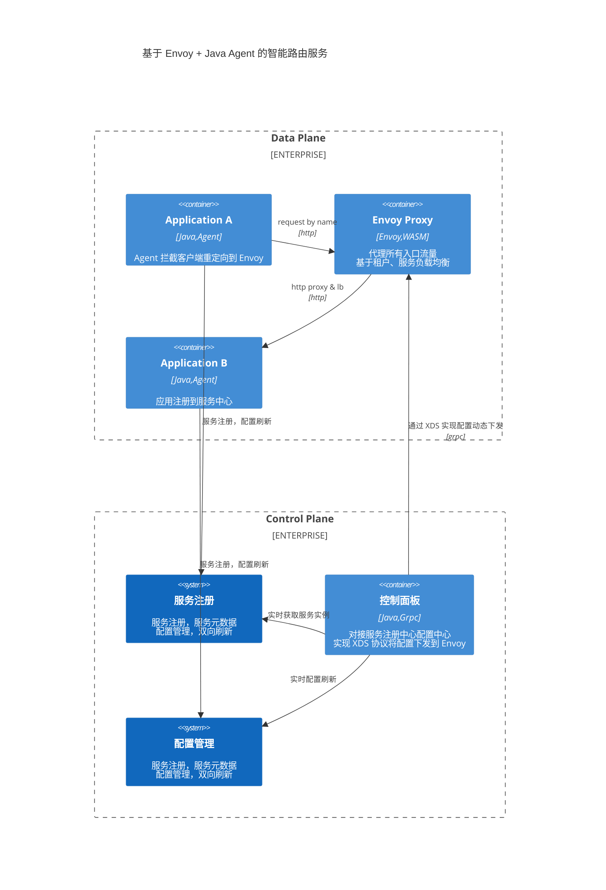

基于 Envoy + Java Agent 的智能路由服务实现方案介绍。

## 核心需求

1. 服务自动注册和发现，通过 Service Name 直接调用服务。当然基本的负载均衡策略、熔断降级限流等功能也要支持。
2. 公司约定的路由策略，支持按照租户路由到特定环境的服务，比如 VIP、Gray、Sandbox 等。
3. 多集群通信，同云内新老 K8S 集群路由打通，可通过 POD IP 互相通信。
4. 跨云通信，支持通过 VPN 或代理，从专属云访问公有云服务。

## 整体架构

智能路由服务从逻辑上分为数据平面和控制平面，主要包含以下组件。

- Nacos：服务注册中心，配置中心。
- XDS Server：对接服务注册中心、配置中心，实现 CDS、LDS、RDS 协议将集群、服务、路由、灰度租户等配置下发到 Envoy。
- Envoy + WASM Plugin：通过 Envoy 代理流量，自定义 WASM 插件实现按照租户、用户路由到不同服务，实现自定义负载均衡策略。
- Java Agent：增强 Java 应用 Http Client，拦截 OkHttp、Apache Http Client、RestTemplate、OpenFeign 等客户端调用，将流量重定向到 Envoy，Envoy 再根据服务名路由到真实的 Pod，实现服务发现和灾备切换。
- Nacos Service CRD：自定义 Nacos Service CRD，将 Service 注册到 Nacos 中作为一个永久实例，解决跨云、跨集群服务调用。比如跨云情况下注册的是一个公网地址或 VPN 可通的地址。



## 方案对比

此方案原始的目标有几个：

1. 语言无关，可以不绑定 Java。目前看来这是个伪需求。
2. 实现类似 Istio Ambient Mesh，剔除 Egress 流量代理，每个 Node 部署一个 Envoy Proxy，减少 Sidecar 资源开销。目前随着 Istio Ambient Mesh 成熟，这个优点反而也没有了。

对比 K8S 体系、Spring Cloud 体系，此方案优点：

1. 各服务实际上只需要注入服务中心，服务发现和负载均衡交给 Agent 和 Envoy，对于老的 Spring 项目也能直接使用，相对 Spring Cloud 轻量一些。
2. 不需要引入 Istio 也能支持跨云、跨集群访问场景，Istio 相对还是比较重。

此方案缺点：

1. 本质上还是 Proxy 模式，Proxy 的所有缺点他都绕不过，比如：性能损耗、Http Keepalive 和 reset 响应。
2. 对服务和配置实时刷新，要比 K8S、Spring Cloud 略微延迟，对高并发场景难免有中断。
3. 单点故障影响范围太大，以及 Proxy 任何配置性错误都是致命的。

综上，随着 Istio Ambient Mesh 以及基于 eBPF 的 Cilium Mesh 的成熟，这个方案可能逐渐退出历史舞台。那么，使用 Spring Cloud 全家桶快速启动先让业务用起来，反而成了一个最简单的方案。

## 功能实现方案

主要功能实现方式如下。

### 服务注册

服务通过 nacos support 或 nacos starter 注册到服务中心，关注下 Nacos 数据模型：

```tree
namespace
    - group
        - service
            - cluster
                - instance: ip,port,metadata
```

namespace 和 group 的设计目的是为了实现隔离。

1. 同 service 下 instance 唯一标记：ip + port + cluster。metadata 不作为唯一性标记。
2. 同 namespace 不同 group 下 service 可以完全相同。

| Nacos 模型 | 开源原生默认值                           | 我们方案                                                     |
| ---------- | ---------------------------------------- | ------------------------------------------------------------ |
| namespace  | 租户/环境 ，默认 public                  | 固定自定义值                                                 |
| group      | 组织/虚拟分组，默认 DEFAULT              | 默认 DEFAULT，如果某个组确认自己的服务不给组用可自定义 group |
| service    | spring.application.name                  | 默认也是 spring.application.name，子模块名                   |
| cluster    | 虚拟，a k8s cluster/ a AZ                | 线上发布系统的“环境”英文名，实际是 k8s 的 namespace          |
| instance   | 一个 Java 应用，一个 jar 或一个 war 服务 | 一个 jar 或一个 war 服务                                     |

注册实例信息约束：

```console

serviceName: appName.modeleName 应用的子模块名，目前的字符和长度限制都能满足要求
clusterName: 发布系统定义的“环境”英文名
ip: pod ip
port: container port
enabled： true or false 用于主动控制上下线，下线保留实例不承载流量
weight：权重
metadata：
    - contextPath： 推荐等同子模块名，要求必须有且不能随意变更，可以是根目录
    - preserved.register.source: 官方自动加，如 Spring Cloud、Dubbo。
    - secure：官方开源客户端自动加 boolean 值，标记 http or https 协议
    - protocol：通信协议，http/grpc/dubbo
    - version：版本标记，后续扩展路由策略支持多版本或限定版本。
    - runtime：k8s info、node info。
```

对于专属云访问公有云，目前是通过 VPN 代理方式，那么在专属云访问公有云时，如何通过 Service 名字映射到公有云服务呢。
我们会在专属云内，手动（优化为自定义 K8S CRD，联动 GitOps 自动部署）在 Nacos 中增加一个永久性实例（关于永久性实例和临时实例的说明请参考官方文档），只是这个实例的 IP 不是 POD IP，是通过 VPN 可通的 IP。

### 服务发现

调用方可使用 OkHttp、RestTemplate、OpenFeign 等客户端，直接使用服务名调用，比如：`GET http://user-service/users`。

服务发现和负载均衡策略，其实依赖三个组件：XDS Server、Envoy + WASM、Java Agent。

基本实现步骤：

1. XDS Server 从 Nacos 实时获取最新的服务和实例列表，从配置中心获取服务灰度列表，通过 ADS 协议实时下发到 Envoy。
2. 我们为 Envoy 定制了一个 WASM Plugin，这个 Plugin 支持通过租户路由到 Gray、VIP、Sandbox 等不同环境，Envoy 通过环境标记负载到真实的 POD 上。
3. Java Agent 增强 OkHttp 增加自定义 intercept，拦截服务名重定向到 Envoy，Envoy 根据服务名、路径、Header 路由到真实的后端服务。
4. 我们的 RestTemplate、OpenFeign 客户端做了定制，底层连接器都切换到了 OkHttp。
5. 客户端调用时，Header 中增加租户信息。
6. 客户端调用时不需要关心服务的 contextPath，Envoy 会自动追加 contextPath。

### 路由和负载均衡规则

运行环境定义：
Gray: foneshare-gray 用于常规发布的灰度过程；承载 QA 专用在线测试租户
Stage: foneshare-stage 用于大版本发布的灰度过程，承载 QA 专用在线测试租户、必要的真实租户
Urgent: foneshare-urgent 用于解决线上 vip、svip 面临的紧急 bug, 承载 bug 相关的 vip、svip 租户
Normal: foneshare、foneshare01、foneshare02、foneshare03、foneshare04 承载 vip 之外的租户
VIP: foneshare-vip 承载 vip 的租户
SVIP: 一个 foneshare-svip 承载多个 svip 租户
SSVIP: 一个环境承担一个租户，如 foneshare-yqsl 承载 ssvip 租户
Sandbox：所有以 `_sandbox` 结尾的租户都会路由到 Sandbox 环境。

环境路由优先级从高到低：

SSVIP > Gray > Urgent > Stage > SVIP > VIP > Sandbox > Normal

对于同一租户，既配置在 vip 的灰度名单，同时又配置到 gray 的灰度名单，实际路由时走哪个环境：

P1，最高优先级，gray、urgent、yqsl 等专属环境，tenantId 匹配任意环境就会返回；
P2，第 2 优先级，stage；
P3，第 3 优先级，svip；
P4，第 4 优先级，vip；
P5，第 5 优先级，sandbox；
P6，默认 normal，上述环境均未匹配到后，路由到 normal 环境。

按照上述顺序的原则，如一家租户既配置在 vip 同时又配置在 gray，实际会路由到 gray 环境。
注意：

1. 这里`路由到 gray`是指 gray 中存在对应的服务，如果 gray 中不存在服务，会按匹配到的优先级（vip）继续找，直到找到可用的服务。
2. 命中条件：租户在这个环境的这个服务名单里（租户+服务唯一确定）。
3. 沙箱用户比较特殊，是 EA 以 `_sandbox` 结尾。

### Envoy 配置下发和更新

Envoy 通过文件系统或查询管理服务器发现其各种动态资源。这些发现服务及其相应的 API 统称为 xDS。

我们的控制面 XDS Server 只实现了聚合发现服务（ADS），通过 ADS 使用单个流推送 CDS、EDS 和 RDS 资源，实现无中断的更新。

XDS Server 缓存了各个 Envoy 的 grpc connection，同时响应 Nacos 和配置中心的更新事件，收到更新后再通过 grpc 推送到各个 Envoy 终端。

### 使用限制

1. 请求 Header 必须要包含 x-fs-ea 或 x-fs-ei 参数（推荐 x-fs-ea），否则无法支持按租户路由。
2. 同一个服务在同一个环境，发布流程中的 contextPath 必须一致，因为是按环境类型统一路由只能有一个 contextPath。
3. 配置文件变更需要 30s 后才能生效，这取决了 CMS 配置系统拉取方式。
4. 新增加服务无法立即感知到（是新的服务，不是服务实例，实例能即时感知），我们是 10 分钟扫描一次服务，判断有无服务变更。

## Nacos 服务端部署

部署形态：

1. 公有云一套，承接公有云新老集群。
2. 每个专属云有独立的一套。

注意事项：

1. Nacos 需要放开 http（8848）和 grcp（9848、9849）端口。
2. 认证：使用用户名密码模式。不同组创建独立的用户名密码，单独授权。默认的用户`nacos`不要用且权限不足。
3. 连接时配置的 namespace 实际是 namespace id，可以考虑创建 namespace 时主动设置 namespace id 等同于 namespace name，便于定位，误删或迁移的时候能保证 ID 不变。
