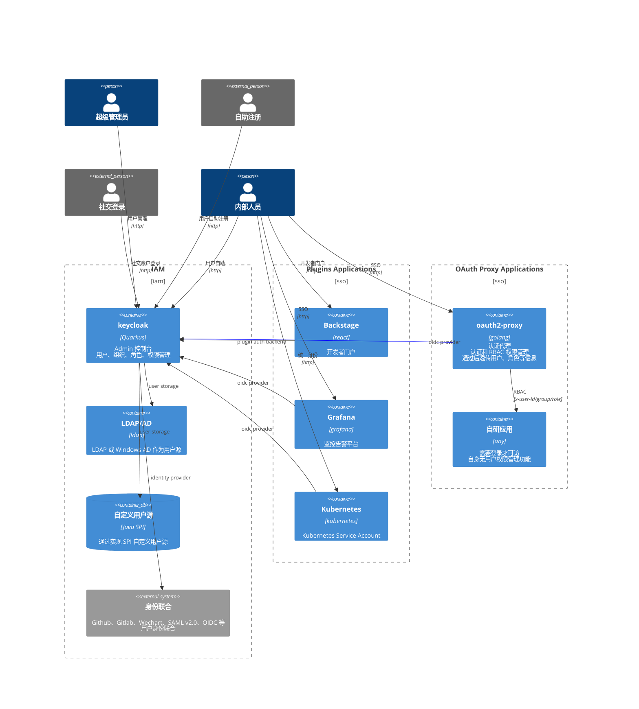

统一身份认证（Identity and Access Management，身份认证和访问控制，简称 IAM）的技术选型和实践。

## 核心需求

- 集中管理：从一个地方管理账户和身份。
- 单点登录：允许用户使用一组凭据访问所有集成的系统和应用，避免记忆多个用户名和密码。
- 动态访问控制：基于角色和策略动态授予或撤销访问权限。
- 审计与合规：记录和监控访问活动，以支持合规性审计。
- 无缝快速集成：作为平台工程的一部分更强调“自助”，各个应用能够无缝快速接入，甚至有些应用只需要简单的权限能够不需要开发自动接入。
- 强化认证机制：采用多因素认证（MFA：OTP 口令、指纹、短信验证码等）方法，为重要操作增加额外防护。

## 技术选项

为满足以上需求，在初期技术选项时主要关注以下几个开源组件。

- [keycloak](https://github.com/keycloak/): 全面的 IAM 解决方案 ，实现用户、权限管理，单点登录、MFA 等。
- [Dex](https://github.com/dexidp): 身份代理，连接多个身份源，仅作为 OpenID Connect。
- [Ory](https://github.com/ory/): 包含多个独立的组件，组成一个全家桶的解决方案。
- [oauth2-proxy](https://github.com/oauth2-proxy): 反向代理工具，专为提供 OAuth 2.0 身份验证和授权服务而设计，附带基于用户、分组、角色的权限管理。
- [Pomerium](https://github.com/pomerium/): Pomerium 不仅仅是一个 OAuth 2.0 代理，它还提供了细粒度的访问控制，能够根据用户、组、和其他上下文属性来决定访问权限。

以下为 keycloak 和 Dex 的简单对比。为什么不把 Ory 加进来，因为没有实际用过，不便于发表意见，如果你是一个 Ory 用户欢迎补充。

| 特性/工具    | Keycloak                            | Dex                                                |
| ------------ | ----------------------------------- | -------------------------------------------------- |
| **类型**     | 全面的 IAM 解决方案                 | 身份代理                                           |
| **用户管理** | 支持内置用户管理                    | 不直接管理用户，依赖外部身份提供者                 |
| **协议支持** | OpenID Connect、OAuth 2.0、SAML 2.0 | OpenID Connect                                     |
| **SSO**      | 支持                                | 依赖外部身份提供者实现                             |
| **社交登录** | 支持多种社交登录选项                | 不直接支持，可通过连接外部身份提供者实现           |
| **角色管理** | 支持复杂的角色和权限管理            | 不直接支持                                         |
| **扩展性**   | 高，适合各种规模和复杂性的需求      | 适合将多个身份源统一到一个认证流程的环境           |
| **使用场景** | 需要全面、集中式身份管理的组织      | 需要统一多个身份源认证，如在云原生环境中           |
| **用户界面** | 提供丰富的用户和管理员界面          | 主要是 API，没有详细的用户界面                     |
| **适用性**   | 适用于需要完整 IAM 解决方案的组织   | 适用于作为多个身份源代理，尤其在 Kubernetes 环境中 |

以下为 OAuth2 Proxy 和 Pomerium 的简单对比。

| 特性/工具           | OAuth2 Proxy                       | Pomerium                               |
| ------------------- | ---------------------------------- | -------------------------------------- |
| **主要用途**        | 身份验证代理                       | 边缘身份验证和访问控制                 |
| **身份认证方法**    | 支持多种 OAuth 2.0 提供商          | 支持 OAuth 2.0、OpenID Connect 和 SAML |
| **安全性**          | 基本的身份验证和授权               | 高级访问控制，包括路由规则和策略       |
| **单点登录（SSO）** | 支持                               | 支持                                   |
| **部署复杂性**      | 相对简单，易于部署                 | 较为复杂，但提供更多的配置选项和灵活性 |
| **用户界面**        | 主要通过配置文件和命令行界面操作   | 提供 Web 界面用于配置和管理            |
| **适用场景**        | 适合于小型应用和简单的身份验证需求 | 适合于大型企业和复杂的访问控制需求     |
| **集成能力**        | 适合单一应用或小型系统             | 适合复杂的系统架构和多应用环境         |
| **扩展性和灵活性**  | 基本扩展性，适用于标准用例         | 高度可扩展和灵活，适用于复杂多变的环境 |
| **社区和支持**      | 拥有活跃的社区                     | 社区支持强大，提供企业级支持和服务     |

## 方案落地

为满足核心诉求，根据不同场景我们做了以下选择。

1. 以 keycloak + ldap 管理用户、角色、权限，用户原始数据存于 ldap 中。
2. 以 oatuh2-proxy + keycloak oidc 作为认证代理中间件，为那些不具备认证授权机制的应用提供统一的认证授权访问控制。

一个简单的应用统一身份认证总架构示例如下。

