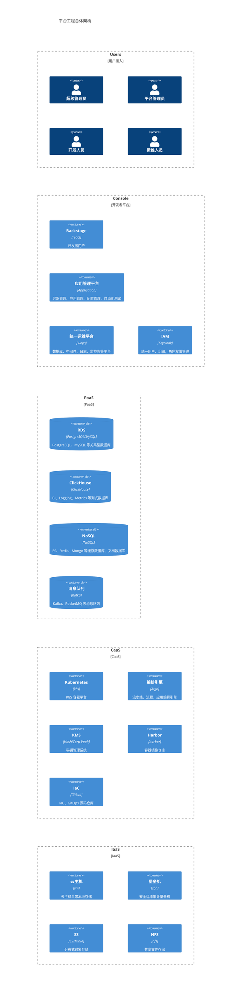

我们的平台工程建设之路，介绍前期方案设计、中间踩坑历程。

## 原则

分享我们平台工程建设的一些基本原则。

1. 以开发者为中心：赋能开发者，了解困难，解决问题，让开发者生活更轻松。
2. 自动化：自动化手动和重复性任务，减少人为错误，提高效率。
3. 标准化：标准化保持一致性，减少复杂性，减少团队认知负载，提供最佳实践和统一的编码结构。
4. 模块化：松耦合且独立的模块，可独立开发、测试和部署。
5. 弹性：可扩展水平扩缩容的能力，以及容错抗脆弱的能力。
6. 安全：相比于微服务、云原生领域的安全，在平台工程里，更强调代码、基础设施、数据和其他资源的安全。
7. 协作：平台工程师、开发人员、运维运营人员以及其他参与者之间的协作，提高生产力、促进创新并创造积极包容的工作环境。
8. 持续改进：持续性反馈、评估、改进。

## 架构概述

为便于理解，我们仍然按照惯用架构模型，将架构分为 IaaS、CaaS、PaaS、Applications 这几个层级。

专业的运维人员作为 platform engineer 着重于 IaaS、CaaS、PaaS 建设，开发人员作为 application engineer 更专注于 PaaS、Applications 建设，为开发和运维提供工具、协作平台、基础应用。

## 基础设施标准化

基础设施标准化是平台工程建设的第一步，通过对基础设施服务进行标准化，减少开发人员和运维团队之间的摩擦，减少运维难度，大大降低出错的概率。

云平台已经成熟，在云平台的基础上，我们更近一步，提出 `All In K8S` 策略，这里的 `All In` 主要包括两点：

- Run On K8S：数据库、缓存、消息队列、业务应用，一切都运行在 K8S 上，K8S 是事实上的基础设施。
- 面向 K8S 设计：遵循 K8S 设计原则，拥抱 K8S 生态，充分利用开源功能特性。

作为一个由传统运维转变而来的团队，分享几个可能有用的关注点：

- 操作习惯变化，由命令式到声明式：过去在虚拟机内直接修改文件、执行某个命令、安装某个插件，变为修改 yaml 配置、修改基础镜像、修改镜像 init 进程。
- 资源隔离：从集群、node、namespace 不同维度进行物理或逻辑隔离，对数据库、业务应用按 Label 、污点进行逻辑分区。
- 权限和策略管理：有容器云平台用平台即可。如果没有，K8S 4 种鉴权模式 Node、ABAC、RBAC 和 Webhook 能否满足要求，考虑是否引入 OPA Gatekeeper 或 Kyverno 完善和简化工作。
- 网络安全：截止目前 K8S 安装时仍然推荐禁用虚拟机内部防火墙，云平台提供虚拟机安全组一般用于防止外部网络入侵， K8S 内部考虑使用 NetworkPolicy 防止内部人员搞坏。比如不同组织的多个数据库，结合上面的资源隔离和权限控制，从一开始就要规划好是按集群还是 namespace 划分。
- 严格版本化管理：操作系统、容器镜像、Helm Charts、命令行工具，精确到小版本。
- 显式声明参数：以 Helm 应用为例，理解 values.yaml 文件中的每个变量并避免使用默认值，每次更新版本比对变量差异并再次执行显式声明参数原则。
- 应用交付自动化：自动化、规范化应用交付全流程，并严格践行面向失败设计的原则。减少人的动作流程才能减少生产事故。
- 日志采集：应用日志可能打印到文件或 Pod console，统一采集展示。
- 故障演练：对不同应用进行故障演练，尤其是模拟备份和恢复，传统的停进程、恢复文件、重启服务的操作模式在容器内可能行不通。

## 开发者体验

如何提升开发者体验。如何实现开发者自助。内部开发者平台解决不了的问题有哪些，如何解决的。

## 可观测性

可观测助力提升开发者体验和质量提升。AIOps 是不是未来。

## 组织架构变革

平台工程如何推动和影响组织架构变革。
