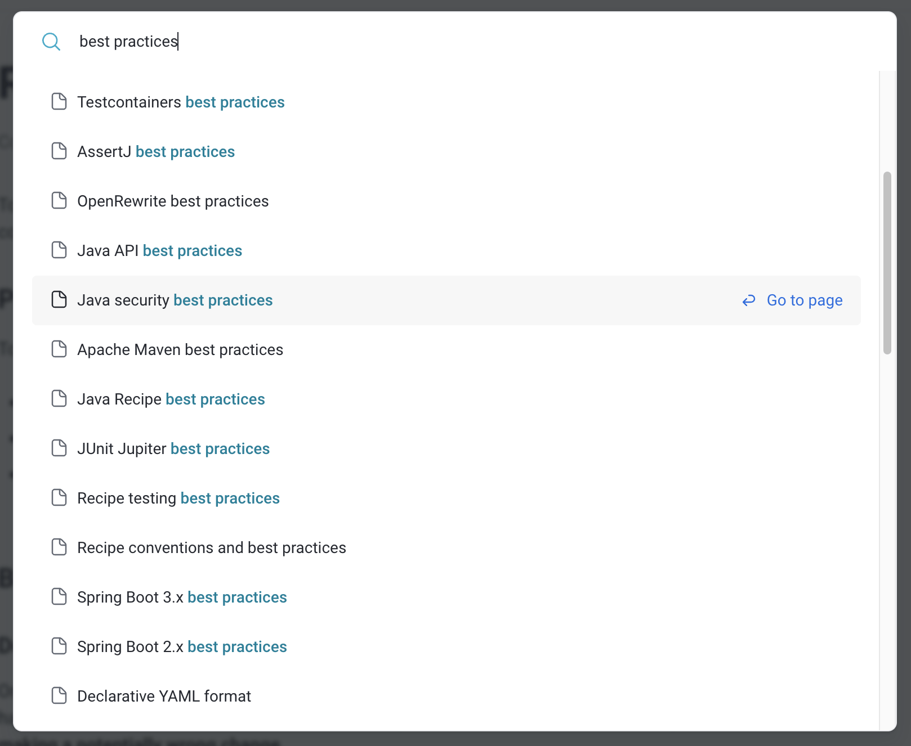

作为一个以 Java 和 Spring 为主要技术栈的团队，在日常的软件开发中，我们经常会遇到一系列的组件升级和代码重构需求，在此过程我们期望能做到几个效果：

- 项目级升级：整个项目（注此项目指 Maven Project）升级，而不是基于某个 Java 类或片段。
- 不同版本跨度变更：比如从 Spring 项目迁移到 Spring Boot，从 Spring Boot 2.x 升级到 3.x，从 Java 8 升级到 Java 21。
- 代码安全可靠：变更的代码一定是正确的，至少是逻辑正确的，至少不能像某 AI 助手一样设置一些根本不存在的属性。
- 经验产品化：最佳实践就是产品，比如我并不（想）了解 Spring Boot 3.2 具体有哪些变更，但希望能一键从 3.0 自动升级到 3.2，直接告诉有哪些变更。
- 自定义重构：对于某些自研代码，希望能自定义重构逻辑，一键自动重构。

基于以上背景，我们探索了 [OpenRewrite][]、[Spring Boot Migrator][]、[Redhat Windup][]、[emt4j][] 和一众不便具名的 AI 代码助手，本文将分享我们使用 OpenRewrite、Spring Boot Migrator 进行代码重构和升级的一些使用经验和体验。

## OpenRewrite

[OpenRewrite][] 是一个开源的代码重写工具，旨在帮助开发人员自动化大规模重构代码。

它提供了一套强大的 API 和插件系统，可以通过静态分析和代码转换技术来解析、修改和生成代码。OpenRewrite 支持多种编程语言，包括 Java、C#、 TypeScript、Python、Kubernetes 等。通过使用 OpenRewrite，开发人员可以轻松地进行代码重构、性能优化、代码风格调整和代码迁移等操作，从而提高代码质量和可维护性。OpenRewrite 的开源性质使得开发人员可以自由地定制和扩展其功能，以满足特定项目的需求。

比如 Java 领域一些热门的应用场景：

- Java 版本升级：从 Java 8 到 Java 21，从 Java EE 到 Jakarta EE 。
- Spring 框架迁移：从 Spring 5 到 Spring 6，从 Spring Boot 2 到 Spring Boot 3。
- 测试框架迁移： 从 Junit 4 到 Junit 5。
- 依赖管理：自动更新 Java 项目的 Maven 或 Gradle 依赖，确保使用最新和最安全的库版本。
- 代码清理和格式化：自动清理和格式化 Java 代码，确保符合项目或组织的编码标准和风格指南。
- 修复安全漏洞：自动识别和修复 Java 代码中的已知安全漏洞，如使用了有安全问题的库或方法。
- 代码异味检测和修复：识别并自动重构 Java 代码中的“代码异味”，以提高代码可维护性。

相比于时下火热的 AI 代码工具，比如 GitHub Copilot、Amazon CodeWhisperer，我认为 OpenRewrite 的优势主要有以下几点：

- 可以直接处理大型项目，截止我写此文的今天还没一个成熟的 AI 助手能将整个项目一次性迁移或重构。
- 准确度较高，它通过预定义的规则来实现代码的精确修改，目前很多 AI 代码助手还在一本正经的瞎扯，尤其是凭空创造让人防不胜防。
- 可自定义扩展，对于自研代码不可能经过自动学习达到精确的效果，此时可自定义实现。
- 免费，可离线使用，便于 CI 集成。

值得一提的是，AWS 最近推出了 Amazon Q Code Transformation 专门做代码迁移和重构，需要开通 Amazon CodeWhisperer 企业版才能使用，可惜我没有钱去试用。

### 快速入门

OpenRewrite 一个最核心的概念是 `Recipe`，由于我是国内首个翻译这个单词的人，以下将直译为食谱。一个 Recipe 可以理解为是一套声明好的规则，OpenRewrite 按照固定规则进行重构。

一个 Recipe 可以包含多个 Recipe，可以层级累加，比如 `UpgradeSpringBoot_3_2`可能包含对 pom.xml、application.properties、java main source、java test source 的升级改动。

初次使用 OpenRewrite，可通过官方提供的 [热门指导](https://docs.openrewrite.org/running-recipes/popular-recipe-guides) 找到自己感兴趣的按步骤操作。

另外就是食谱很多，一个一个用很麻烦，可优先考虑 `best practices` 系列，里面聚合了多个食谱。

[](./popular-recipe-guides.png)

更多功能可通过 [食谱分类](https://docs.openrewrite.org/recipes) 搜索，也可通过官网右上方的搜索按钮按照关键字搜索，也可通过 `mvn rewrite:discover` 列出可用的食谱。

[](./recipes.png)

### 运行方式

友情提示：运行前请把代码交给 Git 管理，并 checkout 一个全新的分支，便于比对自动修改了哪些代码。

OpenRewrite 支持使用 maven、gradle 以及使用 SaaS 服务 Moderne cli `mod` 这三种方法。

1. 使用 maven、gradle 文件定制比较方便，dependency 管理也比较灵活，另外某些食谱只有 maven、gradle 支持，缺点则是需要修改 pom、gradle 文件。
2. 使用 maven 命令行直接执行插件任务并指定属性，不用改 pom.xml 更方便，缺点是不方便管理 dependencies。

   ```bash
   mvn -U org.openrewrite.maven:rewrite-maven-plugin:run -Drewrite.recipeArtifactCoordinates=org.openrewrite.recipe:rewrite-migrate-java:RELEASE -Drewrite.activeRecipes=org.openrewrite.java.migrate.jakarta.JakartaEE10 -Drewrite.exportDatatables=true
   ```

3. 使用 SaaS 服务提供的 Moderne CLI 最方便，比如 `mod run . --recipe JakartaEE10`, 需要注册 license。

### 最佳实践和定制

OpenRewrite 对不同类型分别内置了一些最佳实践，可通过 `best practices` 关键字搜索。

[](./best-practices.png)

最佳实践包含了哪些规则呢，以 [Spring Boot 3.x best practices](https://docs.openrewrite.org/recipes/java/spring/boot3/springboot3bestpractices) 为例，在文档中能看到对应的食谱列表如下：

```yaml
---
type: specs.openrewrite.org/v1beta/recipe
name: org.openrewrite.java.spring.boot3.SpringBoot3BestPractices
displayName: Spring Boot 3.x best practices
description: Applies best practices to Spring Boot 3 applications.
tags:
  - spring
  - boot
recipeList:
  - org.openrewrite.java.spring.boot2.SpringBoot2BestPractices
  - org.openrewrite.java.migrate.UpgradeToJava21
  - org.openrewrite.java.spring.boot3.UpgradeSpringBoot_3_2
```

而其中每个食谱又可能包含多个，比如上面的 [org.openrewrite.java.spring.boot2.SpringBoot2BestPractices](https://docs.openrewrite.org/recipes/java/spring/boot2/springboot2bestpractices) 又包含以下列表：

```yaml
---
type: specs.openrewrite.org/v1beta/recipe
name: org.openrewrite.java.spring.boot2.SpringBoot2BestPractices
displayName: Spring Boot 2.x best practices
description: Applies best practices to Spring Boot 2 applications.
tags:
  - spring
  - boot
recipeList:
  - org.openrewrite.java.spring.NoRequestMappingAnnotation
  - org.openrewrite.java.spring.ImplicitWebAnnotationNames
  - org.openrewrite.java.spring.boot2.UnnecessarySpringExtension
  - org.openrewrite.java.spring.NoAutowiredOnConstructor
  - org.openrewrite.java.spring.boot2.RestTemplateBuilderRequestFactory
  - org.openrewrite.java.spring.boot2.ReplaceDeprecatedEnvironmentTestUtils
```

如果官方的某个食谱不和你的胃口，比如想在最佳实践中去掉或新增某个自定义食谱怎么办，可以自己定义一个 `rewrite.yml` 文件，类似上面的 yaml 文件，在文件中自行组合食谱。注意 `rewrite.yml` 文件要放到 maven 项目的根目录下，更多关于文件的说明参考 [Refactoring with declarative YAML recipes](https://docs.openrewrite.org/running-recipes/popular-recipe-guides/authoring-declarative-yaml-recipes)。

### CI 集成

通过 `mvn rewrite:run` 命令执行后，会直接修改代码。但是大部分 CI 场景下，我们可能只想做分析，不想真正改动代码。那么就可以把命令换成 `mvn rewrite:dryRun`，dryRun 会在控制台输出 warning 结果，并生成一个 rewrite.patch 文件。

如果 dryRun 向控制台日志发出任何警告，或者生成了 rewrite.patch 文件，证明此次有需要变更的地方，则可视为 CI 失败。

## Spring Boot Migrator

OpenRewrite 功能很强悍，但是仍缺失一项功能：将传统 Spring 项目一键迁移到 Spring Boot。

Spring Boot Migrator 基于 OpenRewrite，是一个专门用于协助将传统的 Spring 应用迁移到基于 Spring Boot 的工具，同时也提供 Spring Boot 的升级。

Spring Boot Migrator 程序运行起来后，通过 `list` 命令可以看到提供的 OpenRewrite recipes，其中主要关注的有：

- initialize-spring-boot-migration: 将项目初始化为 Spring Boot 应用。
- migrate-spring-xml-to-java-config：将 Spring xml 转换为 Java 注解。
- spring-context-xml-import：使用 Import xml 文件的形式初始化 Bean。
- boot-2.7-3.0-dependency-version-update：Spring Boot 2 升级到 Spring Boot 3。

```console
migrator:> list
Found these recipes:

  1) remove-redundant-maven-compiler-plugin
     -> Remove standard maven-compiler plugin for applications with boot parent.
  2) initialize-spring-boot-migration
     -> Initialize an application as Spring Boot application.
  3) migrate-jndi-lookup
     -> Migrate JNDI lookup using InitialContext to Spring Boot
  4) migrate-jpa-to-spring-boot
     -> Migrate JPA to Spring Boot
  5) migrate-ejb-jar-deployment-descriptor
     -> Add or overrides @Stateless annotation as defined in ejb deployment descriptor
  6) migrate-weblogic-ejb-deployment-descriptor
     -> Migrate weblogic-ejb-jar.xml deployment descriptor
  7) mark-and-clean-remote-ejbs
     -> Search @Stateless EJBs implementing a @Remote interface
  8) migrate-stateless-ejb
     -> Migration of stateless EJB to Spring components.
  9) migrate-annotated-servlets
     -> Allow Spring Boot to deploy servlets annotated with @WebServlet
  10) migrate-jax-ws
     -> Migrate Jax Web-Service implementation to Spring Boot bases Web-Service
  11) migrate-jax-rs
     -> Any class has import starting with javax.ws.rs
  12) migrate-mule-to-boot
     -> Migrate Mulesoft 3.9 to Spring Boot.
  13) migrate-tx-to-spring-boot
     -> Migration of @TransactionAttribute to @Transactionsl
  14) spring-context-xml-import
     -> Import Spring Framework xml bean configuration into Java configuration without converting them.
  15) migrate-spring-xml-to-java-config
     -> Migrate Spring Framework xml bean configuration to Java configuration.
  16) migrate-jms
     -> Convert JEE JMS app into Spring Boot JMS app
  17) documentation-actions
     -> Create Documentation for Actions
  18) migrate-jsf-2.x-to-spring-boot
     -> Use joinfaces to integrate JSF 2.x with Spring Boot.
  19) cn-spring-cloud-config-server
     -> Externalize properties to Spring Cloud Config Server
  20) boot-2.4-2.5-upgrade-report
     -> Create Upgrade Report for a Spring Boot 2.4 Application
  21) boot-2.7-3.0-dependency-version-update
     -> Bump spring-boot-starter-parent from 2.7.x to 3.0.0
  22) boot-autoconfiguration-update
     -> Create org.springframework.boot.autoconfigure.AutoConfiguration.imports file for new spring 2.7
  23) boot-2.4-2.5-datasource-initializer
     -> Replace deprecated spring.datasource.* properties
  24) boot-2.4-2.5-spring-data-jpa
     -> Rename JpaRepository methods getId() and calls to getOne()
  25) boot-2.4-2.5-dependency-version-update
     -> Update Spring Boot dependencies from 2.4 to 2.5
  26) boot-2.7-3.0-upgrade-report
     -> Create a report for Spring Boot Upgrade from 2.7.x to 3.0.0-M3
  27) boot-2.4-2.5-sql-init-properties
     -> Replace deprecated spring.datasource.* properties
  28) sbu30-report
     -> Create a report for Spring Boot Upgrade from 2.7.x to 3.0.x
  29) sbu30-upgrade-dependencies
     -> Spring boot 3.0 Upgrade - Upgrade dependencies
  30) sbu30-set-java-version
     -> Spring boot 3.0 Upgrade - Set java version property in build file
  31) sbu30-add-milestone-repositories
     -> Spring boot 3.0 Upgrade - Add milestone repository for dependencies and plugins
  32) sbu30-migrate-spring-data-properties
     -> Spring boot 3.0 Upgrade - Migrate 'spring.data' properties to new property names
  33) sbu30-remove-construtor-binding
     -> Spring boot 3.0 Upgrade - Remove redundant @ConstructorBinding annotations
  34) sbu30-migrate-to-jakarta-packages
     -> Spring boot 3.0 Upgrade - Migrate javax packages to new jakarta packages
  35) sbu30-johnzon-dependency-update
     -> Spring boot 3.0 Upgrade - Specify version number for johnzon-core
  36) sbu30-225-logging-date-format
     -> Spring boot 3.0 Upgrade - Logging Date Format
  37) sbu30-auto-configuration
     -> Move EnableAutoConfiguration Property from spring.factories to AutoConfiguration.imports
  38) sbu30-upgrade-spring-cloud-dependency
     -> Upgrade Spring Cloud Dependencies
  39) sbu30-upgrade-boot-version
     -> Spring boot 3.0 Upgrade - Upgrade Spring Boot version
  40) sbu30-remove-image-banner
     -> Spring boot 3.0 Upgrade - Remove the image banner at src/main/resources
  41) sbu30-paging-and-sorting-repository
     -> Spring boot 3.0 Upgrade - Add CrudRepository interface extension additionally to PagingAndSortingRepository
  42) migrate-raml-to-spring-mvc
     -> Create Spring Boot @RestController from .raml files.
  43) migrate-boot-2.3-2.4
     -> Migrate from Spring Boot 2.3 to 2.4
  44) upgrade-boot-1x-to-2x
     -> Migrate applications built on previous versions of Spring Boot to the latest Spring Boot 2.7 release.

```

## OpenRewrite 使用示例

下面使用 maven 方式演示几个例子，注意如果是 maven 多模块项目，请在父模块下执行，否则运行可能出错，参考官方说明：[Running Rewrite on a multi-module Maven project](https://docs.openrewrite.org/running-recipes/multi-module-maven)。

友情提醒：初次使用会下载很多依赖 jar 包，速度可能比较慢，切换到你最快的 maven 仓库。

### 升级到 Java 21

从任意版本升级到 Java 21。

```bash
mvn -U org.openrewrite.maven:rewrite-maven-plugin:run -Drewrite.recipeArtifactCoordinates=org.openrewrite.recipe:rewrite-migrate-java:RELEASE -Drewrite.activeRecipes=org.openrewrite.java.migrate.UpgradeToJava21

# 或者手动指定版本
mvn -U org.openrewrite.maven:rewrite-maven-plugin:5.31.0:run -Drewrite.recipeArtifactCoordinates=org.openrewrite.recipe:rewrite-migrate-java:2.14.0 -Drewrite.activeRecipes=org.openrewrite.java.migrate.UpgradeToJava21
```

OpenRewrite 会自动替换一些 Java 21 支持的新特性，如：

1. 大文本块 JEP 378: Text Blocks，自动优化格式化。
2. 模式匹配增强：支持在执行 instanceof 操作时同时定义指定类型的新变量，省却了类型转换的过程。
3. String 类增加的新格式化方法： formatted(Object…​ args)。
4. 排序性集合：可以直接使用 getFirst() 和 getLast() 来获取第一个和最后一个集合元素了。参考： JEP 431: Sequenced Collections。

### Base64 方法替换

Base64 常用的实现有：

1. Apache Common Codec，依然可用，可以选择是否转换成 java.util.Base64。
2. sun.misc 包下提供的实现类，从 Java 9 开始，已经不再对外提供，需要替换。
3. 从 Java 1.8 开始提供的标准库 java.util.Base64。

```bash
# UseJavaUtilBase64
mvn -U org.openrewrite.maven:rewrite-maven-plugin:run -Drewrite.recipeArtifactCoordinates=org.openrewrite.recipe:rewrite-migrate-java:RELEASE -Drewrite.activeRecipes=org.openrewrite.java.migrate.UseJavaUtilBase64 -Drewrite.exportDatatables=true

# ApacheBase64ToJavaBase64
mvn -U org.openrewrite.maven:rewrite-maven-plugin:run -Drewrite.recipeArtifactCoordinates=org.openrewrite.recipe:rewrite-apache:RELEASE -Drewrite.activeRecipes=org.openrewrite.apache.commons.codec.ApacheBase64ToJavaBase64 -Drewrite.exportDatatables=true

```

另外更多关于 Apache 包升级、使用 Java 自带方法代替 Apache Utils 的方法，请参考 OpenRewrite 官网 `apache` 下的食谱。

### 升级到 JakartaEE

从 javax 到 jakarta，在 maven 项目父（根）模块下执行以下命令即可，注意命令可能随着版本变化，请去官网查看最新版本示例。

```bash
mvn -U org.openrewrite.maven:rewrite-maven-plugin:run -Drewrite.recipeArtifactCoordinates=org.openrewrite.recipe:rewrite-migrate-java:RELEASE -Drewrite.activeRecipes=org.openrewrite.java.migrate.jakarta.JakartaEE10 -Drewrite.exportDatatables=true
```

执行完成后可根据 git diff 查看修改效果。

### 代码清理

先试一下 CodeCleanup 效果。

pom.xml 文件中增加以下配置，然后执行 `mvn rewrite:run`。

```xml
  <build>
    <plugins>
      <plugin>
        <groupId>org.openrewrite.maven</groupId>
        <artifactId>rewrite-maven-plugin</artifactId>
        <version>5.23.1</version>
        <configuration>
          <activeRecipes>
            <recipe>org.openrewrite.staticanalysis.CodeCleanup</recipe>
          </activeRecipes>
        </configuration>
        <dependencies>
          <dependency>
            <groupId>org.openrewrite.recipe</groupId>
            <artifactId>rewrite-static-analysis</artifactId>
            <version>1.3.1</version>
          </dependency>
        </dependencies>
      </plugin>
    </plugins>
  </build>
```

我的某个项目执行效果：

- 删除了一些多余的空格、空行、多括号。
- 代码格式化，比如多个参数间缺少空格的加了空格。
- 颠倒了一个 equals 比较： `method.equals("CONNECT") -> "CONNECT".equals(method)`。
- 长代码换行归整，三元运算格式化。

### 静态分析、查找、重构

支持以下功能，不一一列举，请参考官方文档。

- 分析依赖关系。
- 查找某个方法是否被使用。
- 将某个方法替换为某个方法。
- 批量修改方法名字，修改参数类型等。
- 排序 imports ，删除未使用的 imports。

### 通用代码格式化

无用空行、空白符、前后空白符、方法参数前后空白符、Tab 转 space 等一些常用格式化方式。

### 日志优化

- Parameterize logging statements：把字符串拼接自动转为参数类型。
- 用 logger 代替 System.err、System.out、printStackTrace。
- 把 JUL、log4j、logback 都转为 slf4j API。

### Spring 到 Spring Boot

下面介绍下我们将 Spring 项目迁移到 Spring Boot 的过程，以及中间遇到的一些问题。

| 升级项  | 迁移前          | 迁移后          |
| ------- | --------------- | --------------- |
| Runtime | Spring + Tomcat | Spring Boot 3.2 |
| Spring  | Spring 4        | Spring 6        |
| Junit   | Junit 4         | Junit 5         |
| okhttp  | okhttp 3        | okhttp 4        |
| Java    | Java 8          | Java 21         |
| Java EE | Java EE         | Jakarta EE      |

基本步骤：

1. 使用 Spring Boot Migrator 将 Spring 项目转换成 Spring Boot，使用 Java 17 启动 spring-boot-migrator 程序并根据提示一步一步操作，如果某个步骤出错，根据 `stacktrace` 命令查看错误信息，修复后继续 `apply <recipe-number>`。

   ```console

   # 注意在执行 spring-boot-migrator 前，先在你要升级的项目中执行 mvn clean package install，拉取和安装依赖包，避免下面的 scan 步骤中下载依赖包失败

   # 使用 Java 17 启动 spring-boot-migrator 程序
   $ java -jar spring-boot-migrator.jar

   Get Started:
   ------------
   Type

   "help" - to display a list all of the available commands.
   "scan <dir>" - to scan an application

   --------------------------------------------------------------------------------------------------

   migrator:> scan my-spring-project-dir

   [ok] Found pom.xml.
   [ok] 'sbm.gitSupportEnabled' is 'true', changes will be committed to branch [springboot] after each recipe.
   [ok] Found required source dir 'src/main/java'.

   Maven        100% │██████████████████████████████████│ 2/2 (0:00:00 / 0:00:00)

   Applicable recipes:

   1) remove-redundant-maven-compiler-plugin
      -> Remove standard maven-compiler plugin for applications with boot parent.
   2) initialize-spring-boot-migration
      -> Initialize an application as Spring Boot application.
   3) spring-context-xml-import
      -> Import Spring Framework xml bean configuration into Java configuration without converting them.
   4) migrate-spring-xml-to-java-config
      -> Migrate Spring Framework xml bean configuration to Java configuration.
   5) cn-spring-cloud-config-server
      -> Externalize properties to Spring Cloud Config Server
   6) sbu30-set-java-version
      -> Spring boot 3.0 Upgrade - Set java version property in build file
   7) sbu30-add-milestone-repositories
      -> Spring boot 3.0 Upgrade - Add milestone repository for dependencies and plugins
   8) sbu30-225-logging-date-format
      -> Spring boot 3.0 Upgrade - Logging Date Format

   Run command '> apply <recipe-number>' to apply a recipe.

   ibss-site-dc:> apply remove-redundant-maven-compiler-plugin
   Applying recipe 'remove-redundant-maven-compiler-plugin'
   [ok] Clean up redundant properties for maven compiler plugin.
   [ok] Clean up redundant maven compiler plugin.

   remove-redundant-maven-compiler-plugin successfully applied the following actions:
   (x) Clean up redundant properties for maven compiler plugin.
   (x) Clean up redundant maven compiler plugin.

   Applicable recipes:

   1) initialize-spring-boot-migration
      -> Initialize an application as Spring Boot application.
   2) spring-context-xml-import
      -> Import Spring Framework xml bean configuration into Java configuration without converting them.
   3) migrate-spring-xml-to-java-config
      -> Migrate Spring Framework xml bean configuration to Java configuration.
   4) cn-spring-cloud-config-server
      -> Externalize properties to Spring Cloud Config Server
   5) sbu30-set-java-version
      -> Spring boot 3.0 Upgrade - Set java version property in build file
   6) sbu30-add-milestone-repositories
      -> Spring boot 3.0 Upgrade - Add milestone repository for dependencies and plugins
   7) sbu30-225-logging-date-format
      -> Spring boot 3.0 Upgrade - Logging Date Format

   Run command '> apply <recipe-number>' to apply a recipe.

   ibss-site-dc:> apply initialize-spring-boot-migration
   Applying recipe 'initialize-spring-boot-migration'
   [ok] Add Spring Boot dependency management section to buildfile.
   [ok] Add Spring Boot starter class.
   [ok] Add initial unit test class to test Spring Boot Application Context startup.
   [ok] Set packaging to 'jar' type if different

   initialize-spring-boot-migration successfully applied the following actions:
   (x) Add Spring Boot dependency management section to buildfile.
   (x) Add spring dependencies 'spring-boot-starter' and 'spring-boot-starter-test'.
   (x) Delete dependencies to artifacts transitively managed by Spring Boot.
   (x) Add Spring Boot Maven plugin.
   (x) Add Spring Boot starter class.
   (x) Add initial unit test class to test Spring Boot Application Context startup.
   (x) Set packaging to 'jar' type if different

   Applicable recipes:

   1) spring-context-xml-import
      -> Import Spring Framework xml bean configuration into Java configuration without converting them.
   2) migrate-spring-xml-to-java-config
      -> Migrate Spring Framework xml bean configuration to Java configuration.
   3) cn-spring-cloud-config-server
      -> Externalize properties to Spring Cloud Config Server
   4) boot-2.7-3.0-dependency-version-update
      -> Bump spring-boot-starter-parent from 2.7.x to 3.0.0
   5) boot-2.7-3.0-upgrade-report
      -> Create a report for Spring Boot Upgrade from 2.7.x to 3.0.0-M3
   6) sbu30-report
      -> Create a report for Spring Boot Upgrade from 2.7.x to 3.0.x
   7) sbu30-upgrade-dependencies
      -> Spring boot 3.0 Upgrade - Upgrade dependencies
   8) sbu30-set-java-version
      -> Spring boot 3.0 Upgrade - Set java version property in build file
   9) sbu30-add-milestone-repositories
      -> Spring boot 3.0 Upgrade - Add milestone repository for dependencies and plugins
   10) sbu30-remove-construtor-binding
      -> Spring boot 3.0 Upgrade - Remove redundant @ConstructorBinding annotations
   11) sbu30-225-logging-date-format
      -> Spring boot 3.0 Upgrade - Logging Date Format
   12) sbu30-upgrade-spring-cloud-dependency
      -> Upgrade Spring Cloud Dependencies
   13) sbu30-upgrade-boot-version
      -> Spring boot 3.0 Upgrade - Upgrade Spring Boot version

   ```

2. Spring Boot Migrator 目前还并不成熟，以上步骤中很多 `recipe` 可能出错，所以我只用 Spring Boot Migrator 做一些基础初始化，其他任务使用 rewrite-maven-plugin，交给 openrewrite 执行。在 maven pom.xml 中增加以下配置后，执行 `mvn rewrite:run`。

   ```xml
      <plugin>
         <groupId>org.openrewrite.maven</groupId>
         <artifactId>rewrite-maven-plugin</artifactId>
         <version>5.19.0</version>
         <configuration>
            <activeRecipes>
               <recipe>org.openrewrite.java.spring.boot2.UpgradeSpringBoot_2_7</recipe>
               <recipe>org.openrewrite.java.testing.junit5.JUnit4to5Migration</recipe>
               <recipe>org.openrewrite.okhttp.UpgradeOkHttp4</recipe>
               <recipe>org.openrewrite.okhttp.ReorderRequestBodyCreateArguments</recipe>
               <recipe>org.openrewrite.java.migrate.UpgradeToJava17</recipe>
            </activeRecipes>
         </configuration>
         <dependencies>
            <dependency>
               <groupId>org.openrewrite.recipe</groupId>
               <artifactId>rewrite-spring</artifactId>
               <version>5.2.0</version>
            </dependency>
            <dependency>
               <groupId>org.openrewrite.recipe</groupId>
               <artifactId>rewrite-testing-frameworks</artifactId>
               <version>2.2.0</version>
            </dependency>
            <dependency>
               <groupId>org.openrewrite.recipe</groupId>
               <artifactId>rewrite-okhttp</artifactId>
               <version>0.1.0</version>
            </dependency>
            <dependency>
               <groupId>org.openrewrite.recipe</groupId>
               <artifactId>rewrite-migrate-java</artifactId>
               <version>2.5.0</version>
            </dependency>
         </dependencies>
      </plugin>
   ```

   ```console

   [INFO] Using active recipe(s) [org.openrewrite.java.spring.boot2.UpgradeSpringBoot_2_7, org.openrewrite.java.testing.junit5.JUnit4to5Migration]
   [INFO] Using active styles(s) []
   [INFO] Validating active recipes...
   [INFO] Project [ibss-site-dc] Resolving Poms...
   [INFO] Project [ibss-site-dc] Parsing source files
   [INFO] Running recipe(s)...
   [WARNING] Changes have been made to pom.xml by:
   [WARNING]     org.openrewrite.java.spring.boot2.UpgradeSpringBoot_2_7
   [WARNING]         org.openrewrite.java.spring.boot2.UpgradeSpringBoot_2_6
   [WARNING]             org.openrewrite.java.spring.boot2.UpgradeSpringBoot_2_5
   [WARNING]                 org.openrewrite.java.spring.boot2.UpgradeSpringBoot_2_4
   [WARNING]                     org.openrewrite.java.spring.boot2.SpringBoot2JUnit4to5Migration
   [WARNING]                         org.openrewrite.java.testing.junit5.JUnit4to5Migration
   [WARNING]                             org.openrewrite.maven.ExcludeDependency: {groupId=junit, artifactId=junit}
   [WARNING]         org.openrewrite.java.dependencies.UpgradeDependencyVersion: {groupId=org.springframework.boot, artifactId=*, newVersion=2.7.x, overrideManagedVersion=false}
   [WARNING] Changes have been made to src/main/java/com/fsde/ibss/dc/controller/ClientController.java by:
   [WARNING]     org.openrewrite.java.spring.boot2.UpgradeSpringBoot_2_7
   [WARNING]         org.openrewrite.java.spring.boot2.UpgradeSpringBoot_2_6
   [WARNING]             org.openrewrite.java.spring.boot2.UpgradeSpringBoot_2_5
   [WARNING]                 org.openrewrite.java.spring.boot2.UpgradeSpringBoot_2_4
   [WARNING]                     org.openrewrite.java.spring.boot2.UpgradeSpringBoot_2_3
   [WARNING]                         org.openrewrite.java.spring.boot2.UpgradeSpringBoot_2_2
   [WARNING]                             org.openrewrite.java.spring.boot2.UpgradeSpringBoot_2_1
   [WARNING]                                 org.openrewrite.java.spring.boot2.UpgradeSpringBoot_2_0
   [WARNING]                                     org.openrewrite.java.spring.boot2.SpringBoot2BestPractices
   [WARNING]                                         org.openrewrite.java.spring.NoRequestMappingAnnotation
   [WARNING]                                         org.openrewrite.java.spring.ImplicitWebAnnotationNames
   [WARNING] Changes have been made to src/test/java/com/fsde/ibss/dc/service/FileSaveTest.java by:
   [WARNING]     org.openrewrite.java.spring.boot2.UpgradeSpringBoot_2_7
   [WARNING]         org.openrewrite.java.spring.boot2.UpgradeSpringBoot_2_6
   [WARNING]             org.openrewrite.java.spring.boot2.UpgradeSpringBoot_2_5
   [WARNING]                 org.openrewrite.java.spring.boot2.UpgradeSpringBoot_2_4
   [WARNING]                     org.openrewrite.java.spring.boot2.SpringBoot2JUnit4to5Migration
   [WARNING]                         org.openrewrite.java.testing.junit5.JUnit4to5Migration
   [WARNING]                             org.openrewrite.java.testing.junit5.UpdateTestAnnotation
   [WARNING]                         org.openrewrite.java.spring.boot2.RemoveObsoleteSpringRunners
   [WARNING]                             org.openrewrite.java.testing.junit5.JUnit5BestPractices
   [WARNING]                                 org.openrewrite.java.testing.cleanup.RemoveTestPrefix
   [WARNING]                                 org.openrewrite.java.testing.cleanup.TestsShouldNotBePublic
   [WARNING] Please review and commit the results.
   [INFO] ------------------------------------------------------------------------
   [INFO] BUILD SUCCESS
   [INFO] ------------------------------------------------------------------------

   ```

3. 在上面步骤我是先升级到了 Spring Boot 2，然后再执行升级 Spring Boot 3 和 Jakarta EE。实际上直接升级到 Spring Boot 3 也是可以的。
4. 执行完成后可从 maven 中删除 rewrite-maven-plugin，也可留着下次做其他变更。

### 试用总结

注意事项：

1. 我们项目配置都是通过远程配置中心管理的，所以升级过程中配置文件无法响应变更，解决办法是将配置从远端拷贝到本地 applicaiton.properties 中，执行完任务后根据变化再更新远程配置中心。
2. 执行过程中可能会报错，比如 maven 插件升级后某些属性可能变更或失效，需要手动解决错误后，再执行 `mvn rewrite:run`，
3. 可重复执行 `mvn rewrite:run` 命令，可随时加入新的 recipe 再执行，所以为了观察变更和保证执行成功，可分批次加入 recipe 多次执行。
4. OpenRewrite 不解析依赖的第三方 jar 包内容，所以第三方 jar 的问题需要自行识别，比如从 Java EE 到 Jakarta EE，只是替换规则中知道的 jar 包版本和当前项目的源代码，不会自动把 jar 包内的 `javax.` 替换为 `jakarta.`。

## 遇见问题和解决办法

[OpenRewrite]: https://docs.openrewrite.org/
[Spring Boot Migrator]: https://github.com/spring-projects-experimental/spring-boot-migrator
[Redhat Windup]: https://github.com/windup
[emt4j]: https://github.com/adoptium/emt4j
